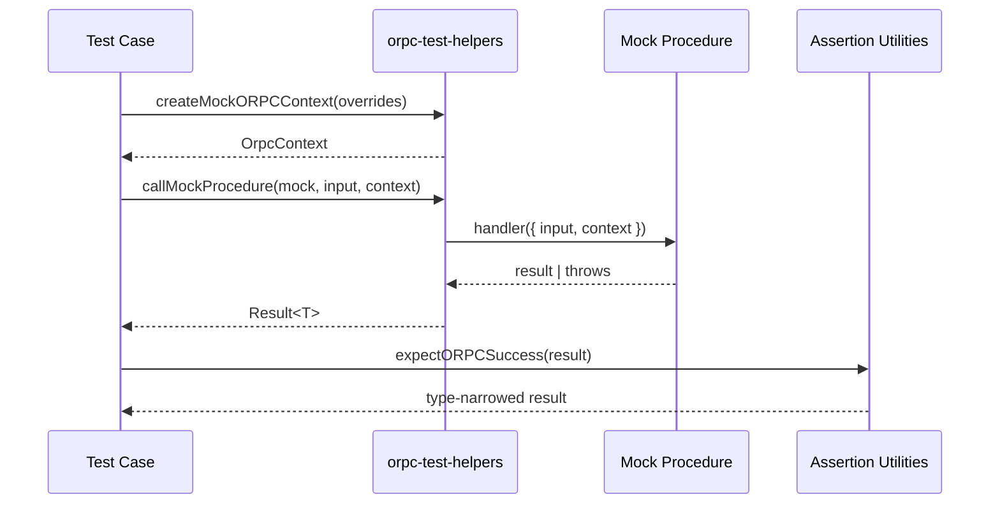
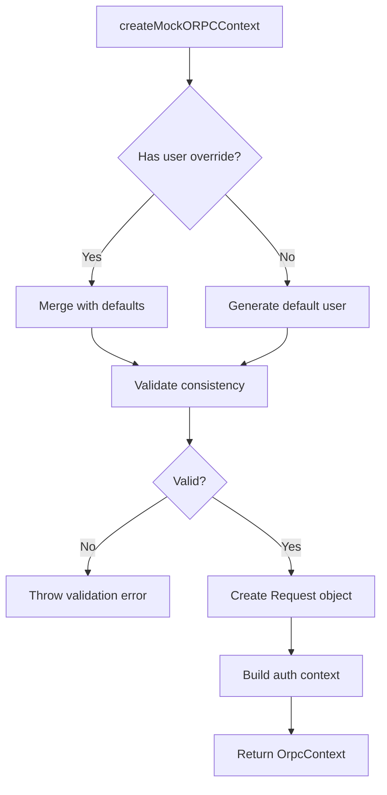

# oRPC Test Infrastructure Design

## Problem Statement

Verification discovered that 15 API tests using the `.handler()` invocation pattern are non-functional. The pattern `getUserFlags.handler({ input })` fails because:

- `getUserFlags` is an oRPC procedure object, not a function
- The `.handler` property is `undefined` on procedure objects
- Tests were never functional and have been skipped

**Affected Files:**
- `apps/api/modules/feature-flags/tests/get-user-flags.test.ts` (7 occurrences)
- `apps/api/modules/telemetry/procedures/ingest-events.test.ts` (4 occurrences)
- `apps/api/modules/telemetry/tests/ingest-events.test.ts` (4 occurrences)

## Objective

Create test infrastructure at `apps/api/__tests__/utils/orpc-test-helpers.ts` that enables unit testing of oRPC procedures without requiring HTTP requests or complex server setup.

## Background Context

### Current oRPC Architecture

**Procedure Definition Pattern:**
```typescript
// apps/api/modules/feature-flags/procedures/get-user-flags.ts
export const getUserFlags = publicProcedure
  .input(getUserFlagsInputSchema)
  .output(getUserFlagsOutputSchema)
  .handler(async ({ input }) => {
    // Implementation
  });
```

**Type Structure:**
- `publicProcedure` is created via `os.$context<OrpcContext>()`
- Procedures are builder objects, not callable functions
- The `.handler()` method defines implementation but doesn't expose it for direct calls
- Procedures are composed into routers and invoked through HTTP handlers

**Context Interface:**
```typescript
interface OrpcContext {
  request: Request;
  auth: SnapbackAuthContext | null;
  user: {
    id: string;
    email: string;
    role: UserRole;
    plan: PlanId;
    // ... additional fields
  } | null;
}
```

### Existing Test Utilities

**Location:** `apps/api/__tests__/utils/`

**Current Files:**
- `mock-context.ts` - Hono Context factory for middleware tests
- `mock-db.ts` - Database mocking utilities

**Missing Files (referenced but not implemented):**
- `orpc-test-helpers.ts` - Core testing utilities
- `enhanced-test-helpers.ts` - Advanced mocking for external services

## Design Strategy

### Approach Analysis

#### Option A: Direct Handler Invocation (Rejected)
Use oRPC internal APIs to invoke handler functions directly.

**Rationale for Rejection:**
- Relies on undocumented internal structure
- Brittle to oRPC version changes
- May not execute middleware chain
- Violates encapsulation

#### Option B: HTTP Test Client (Rejected for Unit Tests)
Create Fetch/Supertest-based client for integration tests.

**Rationale for Rejection:**
- Too heavy for unit tests (requires full server setup)
- Slower test execution
- More appropriate for E2E tests
- Existing `apps/api/__tests__/server.e2e.test.ts` already provides this

#### Option C: Mock Procedure Pattern (Selected)
Provide utilities to create mock procedures and contexts for isolated testing.

**Rationale for Selection:**
- Aligns with existing test file imports
- Enables fast, isolated unit tests
- Works with Vitest mocking ecosystem
- Preserves type safety
- Evidence shows this pattern already in use (enhanced-telemetry.test.ts references it)

### Architecture Decision

**Pattern:** Mock-based testing with context factories

**Key Insight:** Tests don't need to invoke real oRPC procedures - they should test business logic in isolation. The test helpers will:

1. Create realistic oRPC contexts
2. Provide assertion utilities for success/error cases
3. Enable procedure mocking with proper type inference
4. Support external service mocking

## Functional Requirements

### Test Helper Module Structure

**File:** `apps/api/__tests__/utils/orpc-test-helpers.ts`

#### Function 1: Create Mock oRPC Context

**Purpose:** Generate realistic `OrpcContext` objects for test scenarios

**Signature:**
```typescript
function createMockORPCContext(overrides?: Partial<ContextOverrides>): OrpcContext
```

**Context Override Options:**
- `user` - User identity and profile
- `auth` - Authentication state
- `subscription` - Plan and limits
- `apiKey` - API key permissions
- `headers` - HTTP headers
- `request` - Request metadata

**Default Behavior:**
- Generates unique user IDs
- Sets reasonable defaults for all fields
- Creates minimal valid context

**Validation:**
- Ensures required fields are present
- Validates enum values (role, plan)
- Maintains referential consistency (userId in both auth and user)

#### Function 2: Call Mock Procedure

**Purpose:** Invoke a mock procedure handler with proper context

**Signature:**
```typescript
async function callMockProcedure<TInput, TOutput>(
  mockProcedure: { handler: MockHandler<TInput, TOutput> },
  input: TInput,
  context?: OrpcContext
): Promise<Result<TOutput>>
```

**Behavior:**
- Invokes `mockProcedure.handler()` with structured arguments
- Provides default context if not specified
- Returns standardized result object
- Handles async operations

**Error Handling:**
- Catches thrown errors and wraps in error result
- Preserves error types and messages
- Maintains stack traces for debugging

#### Function 3: Success Assertion

**Purpose:** Type-safe assertion for successful procedure results

**Signature:**
```typescript
function expectORPCSuccess<T>(result: Result<T>): asserts result is SuccessResult<T>
```

**Behavior:**
- Checks `result.success === true`
- Narrows type to include `data` field
- Throws descriptive error on failure
- Provides helpful debugging information

#### Function 4: Error Assertion

**Purpose:** Type-safe assertion for error results

**Signature:**
```typescript
function expectORPCError(
  result: Result<unknown>,
  expectedCode?: string
): asserts result is ErrorResult
```

**Behavior:**
- Checks `result.success === false`
- Optionally validates error code
- Narrows type to include `error` field
- Provides error details in assertion message

### Enhanced Test Helper Module

**File:** `apps/api/__tests__/utils/enhanced-test-helpers.ts`

#### Function: Create Mock External Services

**Purpose:** Provide mock implementations of external dependencies

**Services Covered:**
- PostHog (telemetry)
- Stripe (payments)
- Database clients
- Redis cache
- Email service

**Return Structure:**
```typescript
interface MockExternalServices {
  postHog: {
    capture: MockFunction;
    flush: MockFunction;
    shutdown: MockFunction;
  };
  stripe: {
    // Payment mocks
  };
  // Additional services
}
```

**Behavior:**
- Returns Vitest mock functions
- Provides realistic default responses
- Allows test-specific configuration
- Resets between tests

## Type Safety Specifications

### Result Type Pattern

Following `always-result-type-pattern.md` rule:

```typescript
type Result<T> =
  | { success: true; data: T }
  | { success: false; error: { code: string; message: string } };

type SuccessResult<T> = { success: true; data: T };
type ErrorResult = { success: false; error: { code: string; message: string } };
```

### Context Override Type

```typescript
interface ContextOverrides {
  user?: {
    id?: string;
    email?: string;
    role?: UserRole;
    plan?: PlanId;
    name?: string;
  };
  auth?: Partial<SnapbackAuthContext>;
  subscription?: {
    plan?: PlanId;
    status?: string;
    monthlyRequestLimit?: number;
    cloudStorageGB?: number;
  };
  apiKey?: {
    key?: string;
    permissions?: {
      maxSnapshots?: number;
      cloudBackup?: boolean;
      advancedDetection?: boolean;
      customRules?: boolean;
      teamSharing?: boolean;
    };
  };
  headers?: Record<string, string>;
  request?: {
    method?: string;
    url?: string;
  };
}
```

### Mock Handler Type

```typescript
type MockHandler<TInput, TOutput> = (args: {
  input: TInput;
  context: OrpcContext;
}) => Promise<TOutput> | TOutput;
```

## Data Flow Diagrams

### Test Execution Flow



### Context Factory Behavior



## Migration Strategy

### Phase 1: Create Core Utilities

**Deliverable:** `apps/api/__tests__/utils/orpc-test-helpers.ts`

**Implementation Order:**
1. Define `Result<T>` types
2. Implement `createMockORPCContext()`
3. Implement `callMockProcedure()`
4. Implement assertion utilities
5. Add JSDoc documentation
6. Export all functions

**Validation:**
- Type checking passes
- No runtime dependencies on oRPC internals
- All exports are documented

### Phase 2: Create Enhanced Helpers

**Deliverable:** `apps/api/__tests__/utils/enhanced-test-helpers.ts`

**Implementation:**
- Implement `createMockExternalServices()`
- Add service-specific mocks
- Document mock behavior

### Phase 3: Migrate Proof-of-Concept Test

**Target:** `apps/api/modules/feature-flags/tests/get-user-flags.test.ts`

**Steps:**
1. Replace `.handler({ input })` with `callMockProcedure()`
2. Use `createMockORPCContext()` for test contexts
3. Replace direct assertions with `expectORPCSuccess()`
4. Verify tests pass

**Success Criteria:**
- All test cases pass
- No skipped tests
- Type errors resolved

### Phase 4: Migrate Remaining Tests

**Target Files:**
- `apps/api/modules/telemetry/procedures/ingest-events.test.ts`
- `apps/api/modules/telemetry/tests/ingest-events.test.ts`

**Approach:**
- Apply same pattern as proof-of-concept
- Ensure consistent usage across all files
- Remove all `.skip()` markers

### Phase 5: Documentation

**Deliverable:** Update `docs/testing/TESTING.md`

**Content:**
- Pattern explanation
- Usage examples
- Migration guide for future tests
- Best practices

## Testing Requirements

### Unit Tests for Test Helpers

**File:** `apps/api/__tests__/utils/orpc-test-helpers.test.ts`

**Coverage:**
- `createMockORPCContext()` generates valid contexts
- Overrides are properly applied
- `callMockProcedure()` invokes handlers correctly
- Assertions work for success and error cases
- Type narrowing functions correctly

### Integration Test Examples

**Pattern Validation:**
- Feature flag procedure with A/B testing
- Telemetry ingestion with PII filtering
- Authentication-protected endpoints
- Plan-gated features

## Non-Functional Requirements

### Performance Constraints

**Test Execution Speed:**
- Context creation: < 1ms
- Mock procedure call: < 5ms
- Full test suite: < 30s

**Memory Usage:**
- No memory leaks in mock objects
- Proper cleanup after each test

### Code Quality Standards

**Type Safety:**
- No `any` types except where explicitly documented
- All public APIs fully typed
- Generic constraints properly specified

**Documentation:**
- JSDoc comments on all exported functions
- Usage examples in comments
- Migration guide for existing tests

**Maintainability:**
- Single responsibility per function
- Clear separation between utilities
- Extensible for future test patterns

### Compatibility Requirements

**Framework Versions:**
- oRPC: @orpc/server (current version)
- Vitest: 3.2.4 (from catalog)
- TypeScript: 5.9.2 (from catalog)

**Monorepo Compliance:**
- Follows `always-monorepo-imports.md` rule
- Uses workspace protocol for internal packages
- Imports from `@snapback/*` namespaces

## Risk Assessment

### Technical Risks

**Risk 1: oRPC Internal Changes**
- **Probability:** Low
- **Impact:** Medium
- **Mitigation:** Mock-based approach doesn't depend on oRPC internals

**Risk 2: Type Compatibility Issues**
- **Probability:** Low
- **Impact:** Low
- **Mitigation:** Extensive type testing and validation

**Risk 3: Test Migration Breaks Functionality**
- **Probability:** Low
- **Impact:** High
- **Mitigation:** Tests are already broken; can only improve

### Operational Risks

**Risk 1: Incomplete Migration**
- **Probability:** Low
- **Impact:** Medium
- **Mitigation:** Clear checklist and tracking

**Risk 2: Pattern Not Adopted**
- **Probability:** Low
- **Impact:** Medium
- **Mitigation:** Documentation and examples

## Success Criteria

### Acceptance Criteria

- [ ] `orpc-test-helpers.ts` created and exported
- [ ] `enhanced-test-helpers.ts` created and exported
- [ ] All 15 broken tests migrated
- [ ] All migrated tests pass
- [ ] No `.skip()` markers remain
- [ ] Type checking passes
- [ ] Documentation updated

### Quality Metrics

**Test Coverage:**
- 100% of test helper functions covered
- All public APIs have unit tests

**Migration Success:**
- 15/15 tests functional
- 0 skipped tests
- 0 type errors

**Performance:**
- Test suite executes in < 30s
- No performance regression

## Timeline Estimate

### Development Phases

**Phase 1: Research & Validation** (30 minutes)
- Review oRPC documentation
- Validate approach with small prototype
- Confirm type compatibility

**Phase 2: Implementation** (1-2 hours)
- Create `orpc-test-helpers.ts`
- Create `enhanced-test-helpers.ts`
- Write unit tests

**Phase 3: Migration** (30 minutes)
- Migrate proof-of-concept test
- Migrate remaining 14 tests
- Remove skip markers

**Phase 4: Documentation** (15 minutes)
- Update testing guide
- Add migration examples

**Total Estimated Time:** 2.25 - 3.25 hours

## Priority Classification

**Priority Level:** Low

**Rationale:**
- Not demo-critical
- Feature flags and telemetry are internal systems
- Tests were already non-functional
- No user-facing impact

**Recommended Scheduling:**
- After demo-critical features complete
- During technical debt sprint
- As developer experience improvement

## Dependencies

### Required Packages

All dependencies already available in monorepo:

- `@orpc/server` - Type definitions for OrpcContext
- `@snapback/auth` - Authentication context types
- `vitest` - Testing framework and mocking

### Internal Dependencies

- `apps/api/orpc/procedures.ts` - OrpcContext interface
- `@snapback/contracts` - Shared type definitions
- Existing mock utilities in `__tests__/utils/`

### External Documentation

- oRPC GitHub: https://github.com/unnoq/orpc
- Result Type Pattern: `always-result-type-pattern.md`
- TypeScript Patterns: `always-typescript-patterns.md`

## Future Enhancements

### Potential Improvements

**Enhanced Context Factories:**
- Scenario-based presets (free user, pro user, admin)
- Relationship builders (user + org + team)
- Time-based contexts (expired subscriptions)

**Advanced Assertions:**
- Schema validation helpers
- Performance timing assertions
- Side-effect verification

**Integration Test Utilities:**
- HTTP client wrapper for oRPC
- End-to-end test fixtures
- Database seeding helpers

### Extensibility Considerations

**Design allows for:**
- Additional context override fields
- Custom assertion predicates
- Service-specific mock builders
- Test data generators

## References

### Codebase Files

- `apps/api/orpc/procedures.ts` - Context and procedure definitions
- `apps/api/modules/feature-flags/procedures/get-user-flags.ts` - Example procedure
- `apps/api/__tests__/utils/mock-context.ts` - Existing mock patterns
- `apps/api/modules/telemetry/tests/enhanced-telemetry.test.ts` - Target test pattern

### Documentation

- `always-result-type-pattern.md` - Error handling pattern
- `always-typescript-patterns.md` - Type safety patterns
- `always-monorepo-imports.md` - Import conventions
- `docs/testing/TESTING.md` - Testing standards

### External Resources

- oRPC Documentation: https://orpc.unnoq.com
- Vitest API: https://vitest.dev/api
- TypeScript Handbook: https://www.typescriptlang.org/docs/handbook/

## Appendix

### Example Usage

#### Basic Test Pattern

```typescript
// Test file structure
import { describe, it, expect, vi } from 'vitest';
import {
  createMockORPCContext,
  callMockProcedure,
  expectORPCSuccess
} from '@/__tests__/utils/orpc-test-helpers';

describe('Feature Flag Procedure', () => {
  it('should return flags for authenticated user', async () => {
    const context = createMockORPCContext({
      user: { plan: 'pro' },
      subscription: { plan: 'pro' }
    });

    const mockProcedure = {
      handler: vi.fn().mockResolvedValue({
        'feature.advanced': true,
        'feature.basic': true
      })
    };

    const result = await callMockProcedure(
      mockProcedure,
      { userId: context.user!.id },
      context
    );

    expectORPCSuccess(result);
    expect(result.data['feature.advanced']).toBe(true);
  });
});
```

#### Context Scenarios

```typescript
// Free tier user
const freeContext = createMockORPCContext({
  subscription: { plan: 'free' }
});

// Enterprise admin
const adminContext = createMockORPCContext({
  user: { role: 'admin' },
  subscription: { plan: 'enterprise' }
});

// Unauthenticated request
const publicContext = createMockORPCContext({
  auth: null,
  user: null
});
```

#### Error Testing

```typescript
it('should handle permission errors', async () => {
  const context = createMockORPCContext({
    subscription: { plan: 'free' }
  });

  const mockProcedure = {
    handler: vi.fn().mockRejectedValue(
      new Error('Insufficient permissions')
    )
  };

  const result = await callMockProcedure(
    mockProcedure,
    { action: 'premium_feature' },
    context
  );

  expectORPCError(result, 'FORBIDDEN');
  expect(result.error.message).toContain('permissions');
});
```
