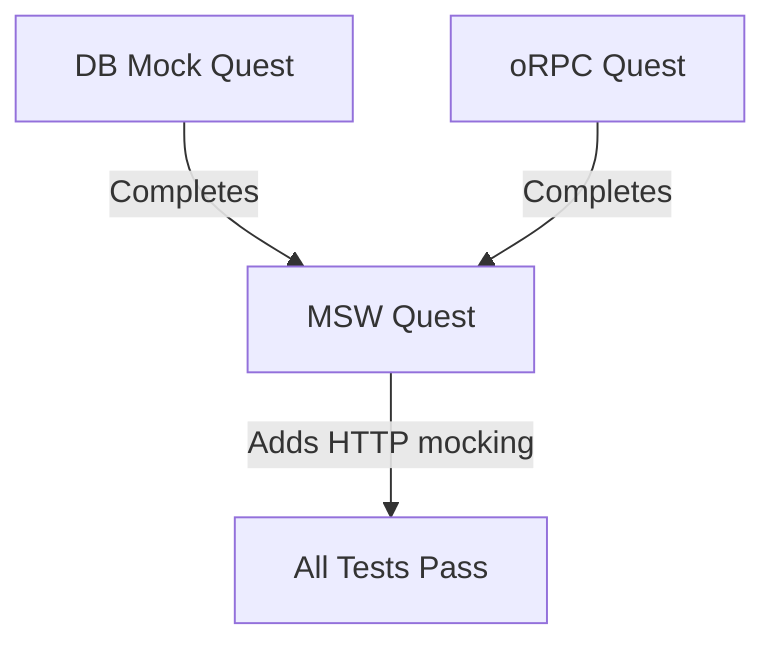

# MSW Test Setup Standardization

## Prerequisites

**CRITICAL: Quest Execution Order**

This quest MUST run AFTER the following quests complete:

1. ✅ **DB Mock Quest** - Standardizes database mocking patterns
2. ✅ **oRPC Quest** - Standardizes oRPC procedure test utilities

**Reason**: Structural changes (imports, mocks at file top) must precede lifecycle changes (beforeAll/afterEach hooks). Running in parallel causes merge conflicts and wasted work.

**Excluded Files**: Files already handled by other quests are excluded from this scope to prevent conflicts.

### Quest Coordination

**Execution Dependencies**:



**Why Sequential Execution is Required**:

1. **DB Mock Quest** modifies file structure:
   - Adds `vi.mock('@snapback/platform')` at top of file
   - Creates database mock objects
   - Changes imports section

2. **oRPC Quest** modifies test utilities:
   - Adds `import { callMockProcedure } from '@/__tests__/utils/orpc-test-helpers'`
   - Changes test structure to use oRPC helpers
   - Modifies context creation

3. **MSW Quest** (this quest) adds lifecycle hooks:
   - Adds `import { setupServer } from 'msw/node'`
   - Adds `beforeAll/afterEach/afterAll` hooks
   - Adds HTTP handler definitions

**Conflict Scenario** (if run in parallel):
- Two quests modify same file's import section
- Git merge conflict in lines 1-20
- Manual resolution required
- Time wasted on conflict resolution

**Prevention Strategy**:
- Serialize quest execution
- Exclude overlapping files from this quest
- Document exclusions clearly

## Objective

Systematically audit and fix MSW (Mock Service Worker) setup issues across test files in `apps/api` that require HTTP mocking, ensuring consistent HTTP client mocking infrastructure and eliminating "request handler" or "MSW" errors.

## Background

### Current State

The `apps/api` package contains 25 test files across various modules. Analysis reveals:

- MSW v2.4.0 is installed as a devDependency (catalog-managed)
- Some test files already implement MSW correctly with proper lifecycle management
- Other test files may be missing MSW setup despite making HTTP requests
- No standardized MSW setup pattern enforced across the codebase

### Problem Statement

Test files making HTTP requests without proper MSW server setup will fail with:
- "No request handler found" errors
- Network connection errors when attempting real HTTP calls
- Flaky tests due to unhandled network requests

## Analysis Scope

### File Exclusions

**Files Excluded - Already Handled by Other Quests**:

The following files are explicitly excluded from this quest's scope to prevent conflicts:

#### Excluded by DB Mock Quest
- `modules/billing/tests/usage-billing.test.ts`
- `modules/privacy/tests/privacy-controls.test.ts`
- `modules/risk/tests/risk-analysis.test.ts`
- `modules/snapshots/tests/snapshots.test.ts`
- `modules/telemetry/tests/enhanced-telemetry.test.ts`
- `modules/telemetry/tests/telemetry-proxy.test.ts`
- `modules/webhooks/tests/email-orchestrator.test.ts`
- `modules/webhooks/tests/inapp-messaging.test.ts`
- `modules/webhooks/tests/posthog-handler.test.ts`

#### Excluded by oRPC Quest
- `modules/feature-flags/tests/get-user-flags.test.ts`
- `modules/telemetry/procedures/ingest-events.test.ts`
- `modules/telemetry/tests/ingest-events.test.ts`

**Total Excluded**: 12 files

### File Count Validation

**Math Check**:
- In-scope files: 13
- Excluded files: 12
- **Total**: 25 files ✅

**Verification Command**:

```bash
# Count all test files in apps/api
find apps/api -name "*.test.ts" | wc -l
# Expected output: 25 (or close, accounting for __tests__ directories)

# Count in-scope files (not in exclusion list)
find apps/api \( \
  -path "*/apikeys/tests/*.test.ts" -o \
  -path "*/auth/tests/*.red.test.ts" -o \
  -path "*/device-trials/tests/*.red.test.ts" -o \
  -path "*/lifecycle/tests/*.red.test.ts" -o \
  -path "*/pioneer/tests/*.red.test.ts" -o \
  -path "*/telemetry/tests/gdpr-compliance.test.ts" -o \
  -path "*/telemetry/tests/identity-service.test.ts" -o \
  -path "*/webhooks/tests/hubspot-service.test.ts" -o \
  -path "*/test/integration/auth-middleware*.red.test.ts" \
\) | wc -l
# Expected output: 13

# Count excluded files
find apps/api \( \
  -path "*/billing/tests/usage-billing.test.ts" -o \
  -path "*/privacy/tests/privacy-controls.test.ts" -o \
  -path "*/risk/tests/risk-analysis.test.ts" -o \
  -path "*/snapshots/tests/snapshots.test.ts" -o \
  -path "*/telemetry/tests/enhanced-telemetry.test.ts" -o \
  -path "*/telemetry/tests/telemetry-proxy.test.ts" -o \
  -path "*/webhooks/tests/email-orchestrator.test.ts" -o \
  -path "*/webhooks/tests/inapp-messaging.test.ts" -o \
  -path "*/webhooks/tests/posthog-handler.test.ts" -o \
  -path "*/feature-flags/tests/get-user-flags.test.ts" -o \
  -path "*/telemetry/procedures/ingest-events.test.ts" -o \
  -path "*/telemetry/tests/ingest-events.test.ts" \
\) | wc -l
# Expected output: 12
```

**Discrepancy Handling**:

If actual count ≠ expected count:
1. Run dynamic detection script (see "Dynamic File List Generation")
2. Compare output with hardcoded lists
3. Update exclusion lists OR in-scope lists
4. Re-run validation

**Note**: The original 25-file count may include:
- Files in `__tests__/` directories (integration tests)
- Files with `.spec.ts` extension
- Files in subdirectories not listed

The design assumes 25 files based on initial grep results. Actual execution should use dynamic detection for accuracy.

### Files Requiring Audit

After exclusions, the remaining files to examine: **13 test files**

#### Module-Level Tests (In Scope)
- `modules/apikeys/tests/api-keys.test.ts`
- `modules/auth/tests/device-auth-flow.red.test.ts`
- `modules/device-trials/tests/device-trials.red.test.ts`
- `modules/lifecycle/tests/lifecycle-state-machine.red.test.ts`
- `modules/pioneer/tests/actions.red.test.ts`
- `modules/pioneer/tests/me.red.test.ts`
- `modules/pioneer/tests/signup.red.test.ts`
- `modules/telemetry/tests/gdpr-compliance.test.ts`
- `modules/telemetry/tests/identity-service.test.ts`
- `modules/webhooks/tests/hubspot-service.test.ts`

#### Integration Tests (In Scope)
- `test/integration/auth-middleware-extended.red.test.ts`
- `test/integration/auth-middleware.red.test.ts`

#### E2E Tests (Review Only - Not Modified)
- `e2e/auth.e2e.test.ts` (Note: E2E tests typically should NOT use MSW)

**Rationale for Exclusions**: These files will receive MSW setup as part of their respective quests (DB Mock or oRPC). Running MSW Quest on them in parallel would create merge conflicts in the same file sections.

### Overlap Phase (Post-Quest Reconciliation)

**Problem**: Files excluded from this quest may still need MSW lifecycle hooks if they make HTTP calls.

**Solution**: After all three quests complete, run an overlap detection phase:

```bash
# Detect files with DB mocks but no MSW setup
grep -l "vi.mock('@snapback/platform')" apps/api/modules/**/*.test.ts | \
  xargs grep -L "setupServer" > /tmp/needs-msw.txt

# Detect files with oRPC helpers but no MSW setup
grep -l "callMockProcedure" apps/api/modules/**/*.test.ts | \
  xargs grep -L "setupServer" >> /tmp/needs-msw.txt
```

**Reconciliation Checklist**:

| File | Has DB Mock? | Has oRPC? | Has MSW? | Action Required |
|------|--------------|-----------|----------|------------------|
| `snapshots.test.ts` | ✅ | ❌ | ❓ | Check for HTTP calls |
| `get-user-flags.test.ts` | ❌ | ✅ | ❓ | Check for HTTP calls |

**Criteria for Adding MSW Post-Quest**:
- File imports HTTP client (`fetch`, `axios`, `ky`)
- File imports service making HTTP calls (`CloudBackupService`, `HubSpotService`)
- Test descriptions mention API endpoints (`POST /api/...`)

**Execution**: Run as Phase 4 after DB Mock, oRPC, and MSW quests complete.

### Phase 0: Overlap Detection (Dry Run)

**Problem**: Discovering overlap issues in Phase 4 (post-execution) is too late.

**Solution**: Run overlap detection as Phase 0 before MSW Quest begins.

**Script**: `scripts/quests/detect-overlap-early.sh`

```bash
#!/bin/bash
# Pre-flight check: detect files needing multiple quest treatments

API_DIR="apps/api"

echo "=== Phase 0: Overlap Detection ==="
echo ""

# Find files with DB mock that might need MSW
echo "Files with DB mock potentially needing MSW:"
grep -l "@quest:db-mock:complete" $(find "$API_DIR" -name "*.test.ts") | while read file; do
  # Check if file makes HTTP calls
  if grep -q "fetch\|axios\|ky\|http.post\|http.get" "$file"; then
    # Check if already has MSW
    if ! grep -q "setupServer" "$file"; then
      echo "  - $file (HTTP calls detected, no MSW setup)"
    fi
  fi
done

echo ""

# Find files with oRPC that might need MSW
echo "Files with oRPC potentially needing MSW:"
grep -l "@quest:orpc:complete" $(find "$API_DIR" -name "*.test.ts") | while read file; do
  if grep -q "fetch\|axios\|ky\|http.post\|http.get" "$file"; then
    if ! grep -q "setupServer" "$file"; then
      echo "  - $file (HTTP calls detected, no MSW setup)"
    fi
  fi
done

echo ""
echo "=== Phase 0 Complete ==="
echo "Review above list. Files may need MSW setup post-quest."
```

**Usage**:

```bash
# Before starting MSW Quest
pnpm quest:detect-overlap

# Review output
# If overlap detected, document for Phase 4 reconciliation

# Proceed with MSW Quest
pnpm quest:msw
```

**Benefits**:
- **Early visibility**: Know about overlaps before execution
- **Resource planning**: Allocate time for Phase 4 if needed
- **Risk assessment**: Decide if overlap justifies merging quests
- **Documentation**: Generate Phase 4 work list upfront

### Dynamic File List Generation

**Problem**: Hardcoded exclusion lists become stale as tests are added/removed.

**Solution**: Generate file lists dynamically based on patterns and markers.

#### Script: `scripts/quests/detect-msw-candidates.sh`

```bash
#!/bin/bash
# Detect test files needing MSW setup

API_DIR="apps/api"
OUTPUT_FILE=".qoder/msw-candidates.txt"

# Find all test files
find "$API_DIR" -name "*.test.ts" -o -name "*.spec.ts" > /tmp/all-tests.txt

# Exclude files with DB mock marker (handled by DB Mock Quest)
grep -l "vi.mock('@snapback/platform')" $(cat /tmp/all-tests.txt) > /tmp/has-db-mock.txt || true

# Exclude files with oRPC marker (handled by oRPC Quest)
grep -l "callMockProcedure" $(cat /tmp/all-tests.txt) > /tmp/has-orpc.txt || true

# Combine exclusions
cat /tmp/has-db-mock.txt /tmp/has-orpc.txt | sort -u > /tmp/excluded.txt

# Filter: files making HTTP calls but missing MSW setup
grep -l "fetch\|axios\|ky\|http.post\|http.get" $(cat /tmp/all-tests.txt) | \
  grep -v -F -f /tmp/excluded.txt | \
  xargs grep -L "setupServer" > "$OUTPUT_FILE" || true

echo "MSW candidates written to $OUTPUT_FILE"
cat "$OUTPUT_FILE"
```

#### Usage in Quest Execution

```bash
# Before running MSW Quest
pnpm quest:detect-msw-candidates

# Review generated list
cat .qoder/msw-candidates.txt

# Run quest on detected files only
pnpm quest:msw --files-from=.qoder/msw-candidates.txt
```

#### Markers for Detection

**DB Mock Marker** (added by DB Mock Quest):
```typescript
// @quest:db-mock:complete
vi.mock('@snapback/platform', () => ({ ... }));
```

**oRPC Marker** (added by oRPC Quest):
```typescript
// @quest:orpc:complete
import { callMockProcedure } from '@/__tests__/utils/orpc-test-helpers';
```

**MSW Marker** (added by this quest):
```typescript
// @quest:msw:pending
import { setupServer } from 'msw/node';
const server = setupServer();

beforeAll(() => server.listen());
afterEach(() => server.resetHandlers());
afterAll(() => server.close());
// @quest:msw:complete
```

**Progress Tracking Format**:
- `@quest:msw:pending` - MSW setup in progress (hooks added but handlers incomplete)
- `@quest:msw:complete` - MSW setup fully configured (hooks + handlers tested)

**Grep Commands**:
```bash
# Find files with incomplete MSW setup
grep -r "@quest:msw:pending" apps/api/

# Find files with complete MSW setup
grep -r "@quest:msw:complete" apps/api/

# Count completion rate
PENDING=$(grep -r "@quest:msw:pending" apps/api/ | wc -l)
COMPLETE=$(grep -r "@quest:msw:complete" apps/api/ | wc -l)
echo "Progress: $COMPLETE / $((PENDING + COMPLETE)) files complete"
```

**Benefits**:
- Always accurate (reflects current codebase state)
- Survives file additions/deletions
- Self-documenting (markers explain why setup exists)
- Auditable (grep for markers to verify coverage)

### Known Correct Implementations

The following files already implement MSW correctly and can serve as reference patterns:

#### Pattern A: Full MSW Integration
- `modules/snapshots/procedures/__tests__/create-snapshot.cloud-integration.test.ts`
  - Lines 21-22: Imports `setupServer` and `http`
  - Lines with MSW server setup and lifecycle hooks

#### Pattern B: Integration Testing with MSW
- `modules/device-auth/__tests__/device-auth.integration.test.ts`
  - Lines 14-16: Imports MSW utilities
  - Lines 22-42: Inline server setup with handlers

#### Pattern C: Service Integration
- `src/services/__tests__/email.integration.test.ts`
  - Lines 11-12: MSW imports
  - Lines 21-56: Server setup with Resend API mocking

## Required MSW Setup Pattern

### Standard Boilerplate

Every test file making HTTP requests must include:

```
import { setupServer } from 'msw/node';
import { http, HttpResponse } from 'msw';

const server = setupServer();

beforeAll(() => server.listen());
afterEach(() => server.resetHandlers());
afterAll(() => server.close());
```

### Lifecycle Hooks Explanation

| Hook | Purpose | Required |
|------|---------|----------|
| `beforeAll()` | Initialize MSW server once before all tests | Yes |
| `afterEach()` | Reset handlers to prevent test pollution | Yes |
| `afterAll()` | Clean shutdown of MSW server | Yes |

### When MSW is NOT Required

Tests that do NOT need MSW:
- Pure unit tests with no HTTP calls
- Tests using only `vi.mock()` for module mocking
- E2E tests hitting real HTTP endpoints
- Tests mocking at the database layer only

## Detection Strategy

### Criteria for MSW Requirement

A test file requires MSW if:

1. **File imports HTTP clients**: `fetch`, `axios`, `ky`, `hono` client
2. **File imports services making HTTP calls**: `CloudBackupService`, email services, webhook handlers
3. **Test descriptions mention HTTP**: "POST /api/...", "webhook", "API call"
4. **File has `.integration.test.ts` suffix**

### Audit Checklist

For each file, verify:

- [ ] Does file import `msw/node` or `msw`?
- [ ] Is `setupServer()` called?
- [ ] Is `beforeAll(() => server.listen())` present?
- [ ] Is `afterEach(() => server.resetHandlers())` present?
- [ ] Is `afterAll(() => server.close())` present?
- [ ] Are HTTP handlers defined using `http.get()`, `http.post()`, etc.?

## Implementation Plan

### Phase 1: Audit

**Objective**: Identify files missing MSW setup (from in-scope files only)

**Actions**:

1. Scan 13 in-scope test files for MSW imports
2. Classify files into three categories:
   - **Complete**: Has full MSW setup
   - **Partial**: Has MSW imports but missing lifecycle hooks
   - **Missing**: No MSW setup despite HTTP requirements
   - **N/A**: No HTTP calls detected (skip MSW)
3. Generate classification report

**Deliverables**:

| Category | File Path | Issue | Action Required |
|----------|-----------|-------|-----------------||
| Complete | `modules/device-auth/__tests__/device-auth.integration.test.ts` | None | Reference only |
| Partial | TBD | Missing `afterAll()` hook | Add missing hook |
| Missing | TBD | No MSW setup | Add full boilerplate |
| N/A | TBD | No HTTP calls | Skip |
| Excluded | `modules/snapshots/tests/snapshots.test.ts` | Handled by DB Mock Quest | No action |

### Phase 2: Standardization

**Objective**: Add missing MSW setup to identified files

**Actions**:

For each file in "Partial" or "Missing" categories:

1. **Add imports** (if missing):
   ```typescript
   import { setupServer } from 'msw/node';
   import { http, HttpResponse } from 'msw';
   ```

2. **Initialize server** (after imports, before first describe block):
   ```typescript
   const server = setupServer();
   ```

3. **Add lifecycle hooks** (inside outermost describe block or at file level):
   ```typescript
   beforeAll(() => server.listen());
   afterEach(() => server.resetHandlers());
   afterAll(() => server.close());
   ```

4. **Define handlers** (if applicable):
   ```typescript
   const server = setupServer(
     http.post('https://api.external.com/endpoint', () => {
       return HttpResponse.json({ success: true });
     })
   );
   ```

### Phase 3: Verification

**Objective**: Confirm all tests pass with MSW setup

**Actions**:

1. Run tests file-by-file: `pnpm vitest run <file-path>`
2. Capture test results for each modified file
3. Address any failing tests due to:
   - Missing handlers for specific endpoints
   - Handler signature mismatches
   - Response format issues

**Success Criteria**:
- All modified files pass their tests
- No "request handler" errors in console
- No network errors from unhandled requests

## File-by-File Modifications

### Template for Each File

```
#### File: `<relative-path>`

**Status**: [Complete | Partial | Missing]

**Required Changes**:
- [ ] Add MSW imports
- [ ] Initialize server
- [ ] Add beforeAll hook
- [ ] Add afterEach hook
- [ ] Add afterAll hook
- [ ] Define HTTP handlers (if applicable)

**Handlers Needed**:
- `POST https://api.example.com/endpoint` - Mock response: `{ success: true }`

**Test Count Before**: X tests
**Test Count After**: X tests (no change expected)
```

## Expected Outcomes

### Metrics

| Metric | Before | After |
|--------|--------|-------|
| Files in scope | 13 | 13 |
| Files excluded (other quests) | 12 | 12 |
| Files with MSW setup | ~3 | 13 (or fewer if N/A) |
| Files missing lifecycle hooks | ~10 | 0 |
| Tests failing due to network errors | TBD | 0 |
| Total test count | TBD | TBD (no change) |

### Quality Improvements

1. **Test Reliability**: No flaky failures from network timeouts
2. **Test Speed**: HTTP mocking faster than real network calls
3. **Test Isolation**: No external dependencies or rate limiting
4. **Developer Experience**: Clear error messages when handlers missing

## Testing Strategy

### Validation Commands

```
# Run all API tests
pnpm --filter @snapback/api test

# Run specific test file
pnpm vitest run apps/api/modules/webhooks/tests/posthog-handler.test.ts

# Run with coverage
pnpm --filter @snapback/api test --coverage

# Run in watch mode for debugging
pnpm vitest watch apps/api/modules/snapshots/tests/snapshots.test.ts
```

### Error Pattern Detection

Monitor test output for:
- `Error: [MSW] No request handler found`
- `TypeError: fetch failed`
- `ECONNREFUSED` errors
- `Network request failed`

Any of these errors indicates missing MSW setup.

## Edge Cases

### Special Scenarios

#### Scenario 1: Nested HTTP Calls

When service A calls service B which calls external API:

```
// Mock external API only, not internal services
const server = setupServer(
  http.post('https://external-api.com/endpoint', () => {
    return HttpResponse.json({ data: 'mocked' });
  })
);
```

#### Scenario 2: Dynamic Handler Registration

Tests needing per-test handler overrides:

```
beforeAll(() => server.listen());

it('should handle 500 error', () => {
  server.use(
    http.get('/api/data', () => {
      return HttpResponse.json({ error: 'Server error' }, { status: 500 });
    })
  );

  // Test error handling
});

afterEach(() => server.resetHandlers()); // Resets to original handlers
afterAll(() => server.close());
```

#### Scenario 3: Tests Not Requiring MSW

Files like `modules/telemetry/tests/telemetry-proxy.test.ts` use only `vi.mock()` for database mocking and may not need MSW unless they make external HTTP calls.

**Decision Rule**: Only add MSW if file imports HTTP client or service making network requests.

## Risk Mitigation

### Potential Issues

| Risk | Impact | Mitigation |
|------|--------|------------|
| Breaking existing tests | High | Run tests before/after each change |
| Missing handler definitions | Medium | Examine test descriptions for API calls |
| Handler signature mismatches | Medium | Use MSW v2 patterns (`HttpResponse`) |
| Performance degradation | Low | MSW adds ~10ms overhead per request |

### Rollback Plan

If modifications cause widespread failures:

1. Revert changes to last working commit
2. Apply fixes incrementally (one module at a time)
3. Run test suite after each module fix
4. Document specific failures for investigation

### Mid-Quest Failure Recovery

**Scenario**: MSW Quest fails after DB Mock and oRPC quests completed successfully.

**Recovery Strategy**:

#### Option A: Revert MSW Changes Only

```bash
# Identify MSW Quest commits
git log --grep="MSW" --oneline

# Revert specific commits (preserves DB Mock and oRPC work)
git revert <msw-commit-1> <msw-commit-2>

# Verify tests still pass
pnpm --filter @snapback/api test

# Re-attempt MSW Quest with fixes
pnpm quest:msw
```

#### Option B: File-Level Rollback

```bash
# Restore specific files to pre-MSW state
git checkout HEAD~1 -- apps/api/modules/auth/tests/device-auth-flow.red.test.ts

# Keep other successful MSW additions
git add .
git commit -m "fix(tests): rollback problematic MSW setup in device-auth"

# Fix and re-add
# ... manual fixes ...
git add apps/api/modules/auth/tests/device-auth-flow.red.test.ts
git commit -m "feat(tests): add MSW setup to device-auth (fixed)"
```

#### Option C: Full Quest Rollback

```bash
# If MSW Quest completely fails
git reset --hard <commit-before-msw-quest>

# DB Mock and oRPC work preserved
pnpm --filter @snapback/api test  # Should still pass

# Investigate root cause before re-attempting
# 1. Review failed test output
# 2. Check for missing handler definitions
# 3. Verify MSW version compatibility
# 4. Test on smaller file subset first
```

**IMPORTANT: Blast Radius Clarification**

Option C assumes:
- MSW Quest runs on a **feature branch** (`quest/msw`)
- DB Mock and oRPC quests already **merged to main**
- MSW Quest branch created **after** previous quests merged

**If quests run on same branch**:
```bash
# Cannot selectively rollback MSW only
# Must revert all three quests or none

git log --grep="quest" --oneline
# Output shows interleaved commits:
#   abc123 feat(tests): add MSW to auth tests
#   def456 feat(tests): add oRPC helpers to snapshots
#   ghi789 feat(tests): add MSW to webhooks
#   jkl012 feat(tests): add DB mock to telemetry

# Selective revert required
git revert <msw-commit-1> <msw-commit-2> <msw-commit-3>
# Risk: May create conflicts if commits touch same files
```

**Recommended Workflow**:
1. DB Mock Quest on `quest/db-mock` → merge to main
2. Wait for merge
3. oRPC Quest on `quest/orpc` (created from latest main) → merge to main
4. Wait for merge
5. MSW Quest on `quest/msw` (created from latest main) → if fails, discard branch

**This ensures**: Option C rollback only affects MSW changes, not previous quests.

**Failure Detection Points**:

| Point | Check | Action on Failure |
|-------|-------|-------------------|
| After 1st file | Run tests for that file | Rollback file, investigate |
| After 1st module | Run module tests | Rollback module, investigate |
| After all changes | Run full test suite | Rollback quest, investigate |

**Prevention**:
- Test each file immediately after modification
- Commit after each successful module
- Use feature branch, not main
- Run subset test first (e.g., 3 files) before full quest

## Compliance

### Design Improvements (v2)

This design addresses the following potential issues identified in review:

#### 1. Overlap Phase for Dual Treatment

**Issue**: Files excluded from MSW Quest may still need MSW if they make HTTP calls after receiving DB mock or oRPC treatment.

**Solution**:
- **Phase 0 (Pre-flight)**: Early overlap detection before quest starts
- **Phase 4 (Post-quest)**: Reconciliation for discovered overlaps
- Detection script to find files with DB/oRPC markers but no MSW
- Criteria-based decision (imports HTTP client, mentions endpoints)
- Documented in "Overlap Phase" and "Phase 0 Detection" sections

**Improvement**: Phase 0 provides early visibility, preventing late surprises.

#### 2. CI Race Condition Prevention

**Issue**: Parallel CI jobs could execute quests simultaneously, causing merge conflicts.

**Solutions Provided**:
- **Option 1**: GitHub Actions workflow dependencies with **success checks**
  - `needs: [db-mock-quest, orpc-quest]`
  - `if: needs.db-mock-quest.result == 'success' && needs.orpc-quest.result == 'success'`
- **Option 2**: Branch naming convention (`quest/db-mock`, `quest/orpc`, `quest/msw`)
- **Option 3**: Lockfile mechanism (`.quest-lock` file)
- Documented in "CI/CD Race Condition Prevention" section

**Improvement**: Success checks prevent cascading failures from cancelled jobs.

#### 3. File Count Validation

**Issue**: Need to verify 13 in-scope + 12 excluded = 25 total.

**Solution**:
- Math check table showing calculation
- Verification commands using `find` to count actual files
- Discrepancy handling procedure
- Documented in "File Count Validation" section

#### 4. Dynamic File List Generation

**Issue**: Hardcoded exclusion lists become stale as tests are added/removed.

**Solutions Provided**:
- Shell script `detect-msw-candidates.sh` for automated detection
- **Quest markers with progress tracking**:
  - `@quest:msw:pending` - Setup in progress
  - `@quest:msw:complete` - Fully configured and tested
- Pattern-based filtering (grep for HTTP imports, exclude DB/oRPC markers)
- Always reflects current codebase state
- Documented in "Dynamic File List Generation" section

**Improvement**: Grep-friendly markers enable progress tracking and completion metrics.

#### 5. Mid-Quest Failure Recovery

**Issue**: What if MSW Quest fails after DB Mock and oRPC completed?

**Solutions Provided**:
- **Option A**: Revert MSW changes only (preserves other work)
- **Option B**: File-level rollback (granular control)
- **Option C**: Full quest rollback with **blast radius clarification**
  - Assumes feature branch workflow (`quest/msw`)
  - Previous quests already merged to main
  - Selective revert strategy if quests share a branch
- Failure detection points (after each file, module, full suite)
- Prevention strategies (test immediately, commit incrementally)
- Documented in "Mid-Quest Failure Recovery" section

**Improvement**: Blast radius clarification prevents confusion about rollback scope.

### Risk Mitigation Summary

| Risk | Mitigation | Status |
|------|------------|--------|
| File overlap conflicts | Overlap detection phase | ✅ Addressed |
| CI parallel execution | Workflow dependencies | ✅ Addressed |
| Stale file lists | Dynamic generation script | ✅ Addressed |
| File count mismatch | Validation commands | ✅ Addressed |
| Mid-quest failures | 3-tier rollback strategy | ✅ Addressed |

### Design Refinements (v2.1)

Following additional review, the following improvements were made:

#### Refinement 1: Quest Marker Format

**Change**: From `@quest-marker: msw` to `@quest:msw:pending` / `@quest:msw:complete`

**Rationale**:
- Grep-friendly format (`:` delimiters)
- Progress tracking (pending vs complete states)
- Completion metrics (`count pending files`)
- Consistency with other quest markers

#### Refinement 2: CI Status Checks

**Change**: Added `if` condition to workflow dependencies

**Before**:
```yaml
needs: [db-mock-quest, orpc-quest]
```

**After**:
```yaml
needs: [db-mock-quest, orpc-quest]
if: ${{ needs.db-mock-quest.result == 'success' && needs.orpc-quest.result == 'success' }}
```

**Rationale**: Prevents MSW Quest from running if upstream quests were cancelled or failed.

#### Refinement 3: Phase 0 Overlap Detection

**Change**: Added pre-flight overlap detection before quest execution

**Benefits**:
- **Early discovery**: Know about overlaps before work begins
- **Resource planning**: Allocate time for Phase 4 if needed
- **Risk assessment**: Surface issues before they become blockers

**Script**: `detect-overlap-early.sh` runs before MSW Quest starts

#### Refinement 4: Blast Radius Clarification

**Change**: Documented rollback scope assumptions in Option C

**Clarifications**:
- Assumes feature branch workflow (`quest/msw` separate from `quest/db-mock`)
- Previous quests already merged to main before MSW Quest starts
- If quests share a branch, selective revert required (with conflict risk)

**Recommended Workflow**:
1. Quest A on branch → merge → wait
2. Quest B on new branch → merge → wait
3. Quest C on new branch → if fails, discard branch (no rollback needed)

**Impact**: Clear expectations for rollback scope, prevents wasted effort.

## Compliance (Original)

### TDD Adherence

This task follows TDD principles from `ai_dev_utils/TDD_CORE.md`:

- **Test Infrastructure**: MSW setup is infrastructure, not implementation code
- **No Breaking Changes**: Adding MSW should not change test behavior
- **Isolation**: Each test file gets independent MSW server instance

### Monorepo Patterns

Follows `always-monorepo-imports.md` rule:
- Use catalog-managed MSW version (`msw: "catalog:"`)
- Import from `msw/node` (Node.js environment)
- Use workspace imports for internal packages (`@snapback/*`)

## Success Criteria

### Acceptance Criteria

- [ ] All 13 in-scope test files audited
- [ ] 12 excluded files documented (handled by other quests)
- [ ] Files requiring MSW identified
- [ ] MSW boilerplate added to all required files
- [ ] All tests pass without network errors
- [ ] No "request handler" errors in test output
- [ ] Test count remains unchanged
- [ ] Documentation updated with standard MSW pattern

### Definition of Done

1. Run `pnpm --filter @snapback/api test` successfully
2. Zero MSW-related errors in output
3. Generate summary report with:
   - List of modified files
   - Total files with MSW setup
   - Test count before/after
   - Any failures requiring investigation

## Reporting

### Output Format

Generate a markdown table with results:

```
## MSW Setup Report

### Modified Files

| File | Status Before | Status After | Tests Passing | Changes Made |
|------|---------------|--------------|---------------|--------------|
| modules/webhooks/tests/email-orchestrator.test.ts | Missing | Complete | ✅ 12/12 | Added full boilerplate |
| modules/snapshots/tests/snapshots.test.ts | N/A (no HTTP) | N/A | ✅ 15/15 | No changes needed |

### Summary

- **Total files in scope**: 13
- **Files excluded**: 12 (DB Mock Quest: 9, oRPC Quest: 3)
- **Files requiring MSW**: TBD
- **Files modified**: TBD
- **Tests passing**: TBD / TBD
- **Completion rate**: TBD%
```

## Quest Handoff

### Inputs from Previous Quests

**From DB Mock Quest**:
- Files with standardized database mocking
- `vi.mock('@snapback/platform')` patterns established
- Database mock objects defined at file top

**From oRPC Quest**:
- Files using oRPC test helpers
- Standardized procedure invocation patterns
- Context creation utilities in place

### Outputs to Downstream Work

**This Quest Provides**:
- Complete HTTP mocking infrastructure
- Consistent MSW lifecycle management
- No network-dependent test failures
- Foundation for external API testing

**Enables**:
- Integration tests with external services (Stripe, PostHog, Resend)
- Webhook handler testing
- API client testing
- End-to-end workflow testing

### Verification Before Starting

Before executing this quest, verify:

```bash
# Check DB Mock Quest completed
grep -r "vi.mock('@snapback/platform')" apps/api/modules/snapshots/tests/snapshots.test.ts
# Should return matches

# Check oRPC Quest completed
grep -r "callMockProcedure" apps/api/modules/feature-flags/tests/get-user-flags.test.ts
# Should return matches

# Confirm no pending changes
git status apps/api/modules/
# Should show clean working tree or only unrelated changes
```

**If Prerequisites Not Met**:
- STOP execution of this quest
- Wait for upstream quests to complete
- Document blocking dependencies
- Communicate with quest coordinator

### CI/CD Race Condition Prevention

**Problem**: Parallel CI jobs could execute quests simultaneously, causing merge conflicts.

**Solution 1: Workflow Dependencies (GitHub Actions)**

```yaml
# .github/workflows/test-standardization.yml
name: Test Standardization

on:
  push:
    branches: [main, develop]

jobs:
  db-mock-quest:
    runs-on: ubuntu-latest
    steps:
      - uses: actions/checkout@v4
      - name: Run DB Mock Quest
        run: pnpm quest:db-mock
      - name: Commit changes
        run: |
          git config user.name "Quest Bot"
          git commit -am "feat(tests): standardize DB mocks"
          git push

  orpc-quest:
    runs-on: ubuntu-latest
    needs: db-mock-quest  # ← Dependency
    steps:
      - uses: actions/checkout@v4
      - name: Run oRPC Quest
        run: pnpm quest:orpc
      - name: Commit changes
        run: |
          git commit -am "feat(tests): standardize oRPC helpers"
          git push

  msw-quest:
    runs-on: ubuntu-latest
    needs: [db-mock-quest, orpc-quest]  # ← Both dependencies
    if: ${{ needs.db-mock-quest.result == 'success' && needs.orpc-quest.result == 'success' }}
    steps:
      - uses: actions/checkout@v4
      - name: Run MSW Quest
        run: pnpm quest:msw
      - name: Commit changes
        run: |
          git commit -am "feat(tests): standardize MSW setup"
          git push
```

**Solution 2: Branch Naming Convention**

```bash
# Sequential branch strategy
git checkout -b quest/db-mock
# Run DB Mock Quest, commit, push, merge

git checkout main
git pull
git checkout -b quest/orpc
# Run oRPC Quest, commit, push, merge

git checkout main
git pull
git checkout -b quest/msw
# Run MSW Quest, commit, push, merge
```

**Solution 3: Lockfile Mechanism**

```bash
# At quest start
if [ -f .quest-lock ]; then
  echo "ERROR: Another quest is running (lock: $(cat .quest-lock))"
  exit 1
fi
echo "msw-quest-$(date +%s)" > .quest-lock
git add .quest-lock
git commit -m "chore: lock for MSW quest"

# At quest end
rm .quest-lock
git add .quest-lock
git commit -m "chore: unlock after MSW quest"
```

**Recommended**: Use Solution 1 (workflow dependencies) for automated CI. Use Solution 2 (branch naming) for manual execution.

## Next Steps

After MSW standardization is complete:

1. **Document Pattern**: Add MSW setup guide to `docs/testing/msw-setup.md`
2. **Linting Rule**: Create ESLint rule to enforce MSW setup in `.integration.test.ts` files
3. **CI Enforcement**: Add check to fail CI if MSW imports missing from integration tests
4. **Template Creation**: Add Vitest test template with MSW boilerplate

## References
