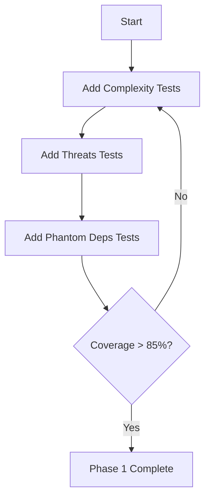
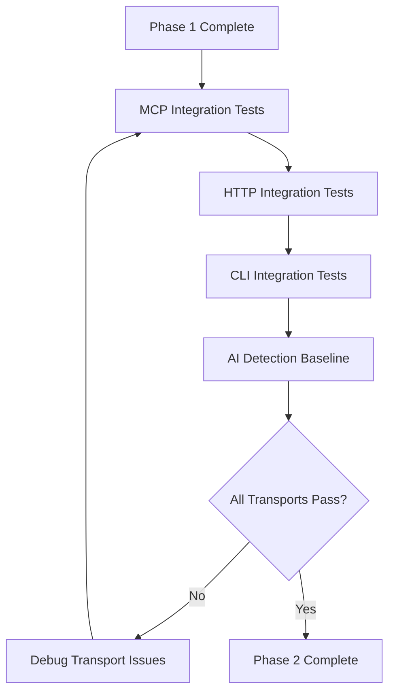
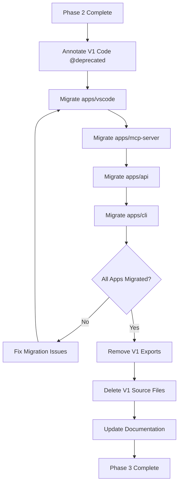

# V2 Engine Code Review - Task Design

**Design Date:** 2025-12-16
**Task Type:** TESTING + REFACTORING
**Priority:** P2 (Pre-Merge Validation)
**Context:** Multi-package (engine, MCP, API, CLI)
**Estimated Effort:** 3-5 days

---

## Task Classification

Based on ROUTER.md analysis, this code review encompasses three distinct work streams:

| Work Stream | Task Type | Workflow | Priority | Effort |
|-------------|-----------|----------|----------|--------|
| Test Coverage Parity | TESTING | `6_test.md` | P2 | 2-3 days |
| V1 Artifact Removal | REFACTORING | `5_refactor.md` | P3 | 1-2 days |
| Integration Verification | TESTING | `6_test.md` | P2 | 0.5 days |

**Routing Decision:**
- Primary workflow: `workflows/6_test.md` (Pure Testing)
- Secondary workflow: `workflows/5_refactor.md` (Code Cleanup)
- No research needed (gaps already identified)
- No planning needed (design already complete per MIGRATION.md)

---

## Strategic Objectives

### Primary Goal
Achieve 100% behavioral parity between V1 Guardian and V2 Engine through comprehensive test coverage, ensuring no regressions before V1 deprecation.

### Success Criteria

| Criterion | Current | Target | Measurement |
|-----------|---------|--------|-------------|
| Test Coverage (Signals) | 72.86% | 90%+ | Vitest coverage report |
| Test Coverage (Validators) | 50.91% | 85%+ | Vitest coverage report |
| V1 Capability Parity | Unknown | 100% | All V1 test cases migrated |
| Integration Tests | 0 | 15+ | Transport adapter tests |
| V1 Code Removed | 0% | 100% | Grep for deprecated patterns |

---

## Work Breakdown Structure

### Stream 1: Test Coverage Parity (P2, 2-3 days)

#### 1.1 Complexity Signal Tests

**Current State:** Basic complexity tests exist, but V1 Guardian methods lack coverage

**Required Tests:**

| V1 Method | V2 Signal | Test Cases Needed | Priority |
|-----------|-----------|-------------------|----------|
| `Guardian.countFunctions()` | `complexity.ts` | Arrow, regular, class methods | HIGH |
| `Guardian.calculateMaxNestingDepth()` | `complexity.ts` | Flat code, nested if, mixed nesting | HIGH |
| `Guardian.findLargeFunctions()` | `complexity.ts` | 50+ line threshold | HIGH |
| `Guardian.calculateComplexity()` | `complexity.ts` | Cyclomatic complexity edge cases | MEDIUM |

**Acceptance Criteria:**
- All V1 `Guardian` complexity methods have equivalent V2 test coverage
- Test cases validate same thresholds (50 lines for large functions, etc.)
- Edge cases covered: empty files, single-line functions, deeply nested blocks

**Test Location:** `packages/engine/test/signals/complexity.test.ts`

**Test Pattern:**
```typescript
describe('V1 Guardian Parity - Complexity', () => {
  describe('countFunctions', () => {
    // Test case: Arrow functions counted correctly
    // Test case: Regular functions counted correctly
    // Test case: Class methods counted correctly
    // Test case: Empty file returns 0
  });

  describe('calculateMaxNestingDepth', () => {
    // Test case: Flat code returns 0
    // Test case: Nested if statements
    // Test case: Mixed for/while/if nesting
    // Test case: Switch statement nesting
  });

  describe('findLargeFunctions', () => {
    // Test case: Function exactly 50 lines (should NOT flag)
    // Test case: Function 51 lines (should flag)
    // Test case: Multiple large functions detected
    // Test case: Arrow function size detection
  });
});
```

---

#### 1.2 Threats Signal Tests

**Current State:** Basic threat detection exists, but V1 plugin coverage missing

**Required Tests:**

| V1 Plugin | V2 Signal | Pattern Categories | Priority |
|-----------|-----------|-------------------|----------|
| `SecretDetectionPlugin` | `threats.ts` | AWS keys, GitHub tokens, OpenAI keys, passwords | CRITICAL |
| `MockReplacementPlugin` | `threats.ts` | jest.mock, vi.mock, sinon.stub | HIGH |
| Destructive Commands | `threats.ts` | rm -rf, DROP TABLE, eval() | CRITICAL |

**Secret Detection Patterns (from V1):**

| Pattern Type | Regex/String | Severity | Example |
|--------------|--------------|----------|---------|
| AWS Access Key | `/AKIA[0-9A-Z]{16}/` | critical | AKIA1234567890123456 |
| GitHub Token | `/ghp_[a-zA-Z0-9]{36}/` | critical | ghp_abcd1234567890 |
| OpenAI Key | `/sk-[a-zA-Z0-9]+/` | critical | sk-proj-abc123 |
| Generic Password | `password` | high | const password = "..." |
| API Key | `api_key`, `apiKey` | high | const api_key = "..." |

**Mock Detection Patterns:**

| Mock Framework | Pattern | Severity | Risk |
|----------------|---------|----------|------|
| Jest | `jest.mock(` | high | Production code with test mocks |
| Vitest | `vi.mock(` | high | Production code with test mocks |
| Sinon | `sinon.stub(`, `sinon.mock(` | high | Production code with test mocks |

**Acceptance Criteria:**
- All V1 secret patterns detected with correct severity
- All V1 mock patterns detected
- Zero false negatives on critical patterns (AWS keys, GitHub tokens)
- Acceptable false positive rate: <5% on medium severity patterns

**Test Location:** `packages/engine/test/signals/threats.test.ts`

**Test Pattern:**
```typescript
describe('V1 Plugin Parity - Threats', () => {
  describe('SecretDetectionPlugin equivalence', () => {
    // Test case: AWS access key detected as critical
    // Test case: GitHub personal access token detected
    // Test case: OpenAI API key detected
    // Test case: Generic password variable detected as high
    // Test case: API key in different naming formats
  });

  describe('MockReplacementPlugin equivalence', () => {
    // Test case: jest.mock in production code flagged
    // Test case: vi.mock in production code flagged
    // Test case: sinon.stub in production code flagged
    // Test case: Mock in test file NOT flagged (false positive check)
  });

  describe('Destructive command detection', () => {
    // Test case: rm -rf detected as critical
    // Test case: DROP TABLE SQL injection detected
    // Test case: eval() code injection detected
    // Test case: innerHTML XSS vector detected
  });
});
```

---

#### 1.3 Phantom Dependencies Tests

**Current State:** Basic import extraction, needs V1 plugin parity validation

**Required Tests:**

| Capability | V1 Plugin Behavior | V2 Signal Requirement | Priority |
|------------|-------------------|----------------------|----------|
| Import extraction | ES6, CommonJS, dynamic imports | Same coverage | HIGH |
| Phantom detection | Missing from package.json | Same logic | HIGH |
| Builtin ignoring | Node.js core modules | Same allowlist | HIGH |
| Typosquatting detection | Levenshtein distance check | New capability (verify) | MEDIUM |

**Acceptance Criteria:**
- All import styles extracted (ES6, CommonJS, dynamic)
- Node.js builtins correctly ignored (fs, path, http, etc.)
- Missing dependencies flagged
- Workspace protocol dependencies handled correctly
- Typosquatting detection validated against known attack vectors

**Test Location:** `packages/engine/test/signals/phantom-deps.test.ts`

**Test Pattern:**
```typescript
describe('V1 Plugin Parity - Phantom Dependencies', () => {
  describe('Import extraction', () => {
    // Test case: ES6 named imports
    // Test case: ES6 default imports
    // Test case: CommonJS require
    // Test case: Dynamic import() statements
    // Test case: Type-only imports (should/should not flag?)
  });

  describe('Phantom detection', () => {
    // Test case: Import missing from dependencies
    // Test case: Import missing from devDependencies
    // Test case: Import present in dependencies (no flag)
    // Test case: workspace:* protocol handling
  });

  describe('Builtin module handling', () => {
    // Test case: Node.js core modules NOT flagged (fs, path, http, etc.)
    // Test case: Non-core module flagged if missing
  });

  describe('Typosquatting detection', () => {
    // Test case: lodash vs lodahs (1 char distance)
    // Test case: react vs raect (transposition)
    // Test case: Known typosquat packages from npm advisories
  });
});
```

---

#### 1.4 AI Detection Validation

**Current State:** Claims 89% accuracy, needs baseline test dataset

**Required Tests:**

| Test Dataset | Source | Expected Accuracy | Priority |
|--------------|--------|------------------|----------|
| Human-written code | SnapBack codebase samples | <10% false positive | HIGH |
| AI-generated code | GPT-4, Claude, Copilot samples | >85% true positive | HIGH |
| Edge cases | Minified, obfuscated, auto-generated | Measured baseline | MEDIUM |

**Acceptance Criteria:**
- Baseline accuracy measured on 100+ code samples
- False positive rate on human code <10%
- True positive rate on AI code >85%
- Performance: <100ms per 1000 LOC analysis

**Test Location:** `packages/engine/test/signals/ai-detection.test.ts`

**Test Pattern:**
```typescript
describe('AI Detection Accuracy Baseline', () => {
  describe('Human code detection (false positive check)', () => {
    // Test case: 50 samples from apps/vscode (expected: <5 flagged)
    // Test case: 50 samples from packages/core (expected: <5 flagged)
  });

  describe('AI code detection (true positive check)', () => {
    // Test case: 50 GPT-4 generated samples (expected: >42 flagged)
    // Test case: 50 Claude generated samples (expected: >42 flagged)
  });

  describe('Edge cases', () => {
    // Test case: Minified code behavior
    // Test case: Auto-generated Prisma client
    // Test case: Migration files
  });

  describe('Performance', () => {
    // Test case: 1000 LOC analyzed in <100ms
  });
});
```

---

### Stream 2: Integration Verification (P2, 0.5 days)

#### 2.1 Transport Adapter Integration Tests

**Current State:** Adapters report as "wired" but lack end-to-end tests

**Required Tests:**

| Transport | Integration Point | Test Scenario | Priority |
|-----------|------------------|---------------|----------|
| MCP | `apps/mcp-server/src/index.ts` | Full analyze request → response | HIGH |
| HTTP | `apps/api/modules/risk/procedures/analyze-risk.ts` | API endpoint → JSON response | HIGH |
| CLI | `apps/cli/src/check.ts` | CLI command → stdout output | HIGH |

**Acceptance Criteria:**
- Each transport executes full analysis pipeline (orchestrator → signals → decision → response)
- Event bus emits correct events during transport operations
- Storage operations persist to correct backend per transport
- Error handling propagates correctly through transport layers

**Test Location:**
- `packages/engine/test/transports/mcp.integration.test.ts`
- `packages/engine/test/transports/http.integration.test.ts`
- `packages/engine/test/transports/cli.integration.test.ts`

**Test Pattern:**
```typescript
describe('MCP Transport Integration', () => {
  it('executes full analysis pipeline', async () => {
    // Given: MCP adapter initialized
    // When: analyze() called with sample code
    // Then:
    //   - Orchestrator invoked
    //   - All 10 signals executed
    //   - Decision engine evaluates
    //   - Events emitted (analysis.started, analysis.completed)
    //   - Response matches schema
  });

  it('propagates errors correctly', async () => {
    // Given: Invalid input code
    // When: analyze() called
    // Then: Error event emitted, structured error response
  });
});
```

---

### Stream 3: V1 Artifact Removal (P3, 1-2 days)

#### 3.1 V1 Code Inventory

**Deprecated Components (to remove after V2 validation):**

| Component | Location | Lines | Dependents | Risk |
|-----------|----------|-------|------------|------|
| `Guardian.ts` | `packages/core/src/` | 850+ | apps/vscode, apps/mcp-server | HIGH |
| `RiskAnalyzer.ts` | `packages/core/src/` | 400+ | Guardian.ts | MEDIUM |
| `SecretDetectionPlugin.ts` | `packages/core/src/plugins/` | 120+ | Guardian.ts | LOW |
| `MockReplacementPlugin.ts` | `packages/core/src/plugins/` | 95+ | Guardian.ts | LOW |
| `PhantomDependencyPlugin.ts` | `packages/core/src/plugins/` | 180+ | Guardian.ts | LOW |
| `BurstDetector.ts` | `packages/core/src/` | 130+ | Guardian.ts | LOW |

**Removal Strategy:**

| Phase | Action | Validation | Rollback Plan |
|-------|--------|-----------|---------------|
| 1. Annotate | Add `@deprecated` JSDoc to all V1 exports | TypeScript warnings visible | N/A |
| 2. Replace Imports | Update all consumers to use V2 engine | Build passes, tests pass | Git revert |
| 3. Remove Exports | Delete from package.json exports | No external imports remain | Restore exports |
| 4. Delete Files | Remove V1 source files | Full test suite passes | Git revert commit |

**Acceptance Criteria:**
- Zero imports of deprecated V1 code in production apps
- All V1 tests migrated to V2 equivalents
- V1 package exports removed from `@snapback/core`
- Documentation updated (API docs, README files)

---

#### 3.2 Dependent App Migrations

**Migration Checklist per App:**

| App | V1 Import Pattern | V2 Replacement | Migration Effort |
|-----|------------------|----------------|------------------|
| apps/vscode | `import { Guardian } from '@snapback/core'` | `import { MCPEngineAdapter } from '@snapback/engine/transports/mcp'` | 2-4 hours |
| apps/mcp-server | `import { Guardian } from '@snapback/core'` | `import { MCPEngineAdapter } from '@snapback/engine/transports/mcp'` | 1-2 hours |
| apps/api | `import { Guardian } from '@snapback/core'` | `import { HTTPEngineAdapter } from '@snapback/engine/transports/http'` | 2-3 hours |
| apps/cli | `import { Guardian } from '@snapback/core'` | `import { CLIEngineAdapter } from '@snapback/engine/transports/cli'` | 1 hour |

**Migration Pattern (per app):**

1. **Replace Import Statements**
   - Change: `import { Guardian } from '@snapback/core'`
   - To: `import { [Transport]EngineAdapter } from '@snapback/engine/transports/[transport]'`

2. **Update Instantiation**
   - Change: `const guardian = new Guardian(config)`
   - To: `const adapter = new [Transport]EngineAdapter(config)`

3. **Update Method Calls**
   - Change: `guardian.analyze(code)`
   - To: `adapter.analyze({ code, context })`

4. **Verify Response Schema**
   - V1 response structure may differ from V2
   - Update response handlers if schema changed

5. **Test Locally**
   - Run app-specific test suite
   - Manual smoke test of core workflows

---

## Execution Sequence

### Phase 1: Test Foundation (Day 1-2)



**Deliverables:**
- 50+ new test cases added
- Validators coverage: 50.91% → 85%+
- Signals coverage: 72.86% → 90%+

---

### Phase 2: Integration Validation (Day 3)



**Deliverables:**
- 15+ integration tests passing
- All 3 transports validated end-to-end
- AI detection baseline measured

---

### Phase 3: V1 Migration & Removal (Day 4-5)



**Deliverables:**
- All apps using V2 engine
- V1 code removed from codebase
- Documentation updated

---

## Risk Assessment

| Risk | Likelihood | Impact | Mitigation |
|------|-----------|--------|------------|
| Test coverage reveals behavioral differences | Medium | High | Add compatibility layer, defer V1 removal |
| Integration tests expose transport bugs | Medium | High | Fix transport issues before V1 removal |
| App migrations introduce regressions | Low | Critical | Incremental migration with rollback points |
| AI detection baseline below 89% claim | Medium | Low | Adjust thresholds, document actual accuracy |
| V1 removal breaks external integrations | Low | Critical | Deprecation warnings, semantic versioning |

---

## Definition of Done

### Stream 1: Test Coverage
- [ ] Complexity signal: 15+ new tests, 90%+ coverage
- [ ] Threats signal: 25+ new tests, all V1 patterns covered
- [ ] Phantom deps: 12+ new tests, 85%+ coverage
- [ ] AI detection: Baseline measured on 100+ samples
- [ ] All validators: 85%+ coverage minimum

### Stream 2: Integration
- [ ] MCP transport: 5+ integration tests passing
- [ ] HTTP transport: 5+ integration tests passing
- [ ] CLI transport: 5+ integration tests passing
- [ ] Event bus: Verified emitting all 15 event types
- [ ] Storage: Verified blob persistence across transports

### Stream 3: V1 Removal
- [ ] All apps migrated to V2 engine adapters
- [ ] Zero V1 imports in production code
- [ ] V1 source files deleted
- [ ] Package exports cleaned (no V1 Guardian export)
- [ ] Documentation updated (API docs, migration guide)

### Overall Quality Gates
- [ ] Full test suite passes (367+ tests)
- [ ] No coverage regressions (maintain 77%+ overall)
- [ ] Build succeeds across all packages
- [ ] No new TypeScript errors introduced
- [ ] Performance baseline maintained (<100ms for 1000 LOC)

---

## Confidence Assessment

**Confidence Level:** Medium

**Key Factors:**

| Factor | Assessment | Rationale |
|--------|-----------|-----------|
| Test scope clarity | High | Specific test cases already identified |
| Implementation risk | Medium | V2 code complete, but behavioral parity unverified |
| Integration complexity | Medium | 3 transports, potential wiring issues |
| V1 removal risk | Low | Straightforward refactoring with clear rollback |
| Timeline feasibility | Medium | 3-5 days realistic if no major bugs found |

**Unknowns:**
- Actual behavioral differences between V1 and V2 (may require V2 fixes)
- Transport integration bugs (may require adapter fixes)
- AI detection true accuracy (claimed 89%, needs validation)
- External dependency on V1 Guardian API (may block removal)

**Recommendation:** Proceed with Phase 1 (test coverage) immediately. Gate Phase 3 (V1 removal) on Phase 2 (integration validation) success.
