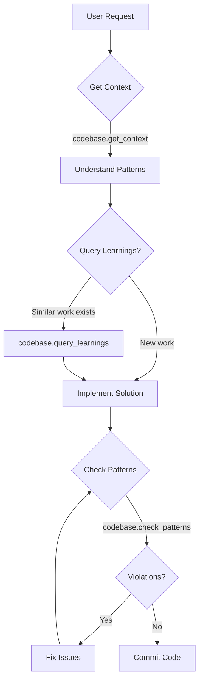

# MCP Tools - Required Before ANY Implementation

**Applies to:** ALL implementation tasks across workspace
**Authority:** Workspace-global (highest priority)
**Enforcement:** CRITICAL - Execute BEFORE any code changes

---

## Core Principle

**NEVER implement code changes without consulting the MCP codebase context tools first.**

The `snapback-internal` MCP server provides architectural intelligence that prevents violations and accelerates development. Using grep or manual pattern searches is **prohibited** when MCP tools are available.

---

## Required MCP Tools (Execute in Order)

### 1. Get Architectural Context

**When:** Before implementing ANY task

```typescript
codebase.get_context({
  task: "description of what you want to implement",
  keywords: ["relevant", "technical", "terms"]
})
```

**Returns:**
- Relevant architectural patterns
- Known constraints for the area
- Past learnings from similar work
- Recent violations to avoid

**Example:**
```typescript
// ✅ CORRECT - Always check context first
codebase.get_context({
  task: "add authentication to MCP server",
  files: ["apps/mcp-server/src/auth.ts"],
  keywords: ["auth", "api-key", "mcp"]
})

// Returns: Use @snapback/auth, avoid custom auth, import patterns, etc.
```

---

### 2. Query Past Learnings

**When:** Implementing features similar to past work

```typescript
codebase.query_learnings({
  keywords: ["pattern", "technology", "feature"]
})
```

**Returns:**
- Patterns discovered in previous sessions
- Pitfalls to avoid
- Efficiency improvements
- Workflow templates

**Example:**
```typescript
// ✅ CORRECT - Learn from past work
codebase.query_learnings({
  keywords: ["vitest", "test", "config"]
})

// Returns: Use @snapback/vitest-config with nodeConfig preset
```

---

### 3. Validate Code Before Committing

**When:** After writing code, BEFORE committing

```typescript
codebase.check_patterns({
  code: "your implementation code",
  filePath: "path/to/file.ts"
})
```

**Returns:**
- List of architectural violations
- Suggestions for fixes
- Pattern compliance status

**Example:**
```typescript
// ✅ CORRECT - Validate before commit
codebase.check_patterns({
  code: "import { db } from '@snapback/infrastructure'",
  filePath: "apps/vscode/src/snapshot.ts"
})

// Returns: VIOLATION - vscode cannot import infrastructure directly
```

---

## Prohibited Patterns

### ❌ Using grep for Patterns

```bash
# ❌ WRONG - Manual grep for patterns
grep -r "vitest.config" packages/
grep -r "@snapback/auth" apps/
```

**Why wrong:**
- Misses architectural context
- Doesn't show violation history
- No learning from past mistakes
- Slower than MCP tools

### ✅ Use MCP Tools Instead

```typescript
// ✅ CORRECT - Query learnings
codebase.query_learnings({ keywords: ["vitest", "config"] })

// ✅ CORRECT - Get context
codebase.get_context({ 
  task: "add vitest config",
  keywords: ["vitest", "testing", "config"]
})
```

---

## Workflow Integration

### Standard Development Flow



### Example: Adding Auth to New Service

```typescript
// Step 1: Get context
codebase.get_context({
  task: "add API key authentication to CLI",
  files: ["apps/cli/src/auth.ts"],
  keywords: ["auth", "api-key", "cli"]
})
// Returns: Use @snapback/auth, verifyApiKey pattern, Result<T,E>

// Step 2: Query learnings
codebase.query_learnings({
  keywords: ["auth", "api-key", "cli"]
})
// Returns: All services use auth.api.verifyApiKey()

// Step 3: Implement
const result = await auth.api.verifyApiKey({ key: apiKey });

// Step 4: Validate
codebase.check_patterns({
  code: `
    import { auth } from "@snapback/auth";
    const result = await auth.api.verifyApiKey({ key: apiKey });
  `,
  filePath: "apps/cli/src/auth.ts"
})
// Returns: ✅ No violations
```

---

## Violation Reporting

### When to Report

After fixing an issue that the MCP tools didn't catch:

```typescript
codebase.report_violation({
  type: "layer-boundary-violation",
  file: "apps/vscode/src/auth.ts",
  whatHappened: "Imported infrastructure directly",
  whyItHappened: "Didn't check layer boundaries",
  prevention: "Use @snapback/core instead"
})
```

**Promotion Thresholds:**
- **1x:** Stored in `violations.jsonl`
- **3x:** Promoted to `patterns/codebase-patterns.md`
- **5x:** Automated detection rule added

---

## MCP Server Configuration

### Workspace Config (`qoder-config.yaml`)

```yaml
mcp:
  servers:
    - name: snapback-internal
      command: "npx"
      args:
        - "-y"
        - "tsx"
        - "/Users/user1/WebstormProjects/SnapBack-Site/ai_dev_utils/mcp/server.ts"
      use_when:
        - "pattern_check"
        - "learning_query"
        - "violation_report"
        - "context_gathering"
```

**Ensures:** MCP tools always available for architectural queries

---

## Performance Benefits

### Without MCP Tools (Old Way)

1. grep codebase manually (30s)
2. Read multiple files (60s)
3. Miss architectural patterns
4. Implement with violations
5. Debug issues (20 min)
6. Refactor to fix (15 min)

**Total:** ~35 minutes + violations introduced

### With MCP Tools (Correct Way)

1. `codebase.get_context()` (2s)
2. `codebase.query_learnings()` (1s)
3. Implement correctly (5 min)
4. `codebase.check_patterns()` (1s)
5. Commit (0 violations)

**Total:** ~5 minutes, zero violations

---

## Available MCP Functions

### Context Functions

| Function | Purpose | When to Use |
|----------|---------|-------------|
| `codebase.get_context()` | Get patterns/constraints/learnings | Before ANY implementation |
| `codebase.query_learnings()` | Search past solutions | When similar work exists |
| `codebase.check_patterns()` | Validate code | Before committing |
| `codebase.report_violation()` | Record new issues | After fixing uncaught violations |
| `codebase.get_violations_summary()` | View violation stats | Understanding common mistakes |
| `codebase.record_learning()` | Save new patterns | After completing complex work |

---

## Real-World Examples

### Example 1: Adding Vitest Config

```typescript
// ✅ CORRECT workflow

// 1. Get context
await codebase.get_context({
  task: "add vitest config to packages/engine",
  keywords: ["vitest", "config", "testing"]
});
// Returns: Use @snapback/vitest-config, nodeConfig preset, mergeConfigs helper

// 2. Query learnings
await codebase.query_learnings({
  keywords: ["vitest", "packages", "config"]
});
// Returns: Standard pattern from 15+ packages

// 3. Implement (no code shown - see pattern in context)

// 4. Validate
await codebase.check_patterns({
  code: vitestConfigCode,
  filePath: "packages/engine/vitest.config.ts"
});
// Returns: ✅ Matches canonical pattern
```

### Example 2: Adding Auth Endpoint

```typescript
// ✅ CORRECT workflow

// 1. Get context
await codebase.get_context({
  task: "add protected API endpoint",
  files: ["apps/api/routes/snapshots.ts"],
  keywords: ["auth", "api", "protected"]
});
// Returns: Use snapbackAuth.requireAuth(), Result<T,E>, logger patterns

// 2. Implement with patterns from context

// 3. Validate
await codebase.check_patterns({
  code: endpointCode,
  filePath: "apps/api/routes/snapshots.ts"
});
// Returns: ✅ No violations
```

---

## Integration with Existing Rules

This rule **enhances** existing always-on rules:

- **`always-better-auth-canonical.md`** → MCP tools will remind you to use `@snapback/auth`
- **`always-monorepo-imports.md`** → MCP tools will catch wrong import patterns
- **`always-result-type-pattern.md`** → MCP tools will suggest Result<T,E> usage
- **`always-code-consolidation.md`** → MCP tools will point to canonical locations

**Think of MCP tools as your architectural guardrails that enforce all other rules.**

---

## Troubleshooting

### "MCP server not found"

**Check:**
1. `qoder-config.yaml` has `snapback-internal` server configured
2. Server path points to correct location: `ai_dev_utils/mcp/server.ts`
3. Run: `pnpm exec tsx ai_dev_utils/mcp/server.ts` to test

### "No patterns found"

**Possible causes:**
1. First time using MCP (expected - record learnings as you work)
2. Keywords too specific (broaden search terms)
3. Try `codebase.get_violations_summary()` to see what's tracked

---

## Best Practices Summary

1. ✅ **Always start with `get_context()`** - understand the landscape
2. ✅ **Query learnings for similar work** - don't reinvent patterns
3. ✅ **Validate before committing** - catch violations early
4. ✅ **Report new violations** - improve detection over time
5. ✅ **Record learnings** - help future work
6. ❌ **Never use grep for patterns** - use MCP tools instead
7. ❌ **Never skip validation** - always check before commit

---

## References

- **MCP Server Implementation:** `ai_dev_utils/mcp/server.ts`
- **Configuration:** `qoder-config.yaml` (lines 84-94)
- **Patterns Directory:** `ai_dev_utils/patterns/`
- **Violations Log:** `ai_dev_utils/state/violations.jsonl`

**Last Updated:** 2025-12-20  
**Priority:** 🔴 CRITICAL - Execute FIRST before any implementation  
**Maintained By:** Architecture team
