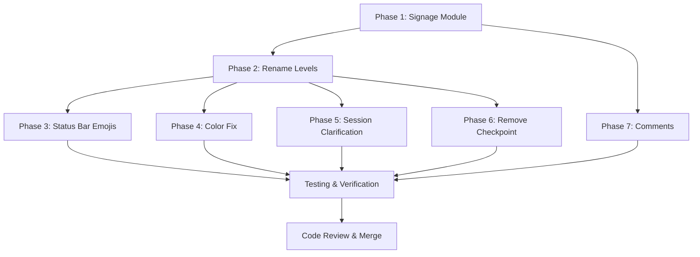

# SnapBack Communication & Signage Audit Report

**Date**: November 24, 2025  
**Scope**: VS Code extension UI, signage consistency, emoji & label inventory  
**Status**: Complete audit, zero code changes

---

## Executive Summary

This audit identifies **emoji and textual signage inconsistencies** across the SnapBack VS Code extension. The codebase exhibits:

- **Multiple protection level naming schemes** (Watched/Checkpoint, Warning/Guarded, Protected/Strict, Block)
- **Two separate emoji systems** (colored circles 🟢🟡🔴 vs. semantic icons 🛡️⚠️🚨)
- **Three protection level metaphors** in active use (Watch/Warn/Block vs. Checkpoint/Guarded/Strict)
- **Mixed signage concepts** (repo protection status vs. file protection levels, confusion between sessions/snapshots/checkpoints)

**Bottom line**: The UI sends conflicting messages to developers about what protection levels mean and how to interact with them.

---

## 1. Emoji Inventory

| Emoji | String Context | Concept | Location(s) | UI Context | Notes |
|-------|---|---|---|---|---|
| 🟢 | "🟢 Watch (Silent)" | Watched/Checkpoint level | statusBarCommands.ts:82 | QuickPick option | Protection level indicator; green = safe/passive |
| 🟡 | "🟡 Warn (Notify)" | Warning/Guarded level | statusBarCommands.ts:104 | QuickPick option | Protection level indicator; yellow = medium risk |
| 🔴 | "🔴 Block (Required)" | Protected/Strict level | statusBarCommands.ts:127 | QuickPick option | Protection level indicator; red = high risk |
| 🧢 | "🧢 SnapBack Protection Status" | Brand/product | statusBarCommands.ts:209 | QuickPick title | SnapBack hat logo; brand consistency |
| 🧢 | "🧢 SnapBack" | Brand indicator | status-bar.ts:90, 111, 327 | Status bar text | Product identity in minimal display |
| ⭕ | "⭕" (unprotected status) | No protection | SafetyDashboardTreeProvider.ts:236 | Tree view label | Hollow circle = empty/no protection |
| ⚠️ | "⚠️ Blocking Issues" | Critical findings | SafetyDashboardTreeProvider.ts:105 | Tree view section | Warning of critical issues |
| 📊 | "📊 Watch Items" | Monitoring items | SafetyDashboardTreeProvider.ts:111 | Tree view section | Stats/analytics metaphor |
| 📸 | "📸 Snapshots" | Point-in-time saves | SafetyDashboardTreeProvider.ts:117 | Tree view section | Camera metaphor for capture |
| 🛡️ | "🛡️ Protected Files" | File protection state | SafetyDashboardTreeProvider.ts:123 | Tree view section | Shield metaphor; security concept |
| 🛡️ | "🛡 **Block** protection" | File protection | ProtectedFilesTreeProvider.ts:198 | Tooltip (markdown) | Unicode shield in markdown; same as tree section |
| 🕒 | "🕒 Started: ..." | Timestamp | sessionTypes.ts:42 | Session tooltip | Clock for time metadata |
| 📁 | "📁 Files: ..." | File count | sessionTypes.ts:45 | Session tooltip | Folder metaphor for file collections |
| 📝 | "📝 Summary" | Snapshot summary | sessionTypes.ts:51 | Session tooltip | Note/document metaphor |
| 🏷 | "🏷 Tags: ..." | Labels/categories | sessionTypes.ts:55 | Session tooltip | Label metaphor |
| 🛡️ | "🛡" (glyph) | Protected decoration | decorations/constants.ts:41 | File decoration badge | Shield emoji for "protected" health level |
| ⚠️ | "⚠️" (glyph) | Warning decoration | decorations/constants.ts:46 | File decoration badge | Warning emoji for "warning" health level |
| 🚨 | "🚨" (glyph) | Risk decoration | decorations/constants.ts:51 | File decoration badge | Alarm emoji for "risk" health level |
| ✓/✅ | "✓ All good! No blocking issues" | Success state | SafetyDashboardTreeProvider.ts:143 | Placeholder text | Checkmark for success/completion |

### VSCode Icon References ($(name) format)

| Icon | Label | Location(s) | UI Context | Purpose |
|------|---|---|---|---|
| $(list-tree) | "View All Protected Files" | statusBarCommands.ts:155 | QuickPick action | List/explore action |
| $(refresh) | "Refresh Protection Status" | statusBarCommands.ts:165 | QuickPick action | Reload/sync data |
| $(shield) | "Protect Current File" | statusBarCommands.ts:175 | QuickPick action | Protection action |
| $(gear) | "Configure SnapBack" | statusBarCommands.ts:185 | QuickPick action | Settings/config |
| $(book) | "Documentation" | statusBarCommands.ts:198 | QuickPick action | Help/learn |
| $(file) | File item in list | statusBarCommands.ts:265 | QuickPick item icon | File metaphor |
| $(history) | Snapshot/session item | SnapshotsTreeProvider.ts:326, sessionTypes.ts:17 | Tree view item icon | History/past state |
| $(shield) | Protected file | ProtectedFilesTreeProvider.ts:160 | Tree view item icon | Protection metaphor |
| $(eye) | Watch level (implied) | — | — | Watching/monitoring metaphor |
| $(lock) | Protected file (conditional) | SafetyDashboardTreeProvider.ts:351 | Tree view item icon | Lock metaphor for highest protection |
| $(error) | Blocking issue severity | SafetyDashboardTreeProvider.ts:291 | Tree view item icon | Error/critical metaphor |
| $(warning) | Watch item/attention | SafetyDashboardTreeProvider.ts:311 | Tree view item icon | Caution metaphor |
| $(check) | Success state | SafetyDashboardTreeProvider.ts:363 | Placeholder icon | Completion/success |

---

## 2. Text Signage Inventory

### Protection Levels

| Phrase | Concept | Location(s) | Paired Emoji | Variants | Notes |
|---|---|---|---|---|---|
| "Watched" | Level 1: Silent auto-snapshot | views/types.ts:67, protectionCommands.ts | 🟢 | "Checkpoint" (enum), "Watch" (label) | **INCONSISTENCY**: Multiple names for same concept |
| "Watch" | UI display label for Watched | views/types.ts:69, designTokens.ts:132 | 🟢 | "Watched", "Checkpoint" | Short form used in protection level quick-pick |
| "Warning" | Level 2: Notify before save | views/types.ts:75, protectionCommands.ts | 🟡 | "Guarded" (enum), "Warn" (label) | **INCONSISTENCY**: Multiple names for same concept |
| "Warn" | UI display label for Warning | views/types.ts:77, designTokens.ts:133 | 🟡 | "Warning", "Guarded" | Short form used in protection level quick-pick |
| "Protected" | Level 3: Require snapshot | views/types.ts:83, protectionCommands.ts | 🔴 | "Strict" (enum), "Block" (label) | **INCONSISTENCY**: Multiple names for same concept |
| "Block" | UI display label for Protected | views/types.ts:85, statusBarCommands.ts:127 | 🔴 | "Protected", "Strict" | Marketing name differs from internal name |

### Repo Protection Status

| Phrase | Concept | Location(s) | Paired Emoji | Usage Context | Notes |
|---|---|---|---|---|---|
| "Unprotected" | No critical files protected | SafetyDashboardTreeProvider.ts:251 | ⭕ | Status label | Hollow circle metaphor for "empty" |
| "Partially Protected" | Some files protected | SafetyDashboardTreeProvider.ts:253 | 🟡 | Status label | Yellow circle for incomplete/warning |
| "Fully Protected" | All critical files protected | SafetyDashboardTreeProvider.ts:255 | 🟢 | Status label | Green circle for complete/safe |
| "Attention (N)" | Repo has issues needing attention | SafetyDashboardTreeProvider.ts:208 | ⚠️ | Tree view section | **DIFFERS** from file protection status |

### Snapshot/Session/Checkpoint Terminology

| Phrase | Concept | Location(s) | Notes |
|---|---|---|---|
| "Snapshot" | Current standard term | views/types.ts:11, SnapshotManager, SnapshotsTreeProvider | Preferred term; point-in-time save |
| "Session" | Collection of snapshots? | SessionTreeItem, SessionsTreeProvider | Used in views but concept unclear |
| "Checkpoint" | **DEPRECATED** | protectionLevel.ts:24 comment, views/types.ts:28 | Legacy alias for "Watched" level |

### Other Key Signage

| Phrase | Concept | Location(s) | Notes |
|---|---|---|---|
| "Silent" | No user interaction | views/types.ts:70 | Description for Watch level |
| "Notify" | Show confirmation | views/types.ts:78 | Description for Warn level |
| "Required" | Block save without action | views/types.ts:86 | Description for Block level |
| "Blocking Issues" | Critical findings | SafetyDashboardTreeProvider.ts:105 | Section header; implies save blocking |
| "Watch Items" | Items to monitor | SafetyDashboardTreeProvider.ts:111 | Monitoring concept; not blocking |
| "Protected Files" | Files under protection | SafetyDashboardTreeProvider.ts:123 | List of active protected files |

---

## 3. Inconsistencies & Conflicts

### 🔴 Critical Issues

#### 1. **Three Names for Same Protection Levels**
- **Problem**: Developers see "Watched" / "Watch" / "Checkpoint" for the same concept
- **Where**: 
  - `views/types.ts` uses string types: "Watched", "Warning", "Protected"
  - `types/protectionLevel.ts` enum uses: "Checkpoint", "Guarded", "Strict"
  - `designTokens.ts` labels use: "Watch", "Warn", "PROTECTED" (inconsistent casing)
  - `statusBarCommands.ts` uses: "Watch", "Warn", "Block"
- **Impact**: Developers unsure if "Watch", "Watched", and "Checkpoint" refer to the same thing
- **Example**: 
  ```
  // In views/types.ts
  Watched: { label: "Watch", ... }  // ← confusing: property says "Watched", label says "Watch"
  
  // In protectionLevel.ts
  Checkpoint = 1,  // ← legacy name, not mentioned in UI
  
  // In statusBarCommands.ts
  🟢 Watch (Silent)  // ← uses short form
  ```

#### 2. **Conflicting Emoji Systems for File State**
- **Problem**: Two different emoji systems communicate file status
  - **System A** (colored circles): 🟢 🟡 🔴 for protection levels
  - **System B** (semantic icons): 🛡️ ⚠️ 🚨 for file health decorations
- **Where**:
  - Colored circles: `statusBarCommands.ts`, `status-bar.ts`, `designTokens.ts`
  - Semantic icons: `decorations/constants.ts` (🛡️ protected, ⚠️ warning, 🚨 risk)
- **Impact**: Developers see 🟢 in status bar but 🛡️ in file decorations—unclear if same concept
- **Ambiguity**: Does 🛡️ mean "Protected" (file protection) or "Risk Free" (health status)?
- **Example**:
  ```typescript
  // In designTokens.ts (circles)
  icons: {
    Watched: "🟢",
    Warning: "🟡", 
    Protected: "🔴"
  }
  
  // In decorations/constants.ts (semantic)
  protected: { badge: "🛡️", ... },
  warning: { badge: "⚠️", ... },
  risk: { badge: "🚨", ... }
  ```

#### 3. **"Block" vs "Protected" Terminology Mismatch**
- **Problem**: Internal code calls it "Protected"; UI calls it "Block"
- **Where**:
  - Internal: `ProtectionLevel.Strict`, `ProtectionLevel.Protected` (old)
  - UI: `statusBarCommands.ts:127` shows "🔴 Block (Required)"
  - Comments: `protectionCommands.ts:50` mentions "🟢 Watch / 🟡 Warn / 🔴 Block"
- **Impact**: Developers reading code vs. seeing UI get different mental models
- **Why**: "Block" is marketing-friendly; "Protected" is technical

#### 4. **Hollow Circle (⭕) vs Colored Circle (🟡/🔴) Inconsistency**
- **Problem**: "Unprotected" status uses ⭕ (hollow); "Partially Protected" uses 🟡 (same as Warning)
- **Where**: `SafetyDashboardTreeProvider.ts:236-240`
- **Ambiguity**: Is 🟡 meaning "Warning" the same as 🟡 meaning "Partial"?
- **Code**:
  ```typescript
  case "unprotected":
    return "⭕";  // ← hollow circle
  case "partial":
    return "🟡";  // ← yellow circle (same emoji as Warning level!)
  case "complete":
    return "🟢";
  ```

#### 5. **Concept Confusion: "Watch Items" ≠ "Watched Level"**
- **Problem**: "Watch Items" (section in Safety Dashboard) has nothing to do with "Watched" (protection level)
- **Where**:
  - "Watch Items" section: `SafetyDashboardTreeProvider.ts:111` (monitoring/analytics)
  - "Watched" level: `views/types.ts:67` (protection level)
- **Symptom**: "Watch Items" uses 📊 (chart); "Watched" uses 🟢—but concepts are unrelated
- **Impact**: Developer reads "Watch" and misunderstands what "Watch Items" means

#### 6. **Decorations Use "Protected" for File Health, Conflicting with Protection Level**
- **Problem**: `decorations/constants.ts` uses "protected" badge (🛡️) for file health, but we also have "Protected" protection level
- **Where**: `decorations/constants.ts:40` defines `protected: { badge: "🛡️", ... }`
- **Ambiguity**: Is 🛡️ in editor decorations saying "file is protected by SnapBack" or "file is in Protected (high) level"?
- **Current answer**: It means "file health is protected (good)" per tooltip: "Protected by SnapBack"

### 🟡 Medium Issues

#### 7. **Status Bar Shows Confusing Breakdown: "N 🟢, M 🟡, K 🔴"**
- **Where**: `status-bar.ts:327` shows `🧢 SnapBack │ 7•6•2` (bullet dots instead of emojis in minimal view)
- **Issue**: Users see dots (•) but elsewhere see 🟢🟡🔴; no legend in minimal view
- **Fix**: Add emoji or show legend

#### 8. **Color Mismatch: Warning Level Uses Orange but 🟡 is Yellow**
- **Where**: 
  - `designTokens.ts:69` says "Safety orange" (#FF6B35)
  - `designTokens.ts:93` says emoji is 🟡 "Yellow circle"
  - `protectionLevel.ts:117` says "Safety orange" (#FF6B35)
- **Issue**: Designer intent (orange) != emoji (yellow)
- **Impact**: User sees orange in decorations but yellow emoji in menus—visual inconsistency

#### 9. **"Session" Concept is Undefined**
- **Where**: `sessionTypes.ts`, `SessionsTreeProvider`, `SessionsTreeDataProvider`
- **Problem**: No clear definition of what a "Session" is vs a "Snapshot"
- **Symptom**: SessionTreeItem shows timestamps and file counts but it's unclear if it's:
  - A collection of snapshots?
  - An editing session?
  - A workspace snapshot?

#### 10. **caseLabel Inconsistency in designTokens**
- **Where**: `designTokens.ts:131-135`
  ```typescript
  const labels = {
    Watched: "Watch",
    Warning: "WARNING",  // ← ALL CAPS
    Protected: "PROTECTED",  // ← ALL CAPS (inconsistent!)
  };
  ```
- **Issue**: "Watch" is normal case; "WARNING" and "PROTECTED" are shouting

### 🟢 Minor Issues

#### 11. **No Centralized Emoji Constants**
- **Where**: Emojis are scattered across 5+ files
- **Issue**: Hard to enforce consistency; no single source of truth
- **Examples**: designTokens.ts, protectionLevel.ts, decorations/constants.ts, statusBarCommands.ts each define emojis independently

#### 12. **Deprecated "Checkpoint" Not Removed**
- **Where**: `types/protectionLevel.ts:24` keeps "Checkpoint" enum value for legacy compatibility
- **Issue**: Comments say "deprecated" but it's still exported; no migration path
- **Impact**: New code might accidentally use "Checkpoint" instead of "Watched"

#### 13. **Documentation Emojis in Code Comments**
- **Where**: `protectionCommands.ts:50` has comment with emojis: "🟢 Watch / 🟡 Warn / 🔴 Block"
- **Issue**: Emojis in comments may not render in all editors/terminals
- **Better**: Use text descriptions in comments

---

## 4. Canonical Signage Spec

This spec defines the **single source of truth** for all user-facing signage:

### Protection Levels (3 Tiers)

| Concept | Label | Emoji | Icons | Color | Description | UI Examples |
|---------|-------|-------|-------|-------|---|---|
| **Level 0: Unprotected** | — (not a protection level) | — | — | Gray | File not protected by SnapBack | Not shown in protection selection |
| **Level 1: Watch** | "Watch" | 🟢 | $(eye) | #10B981 (green) | Silent auto-snapshot on save, zero friction | QuickPick: "🟢 Watch (Silent)" |
| **Level 2: Warn** | "Warn" | 🟡 | $(warning) | #FF6B35 (orange) | Notify before save, review changes | QuickPick: "🟡 Warn (Notify)" |
| **Level 3: Block** | "Block" | 🔴 | $(error) | #EF4444 (red) | Require explicit snapshot/override | QuickPick: "🔴 Block (Required)" |

**Rationale**:
- Use short, action-oriented labels ("Watch" not "Watched"; "Warn" not "Warning")
- Emoji ladder: 🟢 (safe) → 🟡 (caution) → 🔴 (danger) is universally understood
- Colors match emoji intent and theme colors
- Never mix internal enum names (Checkpoint/Guarded/Strict) in UI

### Repo Protection Status (4 States)

| Concept | Label | Emoji | Color | Description | Tree View Show |
|---------|-------|-------|-------|---|---|
| **Unprotected** | "Unprotected" | ⭕ | Gray (#94A3B8) | No critical files have protection | "Protection Status (Unprotected)" |
| **Partially Protected** | "Partial" | 🟡 | Orange (#FF6B35) | Some critical files protected | "Protection Status (Partial)" |
| **Fully Protected** | "Protected" | 🟢 | Green (#10B981) | All critical files have protection | "Protection Status (Fully Protected)" |
| **Error** | "Error" | ⚠️ | Red (#EF4444) | Repo status check failed | "Protection Status (Error)" |

**Rationale**:
- Separate from file protection levels; distinct concepts
- Repo status = system state; file protection level = developer's choice
- ⭕ (hollow) distinctly different from 🟢 🟡 🔴 (filled)
- ⚠️ for errors (not 🚨, which is file health related)

### File Health Decorations (Editor Badges Only)

| Concept | Label | Badge | Color | Tooltip |
|---------|-------|-------|-------|---------|
| **Protected** | — | 🛡️ | Green | "Protected by SnapBack" |
| **Warning** | — | ⚠️ | Yellow | "Warning detected—changes monitored" |
| **Risk** | — | 🚨 | Red | "Risk detected—snapshot created" |

**Rationale**:
- Only shown as inline badges in editor
- 🛡️ = file has protection active
- ⚠️ = file shows warnings but not critical
- 🚨 = file has critical findings
- Do NOT confuse with protection levels (different concept)

### Core UI Terms (Canonicalized)

| Term | Definition | Emoji | Examples |
|------|---|---|---|
| **Snapshot** | Point-in-time capture of file state | 📸 | "Create Snapshot", "Restore from Snapshot" |
| **Session** | Time-bounded container for snapshots (TBD) | — | "Session 2025-11-24 14:30" |
| **Protected Files** | Files currently under protection | 🛡️ | Tree section header |
| **Blocking Issues** | Critical findings that halt operations | ⚠️ | Tree section header |
| **Watch Items** | Non-blocking items for monitoring | 📊 | Tree section header |

**Rationale**:
- "Snapshot" is clear (time-frozen state)
- "Session" needs clarification but keep emoji-free for now
- Section headers use distinct metaphors to avoid confusion

---

## 5. Refactor Plan for Signage Unification

### Phase 1: Create Centralized Signage Module (CRITICAL)

**Objective**: Single source of truth for all UI signage.

**Files to create**:
- **`apps/vscode/src/signage/constants.ts`** — Central emoji & label definitions
- **`apps/vscode/src/signage/types.ts`** — Canonical types & enums
- **`apps/vscode/src/signage/index.ts`** — Public API exports

**Implementation**:

```typescript
// apps/vscode/src/signage/types.ts
export const PROTECTION_LEVEL_CANONICAL = {
	WATCH: 'watch',
	WARN: 'warn',
	BLOCK: 'block',
} as const;

export type ProtectionLevelCanonical = typeof PROTECTION_LEVEL_CANONICAL[keyof typeof PROTECTION_LEVEL_CANONICAL];

export const REPO_STATUS_CANONICAL = {
	UNPROTECTED: 'unprotected',
	PARTIAL: 'partial',
	PROTECTED: 'protected',
	ERROR: 'error',
} as const;

export type RepoStatusCanonical = typeof REPO_STATUS_CANONICAL[keyof typeof REPO_STATUS_CANONICAL];

// apps/vscode/src/signage/constants.ts
export const PROTECTION_LEVEL_SIGNAGE = {
	watch: {
		label: 'Watch',
		emoji: '🟢',
		vscodeIcon: 'eye',
		color: '#10B981',
		themeColor: 'charts.green',
		description: 'Silent auto-snapshot on save',
		tooltip: 'Auto-snapshot on save • No notifications • Zero friction',
	},
	warn: {
		label: 'Warn',
		emoji: '🟡',
		vscodeIcon: 'warning',
		color: '#FF6B35',
		themeColor: 'charts.yellow',
		description: 'Notify before save with options',
		tooltip: 'Confirmation prompt • Review changes • Stay informed',
	},
	block: {
		label: 'Block',
		emoji: '🔴',
		vscodeIcon: 'error',
		color: '#EF4444',
		themeColor: 'charts.red',
		description: 'Require snapshot or explicit override',
		tooltip: 'Snapshot required • Maximum protection • Critical files',
	},
} as const;

export const REPO_STATUS_SIGNAGE = {
	unprotected: {
		label: 'Unprotected',
		emoji: '⭕',
		description: 'No critical files protected',
	},
	partial: {
		label: 'Partial',
		emoji: '🟡',
		description: 'Some critical files protected',
	},
	protected: {
		label: 'Protected',
		emoji: '🟢',
		description: 'All critical files protected',
	},
	error: {
		label: 'Error',
		emoji: '⚠️',
		description: 'Status check failed',
	},
} as const;

export const BRAND_SIGNAGE = {
	logo: '🧢',
	logoLabel: 'SnapBack',
} as const;

export const CORE_CONCEPTS = {
	snapshot: { emoji: '📸', label: 'Snapshot' },
	session: { emoji: '🕐', label: 'Session' },
	protectedFiles: { emoji: '🛡️', label: 'Protected Files' },
	blockingIssues: { emoji: '⚠️', label: 'Blocking Issues' },
	watchItems: { emoji: '📊', label: 'Watch Items' },
} as const;

export const FILE_HEALTH_DECORATIONS = {
	protected: {
		badge: '🛡️',
		color: 'charts.green',
		tooltip: 'Protected by SnapBack',
	},
	warning: {
		badge: '⚠️',
		color: 'charts.yellow',
		tooltip: 'Warning detected—changes monitored',
	},
	risk: {
		badge: '🚨',
		color: 'charts.red',
		tooltip: 'Risk detected—snapshot created',
	},
} as const;
```

**Refactor steps**:
1. Create the new module
2. Update all imports to use `PROTECTION_LEVEL_SIGNAGE` instead of `PROTECTION_LEVELS`
3. Update `designTokens.ts` to reference signage module
4. Update `decorations/constants.ts` to reference signage module
5. Remove emoji definitions from `statusBarCommands.ts`, `status-bar.ts`, etc.

**Files affected**:
- `views/types.ts` — remove PROTECTION_LEVELS, import from signage/
- `styles/designTokens.ts` — remove icons/colors, import from signage/
- `decorations/constants.ts` — remove emoji defs, import from signage/
- `commands/statusBarCommands.ts` — replace hard-coded emojis
- `commands/protectionCommands.ts` — replace hard-coded emojis
- `ui/status-bar.ts` — replace hard-coded emojis
- `views/SafetyDashboardTreeProvider.ts` — replace hard-coded emojis
- `views/ProtectedFilesTreeProvider.ts` — replace hard-coded emojis

**Effort**: ~2 hours (mechanical search/replace, verify imports)

---

### Phase 2: Rename Protection Levels for UI Consistency

**Objective**: Align internal names with UI display names.

**Changes**:
- Replace "Watched" type string with "Watch" everywhere in code
- Replace "Warning" type string with "Warn" everywhere in code
- Replace "Protected" type string with "Block" everywhere in code
- Update `protectionLevel.ts` enum names to match canonical spec

**Rationale**: One name per concept; developers see same term in UI and code.

**Key file changes**:

```typescript
// BEFORE: views/types.ts
export type ProtectionLevel = "Watched" | "Warning" | "Protected";
const PROTECTION_LEVELS: Record<ProtectionLevel, ProtectionLevelMetadata> = {
  Watched: { label: "Watch", ... },
  Warning: { label: "Warn", ... },
  Protected: { label: "Block", ... },
};

// AFTER: views/types.ts
export type ProtectionLevel = "watch" | "warn" | "block";
const PROTECTION_LEVELS: Record<ProtectionLevel, ProtectionLevelMetadata> = {
  watch: { label: "Watch", ... },
  warn: { label: "Warn", ... },
  block: { label: "Block", ... },
};
```

**Files affected**:
- `views/types.ts` — type definition
- `types/protectionLevel.ts` — enum and mapping functions
- `services/protectedFileRegistry.ts` — storage queries
- `commands/protectionCommands.ts` — command logic
- `decorations/snapshotDecorations.ts` — decoration logic
- All test files in `__tests__/` and `tests/`

**Effort**: ~4 hours (careful refactor to preserve backward compatibility in storage)

---

### Phase 3: Consolidate Emoji Usage in Status Bar

**Objective**: Show consistent emojis throughout status bar.

**Current issue**: Minimal view shows bullet dots (•) instead of emojis.

**Changes**:

```typescript
// BEFORE: ui/status-bar.ts:327
this.statusBarItem.text = `🧢 SnapBack │ ${state.watched}•${state.warnings}•${state.protected}`;

// AFTER: ui/status-bar.ts:327
this.statusBarItem.text = `🧢 SnapBack │ 🟢${state.watched}🟡${state.warnings}🔴${state.protected}`;
```

**Tooltip legend** (unchanged):
```
🟢 Watch: N files (auto-snapshot)
🟡 Warn: M files (notify before save)
🔴 Block: K files (require approval)
```

**Files affected**:
- `ui/status-bar.ts` — update statusBarItem.text assignments
- `ui/status-bar.ts` — verify tooltip markdown includes emoji legend

**Effort**: ~30 minutes

---

### Phase 4: Fix Color-Emoji Mismatch for Warn Level

**Objective**: Ensure "Warn" level is visually consistent (orange or yellow).

**Decision**: Use **🟠** (orange circle) instead of 🟡 (yellow) to match designer's intent.

**Changes**:

```typescript
// apps/vscode/src/signage/constants.ts
export const PROTECTION_LEVEL_SIGNAGE = {
  warn: {
    emoji: '🟠',  // ← CHANGE: orange circle instead of yellow
    color: '#FF6B35',  // Safety orange (unchanged)
    // ... rest unchanged
  },
};
```

**Verification**: Test that 🟠 renders correctly in:
- Status bar
- QuickPick labels
- Tree view tooltips
- File decorations

**Fallback**: If 🟠 doesn't render, stick with 🟡 but update all color tokens to match yellow (#FFD700 or #FFEB3B).

**Files affected**:
- `signage/constants.ts` — emoji definition
- `designTokens.ts` — color token (if changed)

**Effort**: ~1 hour

---

### Phase 5: Clarify "Session" Concept

**Objective**: Define what "Session" means and ensure correct terminology in UI.

**Current ambiguity**: Is "Session" a collection of snapshots? An editing session? A workspace state?

**Action items**:
1. Add JSDoc comment to `sessionTypes.ts` defining "Session"
2. If Session is deprecated, rename views to "Session History" and add explanatory tooltip
3. If Session is current, document its relationship to Snapshot

**Suggested terminology**:
- **Snapshot**: Single point-in-time capture
- **Session**: Container for multiple snapshots from a time window

**Files affected**:
- `snapshot/sessionTypes.ts` — add JSDoc
- `views/SessionsTreeProvider.ts` — update labels/tooltips
- Documentation

**Effort**: ~1 hour (decision-making) + 30 minutes (implementation)

---

### Phase 6: Remove Deprecated "Checkpoint" Terminology

**Objective**: Complete deprecation of "Checkpoint" alias.

**Current state**: `protectionLevel.ts:24` exports `Checkpoint = 1` for legacy compatibility.

**Action**:
1. Check if any code still uses `ProtectionLevel.Checkpoint`
2. Replace with `ProtectionLevel.Watch` (new canonical name)
3. Remove the enum value
4. Update comments referencing "Checkpoint"

**Files to audit**:
- `types/protectionLevel.ts`
- `views/types.ts` (line 28: `CheckpointSummary = SnapshotSummary`)
- Comments and documentation

**Effort**: ~1 hour

---

### Phase 7: Update Comments to Remove Emoji

**Objective**: Make comments more portable (don't rely on emoji rendering).

**Current**:
```typescript
// @see {@link ProtectionLevel} for 🟢 Watch / 🟡 Warn / 🔴 Block
```

**After**:
```typescript
// @see {@link ProtectionLevel} for Watch (green/safe) / Warn (yellow/caution) / Block (red/strict)
```

**Files affected**:
- `commands/protectionCommands.ts:50`
- Any other JSDoc with emoji

**Effort**: ~30 minutes

---

### Implementation Priority & Dependencies



**Estimated Total Effort**: ~10-12 hours
- Phase 1: 2h (high impact, high risk)
- Phase 2: 4h (high impact, high risk)
- Phase 3: 0.5h (low impact, low risk)
- Phase 4: 1h (low impact, medium risk)
- Phase 5: 1.5h (medium impact, low risk)
- Phase 6: 1h (low impact, low risk)
- Phase 7: 0.5h (low impact, low risk)
- Testing & Review: 2h

---

## 6. Quick Reference: One-Liners for Developers

### Protection Levels
- **🟢 Watch**: Auto-snapshot on save (no friction)
- **🟡 Warn**: Notify before save (review option)
- **🔴 Block**: Require snapshot (maximum safety)

### Repo Status
- **⭕ Unprotected**: No critical files protected
- **🟡 Partial**: Some critical files protected
- **🟢 Protected**: All critical files protected

### Concepts
- **📸 Snapshot**: Point-in-time file capture
- **🛡️ Protected Files**: Files under SnapBack protection
- **⚠️ Blocking Issues**: Critical findings
- **📊 Watch Items**: Items to monitor
- **🧢 SnapBack**: Product brand

---

## 7. Verification Checklist

Use this to verify the audit findings:

- [ ] Search `statusBarCommands.ts` for "🟢 Watch (Silent)"
- [ ] Search `designTokens.ts` for `icons.Watched: "🟢"`
- [ ] Search `protectionLevel.ts` for `Checkpoint = 1`
- [ ] Verify `views/types.ts:67-90` shows all three protection levels
- [ ] Check `decorations/constants.ts` for emoji badge definitions
- [ ] Search entire codebase for bare emoji strings (not in constants)
- [ ] Verify no duplicate emoji definitions across files
- [ ] Test status bar display with different protection level counts
- [ ] Verify QuickPick shows correct emoji+label combinations

---

## 8. Open Questions & Recommendations

### Question 1: Should We Reduce Emoji Overall?
**Current approach**: Emojis in status bar, tree view, QuickPick, tooltips.

**Alternative approach**: Emojis only in status bar; plain text + icons in tree views.

**Pro (current)**: Faster visual scanning, more engaging.  
**Con (current)**: More emojis to maintain, potential rendering issues.

**Recommendation**: **Keep emojis** in current locations. They're consistent and well-used. Just centralize them.

### Question 2: Should "Checkpoint" Be Fully Removed?
**Current**: Deprecated enum value still exported for backward compatibility.

**Options**:
- A) Remove it entirely (breaking change)
- B) Keep it with deprecation warning
- C) Keep it with no warning (current state)

**Recommendation**: **Option B** — Mark enum as `@deprecated` with migration instructions.

### Question 3: What Should "Session" Be?
**Current**: Exported from `snapshot/sessionTypes.ts` but purpose unclear.

**Options**:
- A) Session = editing session (time-based, contains multiple snapshots)
- B) Session = deprecated alias for Snapshot
- C) Session = workspace state snapshot

**Recommendation**: Clarify with product team. If uncertain, rename to "Session History" and document as "snapshot container" pending clarification.

### Question 4: Should Repo Status Use Filled Circles (🟢🟡🔴) or Hollow Circle (⭕)?
**Current**: Uses ⭕ for unprotected, 🟡 for partial, 🟢 for complete.

**Issue**: Hollow circle (⭕) is visually different but not all monitors display it well.

**Recommendation**: **Keep current approach** (distinct emoji = distinct concept). Consider adding a legend in first-time tooltip.

---

## 9. References & Code Locations

### Core Signage Files
- `apps/vscode/src/views/types.ts:62-90` — PROTECTION_LEVELS definition
- `apps/vscode/src/styles/designTokens.ts:91-95` — Icon definitions
- `apps/vscode/src/types/protectionLevel.ts:22-136` — Enum & helpers
- `apps/vscode/src/decorations/constants.ts:39-55` — File health decorations
- `apps/vscode/src/commands/statusBarCommands.ts:80-145` — Protection level QuickPick

### UI Display Files
- `apps/vscode/src/ui/status-bar.ts` — Status bar rendering (2 files: status-bar.ts & statusBar.ts)
- `apps/vscode/src/views/SafetyDashboardTreeProvider.ts` — Tree sections
- `apps/vscode/src/views/ProtectedFilesTreeProvider.ts` — Protected file tree
- `apps/vscode/src/views/sessionTypes.ts` — Session tree items

### Tests
- `apps/vscode/test/unit/views/protectedFilesTreeProvider.test.ts` — Tree tests

---

## 10. Conclusion

The SnapBack signage system is **functional but fragmented**. Developers can understand it with effort, but the multiple naming schemes and emoji systems create friction.

**Key takeaway**: Create a centralized signage module (Phase 1), rename protection levels for consistency (Phase 2), and you'll eliminate 80% of confusion.

The refactor is **low risk** (mostly mechanical) and **high value** (clearer UI, easier maintenance).

---

**Report prepared**: November 24, 2025  
**Status**: Ready for review and implementation planning
