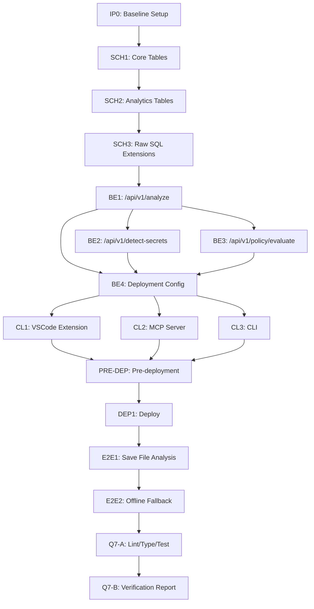

# SnapBack — IP Protection Migration + Supabase Schema Optimization
Implementation Version: 2.0-ip-protection

## Overview
This document outlines the implementation plan for migrating SnapBack to a server-side IP protection model where proprietary algorithms are moved from client-side to backend services. This approach ensures IP protection while maintaining functionality across all platforms.

## Task Dependencies Diagram

## Detailed Task List

### IP0: Baseline — Environment, Supabase connection, audit snapshot
**Steps:**
- Create directories: reports/ip-migration, tools/.tmp, .qoder-build-cache, packages/platform/drizzle/migrations
- Ensure .env.local file exists, create if missing
- Add Supabase credentials to .env.local if missing
- Verify Node.js and pnpm versions
- Install dependencies with pnpm -w install --frozen-lockfile
- Create snapshot of baseline files
- Scaffold database connection spec file
- Run baseline checks (lint, typecheck, build, unit tests)
- Commit baseline snapshot

**Acceptance Criteria:**
- Baseline snapshot captured
- Database connection test passes
- .env.local contains valid Supabase credentials

### SCH1: Drizzle Schema — Core tables (api_keys, snapshots, analysis_events) + Drizzle config
**Depends On:** IP0

**Steps:**
- Create/verify Drizzle config file at packages/platform/drizzle.config.ts
- Create api-keys schema file with all required fields and indexes
- Create snapshots schema file with all required fields and indexes
- Create analysis-events schema file with all required fields and indexes
- Scaffold schema spec file for testing
- Generate migration SQL files using drizzle-kit
- Run unit tests
- Run quality checks (lint, typecheck, build)
- Commit changes

**Acceptance Criteria:**
- Drizzle schemas compile without errors
- Migration SQL files generated in packages/platform/drizzle/migrations/

### SCH2: Drizzle Schema — Analytics tables (rule_violations, user_safety_profiles, bypass_events, suppression_patterns)
**Depends On:** SCH1

**Steps:**
- Create rule-violations schema file with all required fields and indexes
- Create user-safety-profiles schema file with all required fields
- Create bypass-events schema file with all required fields and indexes
- Create suppression-patterns schema file with all required fields and indexes
- Generate migration SQL files using drizzle-kit
- Run unit tests
- Run quality checks (lint, typecheck, build)
- Commit changes

**Acceptance Criteria:**
- All analytics schemas compile
- Indexes defined for frequent queries

### SCH3: Raw Supabase SQL — Timescale, RLS, functions, triggers (guarded)
**Depends On:** SCH2

**Steps:**
- Create raw SQL file for Supabase extensions at packages/platform/drizzle/migrations/0003_supabase_extensions.sql
- Scaffold spec file for Supabase extensions testing
- Push schema to Supabase using drizzle-kit
- Apply raw SQL extensions to Supabase
- Run unit tests
- Run quality checks (lint, typecheck, build)
- Commit changes

**Acceptance Criteria:**
- Timescale extension enabled in Supabase (when available)
- analysis_events is a hypertable
- updated_at triggers fire on update

### BE1: Backend — POST /api/v1/analyze (Guardian server-side)
**Depends On:** SCH3

**Steps:**
- Create Guardian service file at packages/api/src/services/guardian.ts
- Create analyze route file at packages/api/src/routes/v1/analyze.ts
- Scaffold spec file for testing analyze endpoint
- Run unit tests
- Run quality checks (lint, typecheck, build)
- Commit changes

**Acceptance Criteria:**
- Guardian runs server-side
- Analysis logged to analysis_events table
- API returns risk_score + findings

### BE2: Backend — POST /api/v1/detect-secrets
**Depends On:** BE1

**Steps:**
- Create SecretDetection service file at packages/api/src/services/secret-detection.ts
- Create detect-secrets route file at packages/api/src/routes/v1/detect-secrets.ts
- Run unit tests
- Run quality checks (lint, typecheck, build)
- Commit changes

**Acceptance Criteria:**
- Secret detection runs server-side
- Patterns and entropy algorithms not exposed to client

### BE3: Backend — POST /api/v1/policy/evaluate
**Depends On:** BE1

**Steps:**
- Create policy-evaluate route file at packages/api/src/routes/v1/policy-evaluate.ts
- Scaffold spec file for policy evaluation testing
- Run unit tests
- Run quality checks (lint, typecheck, build)
- Commit changes

**Acceptance Criteria:**
- Policy rules evaluated server-side
- Enterprise policies not visible to clients

### BE4: Backend Deployment — Vercel config + health check
**Depends On:** BE1, BE2, BE3

**Steps:**
- Create Vercel config file at packages/api/vercel.json
- Create health check route at packages/api/src/routes/health.ts
- Create main entry point at packages/api/src/index.ts
- Build backend
- Run quality checks (lint, typecheck, build)
- Commit changes

**Acceptance Criteria:**
- Backend builds successfully
- Health check endpoint returns 200

### CL1: VSCode Extension — Remove Guardian, call backend API
**Depends On:** BE4

**Steps:**
- Create API client service at apps/vscode/src/services/api-client.ts
- Remove Guardian directory from VSCode extension
- Create removal documentation at apps/vscode/src/guardian/removed.md
- Scaffold spec file for API client testing
- Run unit tests
- Run quality checks (lint, typecheck, build)
- Commit changes

**Acceptance Criteria:**
- Guardian code removed from VSCode extension
- Extension calls backend API for analysis
- Graceful offline fallback (basic patterns only)

### CL2: MCP Server — Proxy to backend, remove local detection
**Depends On:** BE4

**Steps:**
- Update analyze tool at apps/mcp-server/src/tools/analyze.ts to proxy to backend
- Run unit tests
- Run quality checks (lint, typecheck, build)
- Commit changes

**Acceptance Criteria:**
- MCP server proxies to backend
- No Guardian logic in MCP server

### CL3: CLI — Call backend (or basic offline mode)
**Depends On:** BE4

**Steps:**
- Update check functionality at apps/cli/src/check.ts to call backend
- Run unit tests
- Run quality checks (lint, typecheck, build)
- Commit changes

**Acceptance Criteria:**
- CLI calls backend when online
- Falls back to basic patterns offline

### PRE-DEP: Pre-deployment checks (Drizzle config, env, Vercel auth)
**Depends On:** CL1, CL2, CL3

**Steps:**
- Verify Drizzle config exists and is syntactically valid
- Install Vercel CLI
- Verify Vercel CLI version
- Verify Vercel authentication
- Validate required environment variables
- Ensure backend deploy script exists in packages/api/package.json
- Commit changes

**Acceptance Criteria:**
- Drizzle config exists and is syntactically valid
- Vercel CLI installed and authenticated (vercel whoami succeeds)
- Required environment variables present

### DEP1: Deploy — Push schema to Supabase, deploy backend to Vercel
**Depends On:** PRE-DEP

**Steps:**
- Push schema to Supabase using drizzle-kit
- Apply raw SQL extensions to Supabase
- Deploy backend to Vercel
- Run quality checks (lint, typecheck, build)
- Commit changes

**Acceptance Criteria:**
- Schema deployed to Supabase
- Backend API live at https://api.snapback.dev

### E2E1: E2E — Save file → backend analysis → block/allow
**Depends On:** DEP1

**Steps:**
- Scaffold spec file for backend path verification
- Run E2E tests
- Run quality checks (lint, typecheck, build)
- Commit changes

**Acceptance Criteria:**
- Backend API called on save
- High risk score blocks save
- Low risk allows save

### E2E2: E2E — Offline fallback (backend down)
**Depends On:** E2E1

**Steps:**
- Scaffold spec file for offline fallback verification
- Run E2E tests
- Run quality checks (lint, typecheck, build)
- Commit changes

**Acceptance Criteria:**
- Offline mode activates when backend down
- Basic patterns still run (no IP exposed)
- Banner explains downgrade

### Q7-A: Lint/Type/Test/Bundle Size
**Depends On:** E2E2

**Steps:**
- Install dependencies with pnpm -w install --frozen-lockfile
- Run lint checks
- Run type checking
- Run tests
- Analyze VSCode extension bundle size
- Verify bundle size is ≤ 150KB
- Check for TODO/FIXME markers
- Verify no Guardian code in client bundles

**Acceptance Criteria:**
- All tests pass
- VSCode extension bundle ≤ 150KB (Guardian removed)
- No Guardian code in client bundles

### Q7-B: IP Protection Verification Report
**Depends On:** Q7-A

**Steps:**
- Generate final review report
- Commit changes

**Acceptance Criteria:**
- Final review shows IP fully protected
- All proprietary algorithms server-side
- Client bundles clean (no Guardian code)

## Libraries Evaluation Summary

### Drizzle ORM
- **Library ID:** /drizzle-team/drizzle-orm
- **Trust Score:** 7.6
- **Usage:** Database schema management and migrations

### Hono
- **Library ID:** /honojs/hono
- **Trust Score:** 7.3
- **Usage:** Backend API endpoint development

### Supabase
- **Library ID:** /supabase/supabase
- **Trust Score:** 10
- **Usage:** Database operations and backend services

### Ky
- **Library ID:** /sindresorhus/ky
- **Trust Score:** 8.2
- **Usage:** HTTP client for API requests from clients to backend

### Vercel
- **Library ID:** /vercel/vercel
- **Trust Score:** 10
- **Usage:** Backend service deployment platform