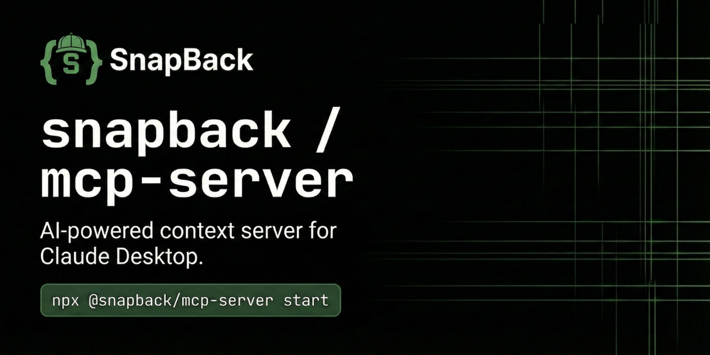

<p align="center">
  
</p>

## Security Features (P0 Fixes Implemented)

✅ **P0-1: Error Logging with Context** - All errors logged with request ID and full context for debugging
✅ **P0-4: API Key Validation** - Strict validation of `sb_live_*` and `sb_test_*` prefixes, prevents injection
✅ **P0-7: Path Injection Prevention** - Validates workspace paths, blocks traversal attacks (`../`)
✅ **P0-8: CORS Security** - Multi-origin support, wildcard blocked in production
✅ **P1-3: Request Size Limits** - 10MB max payload, protects against DoS attacks

**Test Coverage**: 16/16 tests passing, 100% branch coverage on validation logic

## What This Does

Wraps the CLI-based MCP server (`packages/mcp`) in an Express HTTP server that can be deployed to Fly.io or other cloud providers. This allows Claude Desktop, Cursor, and other AI tools to connect to SnapBack over HTTPS instead of requiring local installation.

## Architecture

```
Claude Desktop / Cursor
        ↓ HTTPS
    Fly.io App
        ↓
    apps/mcp-server (Express)
        ↓ Stdio
    packages/mcp (CLI)
        ↓
    SnapBack Logic
```

## Local Development

### Build

```bash
pnpm build
```

### Run

```bash
# Development
PORT=8080 NODE_ENV=development node dist/index.js

# With API key
SNAPBACK_API_KEY=sb_live_test_key PORT=8080 node dist/index.js
```

### Test Health

```bash
curl http://localhost:8080/health
```

### Test MCP Call

```bash
curl -X POST http://localhost:8080/mcp \
  -H "Content-Type: application/json" \
  -d '{
    "workspace": "/path/to/your/workspace",
    "apiKey": "sb_live_test_key",
    "args": {
      "method": "tools/list",
      "params": {}
    }
  }'
```

## Deployment to Fly.io

### Quick Deploy (Recommended)

From the monorepo root:

```bash
# Full deployment with pre-flight checks and verification
pnpm --filter=snapback-mcp-server deploy

# Dry run (validates without deploying)
pnpm --filter=snapback-mcp-server deploy:dry-run
```

The deploy script automatically:
- ✅ Validates Fly CLI is installed and authenticated
- ✅ Checks for uncommitted changes
- ✅ Builds and validates the bundle
- ✅ Deploys to Fly.io
- ✅ Verifies health and `/bridge/push` endpoints after deployment

### Alternative Deploy Methods

```bash
# Quick deploy (skips pre-flight checks)
pnpm --filter=snapback-mcp-server deploy:quick

# Force immediate deployment (no rolling update)
pnpm --filter=snapback-mcp-server deploy:force

# Check deployment status
pnpm --filter=snapback-mcp-server deploy:status

# View live logs
pnpm --filter=snapback-mcp-server deploy:logs

# View releases for rollback
pnpm --filter=snapback-mcp-server deploy:rollback
```

### First-Time Setup

If deploying for the first time:

```bash
# 1. Login to Fly.io
fly auth login

# 2. Create the app (only once)
fly apps create snapback-mcp

# 3. Set secrets
fly secrets set SNAPBACK_API_KEY=sb_live_your_key -a snapback-mcp
fly secrets set CORS_ORIGIN=https://your-domain.com -a snapback-mcp

# 4. Deploy
pnpm --filter=snapback-mcp-server deploy
```

### CI/CD Deployment

Automatic deployments are triggered on push to `main` when changes are detected in:
- `apps/mcp-server/**`
- `packages/mcp/**`, `packages/core/**`, `packages/intelligence/**`

**Required GitHub Secret**: `FLY_API_TOKEN`

Generate a token: `fly tokens create deploy -x 999999h`

### Verify Deployment

```bash
# Health check
curl https://snapback-mcp.fly.dev/health

# Bridge endpoint test
curl -X POST https://snapback-mcp.fly.dev/bridge/push \
  -H "Content-Type: application/json" \
  -d '{"workspaceId":"ws_00000000000000000000000000000000","observations":[]}'
```

Expected responses:
```json
{"status":"healthy","uptime":123.456,"timestamp":"2025-01-06T...","version":"2.0.0"}
{"received":true,"observationsCount":0,"changesCount":0}
```

### Rollback

If something goes wrong:

```bash
# List recent releases
fly releases -a snapback-mcp

# Rollback to a previous version
fly releases rollback v123 -a snapback-mcp
```

## Configuration

### Environment Variables

| Variable | Default | Description |
|----------|---------|-------------|
| `PORT` | 8080 | Server port |
| `NODE_ENV` | development | Environment (production/development) |
| `SNAPBACK_API_KEY` | (required) | API key for authentication |
| `CORS_ORIGIN` | * | Allowed CORS origins (comma-separated) |
| `LOG_LEVEL` | info | Logging level |

### Fly.io Secrets

Set via `fly secrets set KEY=value`:

```bash
fly secrets set SNAPBACK_API_KEY=sb_live_xxx
fly secrets set CORS_ORIGIN=https://your-app.com
```

View secrets:
```bash
fly secrets list
```

## API Endpoints

### `GET /health`

Health check endpoint.

**Response:**
```json
{
  "status": "healthy",
  "uptime": 123.456,
  "timestamp": "2024-12-30T...",
  "version": "1.0.0"
}
```

### `POST /mcp`

Main MCP endpoint - handles JSON-RPC requests.

**Request:**
```json
{
  "workspace": "/path/to/workspace",
  "apiKey": "sb_live_xxx",
  "args": {
    "method": "tools/list",
    "params": {}
  }
}
```

**Response:** JSON-RPC response from MCP server

### `GET /tools`

List available tools.

**Response:**
```json
{
  "tools": [
    {
      "name": "snapback.analyze",
      "tier": "free",
      "description": "..."
    },
    ...
  ],
  "count": 11
}
```

## Security

- **Authentication**: Required `apiKey` parameter (validated against `SNAPBACK_API_KEY`)
- **HTTPS Only**: Fly.io auto-configures HTTPS on port 443
- **CORS**: Configurable via `CORS_ORIGIN` environment variable
- **Non-root user**: Container runs as unprivileged user
- **Request timeouts**: 30-second timeout on MCP calls
- **Rate limiting**: Consider adding in production (not yet implemented)

## Monitoring

### Logs

```bash
fly logs
```

### Metrics

```bash
# CPU/Memory usage
fly scale show

# App status
fly status
```

### Scaling

Edit `fly.toml`:
```toml
[scaling]
min_count = 1
max_count = 5
```

Then deploy:
```bash
fly deploy
```

## Troubleshooting

### "Connection refused"

Ensure Fly.io app is running:
```bash
fly status
```

### "Unauthorized"

Check that API key is set:
```bash
fly secrets list
```

Should show `SNAPBACK_API_KEY`.

### "MCP server timeout"

Default timeout is 30 seconds. Check workspace size and API key validity.

### Logs show errors

View detailed logs:
```bash
fly logs --follow
```

## Integration with VS Code Extension

### Quick Setup (2 steps)

1. **Get your API key** from deployment output (look for `sb_live_...`)
2. **Configure VS Code settings**:

```json
{
  "snapback.mcp.enabled": true,
  "snapback.mcp.serverUrl": "https://snapback-mcp.fly.dev",
  "snapback.mcp.authType": "apikey"
}
```

3. **Store your API key securely** using VS Code command palette:
   - Press `Cmd+Shift+P` / `Ctrl+Shift+P`
   - Run: `SnapBack: Set MCP Auth Token (Secure)`
   - Paste your API key: `sb_live_...`

### Configuration Options

| Setting | Default | Description |
|---------|---------|-------------|
| `snapback.mcp.enabled` | `true` | Enable MCP integration |
| `snapback.mcp.serverUrl` | `https://mcp.snapback.dev` | Remote MCP server URL |
| `snapback.mcp.authType` | `bearer` | Authentication type (`bearer` or `apikey`) |
| `snapback.mcp.timeout` | `5000` | Request timeout in milliseconds |

### Programmatic Usage

The VS Code extension automatically uses `RemoteMCPClient` when `serverUrl` is configured:

```typescript
const client = new RemoteMCPClient({
  serverUrl: 'https://snapback-mcp.fly.dev',
  apiKey: 'sb_live_...',
  authType: 'apikey',
  timeout: 5000,
  maxRetries: 3,
});

await client.connect();
```

See [`apps/vscode/src/services/RemoteMCPClient.ts`](../vscode/src/services/RemoteMCPClient.ts) for implementation details.

### Health Check

Verify the server is accessible:

```bash
curl https://snapback-mcp.fly.dev/health
```

Expected response:
```json
{"status":"healthy","uptime":123.45,"timestamp":"2025-12-31T...","version":"1.0.0"}
```

## Cost

Fly.io free tier includes:
- 3 shared-cpu-1x VMs (256MB each)
- 160GB bandwidth/month

This MCP server easily fits within free tier for individual/small team use.

## References

- [Fly.io Docs](https://fly.io/docs/)
- [MCP Protocol Spec](https://modelcontextprotocol.io/)
- [SnapBack Docs](../../docs/integration/README.md)
