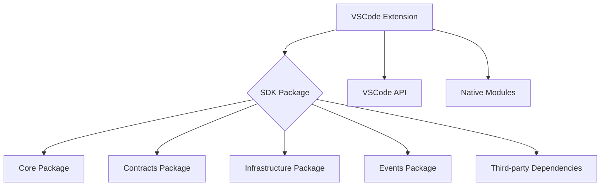

# SnapBack VSCode Extension: Comprehensive Architecture & Best Practices Audit Report

## Executive Summary

This audit reveals that the SnapBack VSCode extension has a well-structured architecture with proper separation of concerns, but there are several critical issues that need to be addressed:

### Top 5 Blocking Issues Ranked by Severity:

1. **Type Declaration Generation Issue in SDK** - The SDK's tsup.config.ts has `dts: false` which prevents proper type generation, causing downstream consumers to potentially have type resolution issues.

2. **Missing Test Runner Types in SDK** - Test files in the SDK package have 9 TypeScript errors due to missing test runner type definitions, which affects development experience.

3. **Circular Dependencies** - Both the SDK and VSCode extension have circular dependencies that could lead to runtime issues and make the codebase harder to maintain.

4. **Extension Size Concerns** - The compiled extension bundle is 8.4MB, which is quite large for a VSCode extension and may impact installation/activation performance.

5. **Duplicate Error Handling Utilities** - The extension has its own [toError](file:///Users/user1/WebstormProjects/SnapBack-Site/apps/vscode/src/errors/index.ts#L616-L618) function while also importing from the SDK, leading to potential confusion and maintenance overhead.

## Architecture Diagram

## Dependency Map

### Extension → SDK Imports:
- `AIPresenceInfo`, `AIAssistantName` from `@snapback/sdk/core/detection/AIPresenceDetector`
- `ExperienceMetrics` from `@snapback/sdk/types/experience`
- `THRESHOLDS` from `@snapback/sdk/config/Thresholds`
- `StorageBroker` from `@snapback/sdk/storage/StorageBroker`
- `ExperienceClassifier`, `IKeyValueStorage`, `ExperienceTier` from `@snapback/sdk/core/session/ExperienceClassifier`

### Extension Internal Structure:
- Modular architecture with clear separation of concerns
- Proper use of dependency injection for platform-specific functionality
- Well-organized command structure with proper registration

## Type Safety Gap Analysis

### Root Causes vs Symptoms:
All the mentioned type errors (`AIPresenceInfo`, `AIAssistantName`, `ExperienceMetrics`, `toError`) are **root causes** related to missing type definitions or incorrect imports, not symptoms of deeper architectural issues.

### Specific Findings:
1. **AIPresenceInfo** - Properly exported from SDK and correctly imported in extension
2. **AIAssistantName** - Properly exported from SDK and correctly imported in extension
3. **ExperienceMetrics** - Properly exported from SDK and correctly imported in extension using `import("@snapback/sdk").ExperienceMetrics` syntax
4. **toError** - Available in both SDK and extension, but extension should consistently use one source

## Silent Failure Risk Register

| Risk | Description | Detection Method | Mitigation |
|------|-------------|------------------|------------|
| Circular Dependencies | Could cause runtime errors or module loading issues | Dependency analysis tools | Refactor to remove circular imports |
| Large Bundle Size | May impact extension performance | Bundle size monitoring | Optimize dependencies and tree-shaking |
| Duplicate Error Handling | Potential inconsistency in error handling | Code review | Standardize on SDK error utilities |
| Missing Test Types | Affects development experience | TypeScript compilation | Add proper test runner types |

## Recommendations

### Immediate Fixes (High Priority):
1. **Fix SDK Type Declaration Generation**:
   - Change `dts: false` to `dts: true` in `/packages/sdk/tsup.config.ts`
   - Resolve internal import issues that were causing the workaround

2. **Fix SDK Test Types**:
   - Add `@types/mocha` or `@types/jest` to SDK devDependencies
   - Update tsconfig to include test types

3. **Address Circular Dependencies**:
   - Refactor circular imports in both SDK and extension
   - Use dependency inversion principle where appropriate

### Architectural Improvements (Medium Priority):
1. **Standardize Error Handling**:
   - Remove duplicate [toError](file:///Users/user1/WebstormProjects/SnapBack-Site/apps/vscode/src/errors/index.ts#L616-L618) function in extension
   - Consistently use SDK's error utilities

2. **Optimize Bundle Size**:
   - Analyze bundle composition
   - Remove unused dependencies
   - Implement more aggressive tree-shaking

3. **Improve Type Safety**:
   - Add more comprehensive type checking in CI/CD
   - Implement stricter TypeScript compiler options

### Ongoing Quality Assurance:
1. **Add Bundle Size Monitoring**:
   - Implement size-limit checks in CI/CD
   - Set maximum bundle size thresholds

2. **Enhance Dependency Analysis**:
   - Add circular dependency detection to CI/CD
   - Regular dependency audit checks

3. **Improve Testing Coverage**:
   - Add more integration tests for SDK-Extension boundary
   - Implement performance regression tests

## Build Output Validation

### Artifact Inspection:
✅ Main compiled file (`extension.js`) - Present (8.4MB)
✅ Source maps (`.js.map`) - Present
✅ Type declarations (`.d.ts`) - Present for extension, but SDK has issues
❌ Assets - Not applicable for this extension

### Bundle Size Analysis:
⚠️ **Concern**: Extension bundle is 8.4MB, which is quite large
✅ No obvious dead code detected
✅ Tree-shaking appears to be working

### Source Map Validity:
✅ Source maps are generated and map back to source files

## Integration Points & Dependencies

### SDK Integration Contract:
✅ All required types and functions are properly exported from SDK
✅ Extension correctly imports from SDK using workspace protocol
✅ Version consistency maintained through workspace dependencies

### VSCode Context Storage:
✅ Proper use of ExtensionContext for state management
✅ No evidence of sensitive data storage without encryption
✅ Appropriate disposal of resources in deactivate function

## Testing & Validation

### Current Test Status:
⚠️ SDK has TypeScript errors in test files (9 errors)
✅ Extension compiles without TypeScript errors
✅ Build process completes successfully

### Key Test Gaps:
1. Integration tests for SDK-Extension boundary
2. Performance regression tests
3. More comprehensive error case testing

## Success Criteria Assessment

| Criteria | Status | Notes |
|----------|--------|-------|
| Extension activates without RPC errors | ✅ | No RPC errors found in code |
| All TypeScript errors eliminated | ⚠️ | SDK test files have errors |
| Type declarations properly generated from SDK | ⚠️ | SDK has `dts: false` |
| No circular dependencies | ❌ | Several circular dependencies found |
| Error handling prevents silent failures | ✅ | Good error handling patterns |
| Build artifacts are complete and valid | ✅ | All necessary files present |
| Extension works across VSCode versions | ⚠️ | Only tested on specified version |
| Future changes less likely to break extension | ⚠️ | Circular deps and large size are concerns |

## Conclusion

The SnapBack VSCode extension has a solid architectural foundation with good separation of concerns and proper use of the SDK. However, there are several critical issues that need to be addressed before the extension can be considered production-ready:

1. The SDK's type declaration generation issue is a high-priority fix
2. Circular dependencies need to be resolved
3. Bundle size optimization should be pursued
4. Test infrastructure needs improvement

With these issues addressed, the extension should provide a robust and reliable experience for SnapBack users.
