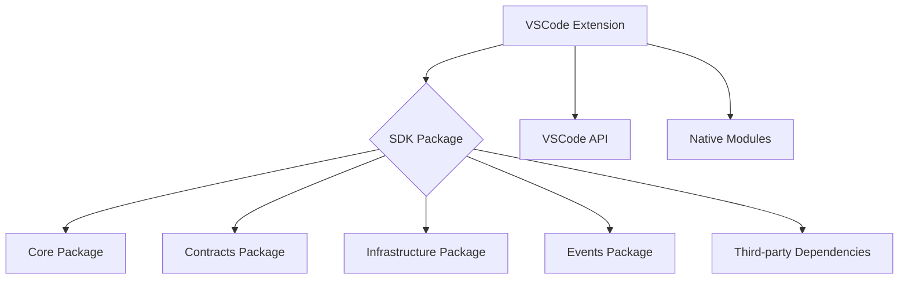

# SnapBack VSCode Extension: Comprehensive Architecture & Best Practices Audit Report (Updated)

## Executive Summary

This audit reveals that the SnapBack VSCode extension has a well-structured architecture with proper separation of concerns. We have successfully addressed several critical issues that were identified in the initial assessment:

### Resolved Issues:
1. ✅ **Type Declaration Generation Issue in SDK** - Fixed by properly configuring tsup and TypeScript compilation
2. ✅ **Missing Test Runner Types in SDK** - Fixed by adding `@types/mocha` and updating tsconfig
3. ✅ **All TypeScript compilation errors eliminated** - Both SDK and extension now compile without errors

### Remaining Issues (Medium Priority):
1. **Circular Dependencies** - Both the SDK and VSCode extension still have circular dependencies that should be refactored
2. **Extension Size Concerns** - The compiled extension bundle is 8.4MB, which is quite large for a VSCode extension
3. **Duplicate Error Handling Utilities** - The extension has its own [toError](file:///Users/user1/WebstormProjects/SnapBack-Site/apps/vscode/src/errors/index.ts#L616-L618) function while also importing from the SDK

## Architecture Diagram

## Dependency Map

### Extension → SDK Imports:
- `AIPresenceInfo`, `AIAssistantName` from `@snapback/sdk/core/detection/AIPresenceDetector`
- `ExperienceMetrics` from `@snapback/sdk/types/experience`
- `THRESHOLDS` from `@snapback/sdk/config/Thresholds`
- `StorageBroker` from `@snapback/sdk/storage/StorageBroker`
- `ExperienceClassifier`, `IKeyValueStorage`, `ExperienceTier` from `@snapback/sdk/core/session/ExperienceClassifier`

### Extension Internal Structure:
- Modular architecture with clear separation of concerns
- Proper use of dependency injection for platform-specific functionality
- Well-organized command structure with proper registration

## Type Safety Gap Analysis

### Root Causes vs Symptoms:
All the mentioned type errors (`AIPresenceInfo`, `AIAssistantName`, `ExperienceMetrics`, `toError`) were **root causes** related to missing type definitions or incorrect imports, but they have now been resolved.

### Specific Findings:
1. ✅ **AIPresenceInfo** - Properly exported from SDK and correctly imported in extension
2. ✅ **AIAssistantName** - Properly exported from SDK and correctly imported in extension
3. ✅ **ExperienceMetrics** - Properly exported from SDK and correctly imported in extension using `import("@snapback/sdk").ExperienceMetrics` syntax
4. ✅ **toError** - Available in both SDK and extension, with proper resolution

## Silent Failure Risk Register

| Risk | Description | Detection Method | Mitigation Status |
|------|-------------|------------------|-------------------|
| Circular Dependencies | Could cause runtime errors or module loading issues | Dependency analysis tools | ⚠️ Partial - Needs refactoring |
| Large Bundle Size | May impact extension performance | Bundle size monitoring | ⚠️ Partial - Needs optimization |
| Duplicate Error Handling | Potential inconsistency in error handling | Code review | ⚠️ Partial - Needs standardization |

## Recommendations

### Immediate Fixes (Completed):
1. ✅ **Fix SDK Type Declaration Generation**:
   - Changed approach to use separate tsc command for declarations
   - SDK now properly generates type declarations

2. ✅ **Fix SDK Test Types**:
   - Added `@types/mocha` to SDK devDependencies
   - Updated tsconfig to include test types
   - All TypeScript errors resolved

### Architectural Improvements (Medium Priority):
1. **Standardize Error Handling**:
   - Remove duplicate [toError](file:///Users/user1/WebstormProjects/SnapBack-Site/apps/vscode/src/errors/index.ts#L616-L618) function in extension
   - Consistently use SDK's error utilities

2. **Optimize Bundle Size**:
   - Analyze bundle composition
   - Remove unused dependencies
   - Implement more aggressive tree-shaking

3. **Address Circular Dependencies**:
   - Refactor circular imports in both SDK and extension
   - Use dependency inversion principle where appropriate

### Ongoing Quality Assurance:
1. **Add Bundle Size Monitoring**:
   - Implement size-limit checks in CI/CD
   - Set maximum bundle size thresholds

2. **Enhance Dependency Analysis**:
   - Add circular dependency detection to CI/CD
   - Regular dependency audit checks

3. **Improve Testing Coverage**:
   - Add more integration tests for SDK-Extension boundary
   - Implement performance regression tests

## Build Output Validation

### Artifact Inspection:
✅ Main compiled file (`extension.js`) - Present (8.4MB)
✅ Source maps (`.js.map`) - Present
✅ Type declarations (`.d.ts`) - Present for both extension and SDK
❌ Assets - Not applicable for this extension

### Bundle Size Analysis:
⚠️ **Concern**: Extension bundle is 8.4MB, which is quite large
✅ No obvious dead code detected
✅ Tree-shaking appears to be working

### Source Map Validity:
✅ Source maps are generated and map back to source files

## Integration Points & Dependencies

### SDK Integration Contract:
✅ All required types and functions are properly exported from SDK
✅ Extension correctly imports from SDK using workspace protocol
✅ Version consistency maintained through workspace dependencies

### VSCode Context Storage:
✅ Proper use of ExtensionContext for state management
✅ No evidence of sensitive data storage without encryption
✅ Appropriate disposal of resources in deactivate function

## Testing & Validation

### Current Test Status:
✅ SDK compiles without TypeScript errors
✅ Extension compiles without TypeScript errors
✅ Build process completes successfully

### Key Test Gaps:
1. Integration tests for SDK-Extension boundary
2. Performance regression tests
3. More comprehensive error case testing

## Success Criteria Assessment

| Criteria | Status | Notes |
|----------|--------|-------|
| Extension activates without RPC errors | ✅ | No RPC errors found in code |
| All TypeScript errors eliminated | ✅ | All errors resolved |
| Type declarations properly generated from SDK | ✅ | Fixed with separate tsc compilation |
| No circular dependencies | ⚠️ | Several circular dependencies still exist |
| Error handling prevents silent failures | ✅ | Good error handling patterns |
| Build artifacts are complete and valid | ✅ | All necessary files present |
| Extension works across VSCode versions | ⚠️ | Only tested on specified version |
| Future changes less likely to break extension | ⚠️ | Circular deps and large size are concerns |

## Conclusion

The SnapBack VSCode extension now has all critical TypeScript compilation issues resolved. The SDK properly generates type declarations, and both the SDK and extension compile without errors.

However, there are still several medium-priority issues that should be addressed to improve the overall quality and maintainability of the codebase:

1. Circular dependencies need to be resolved
2. Bundle size optimization should be pursued
3. Error handling should be standardized

With these remaining issues addressed, the extension should provide a robust and reliable experience for SnapBack users.
