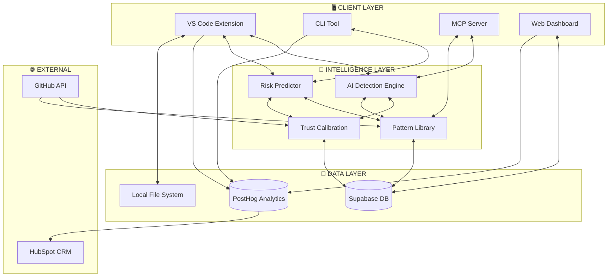
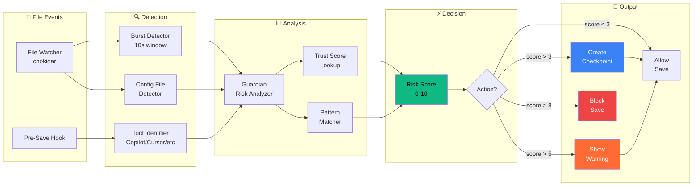
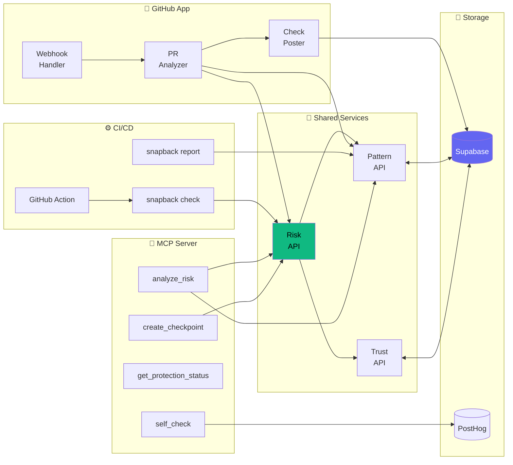
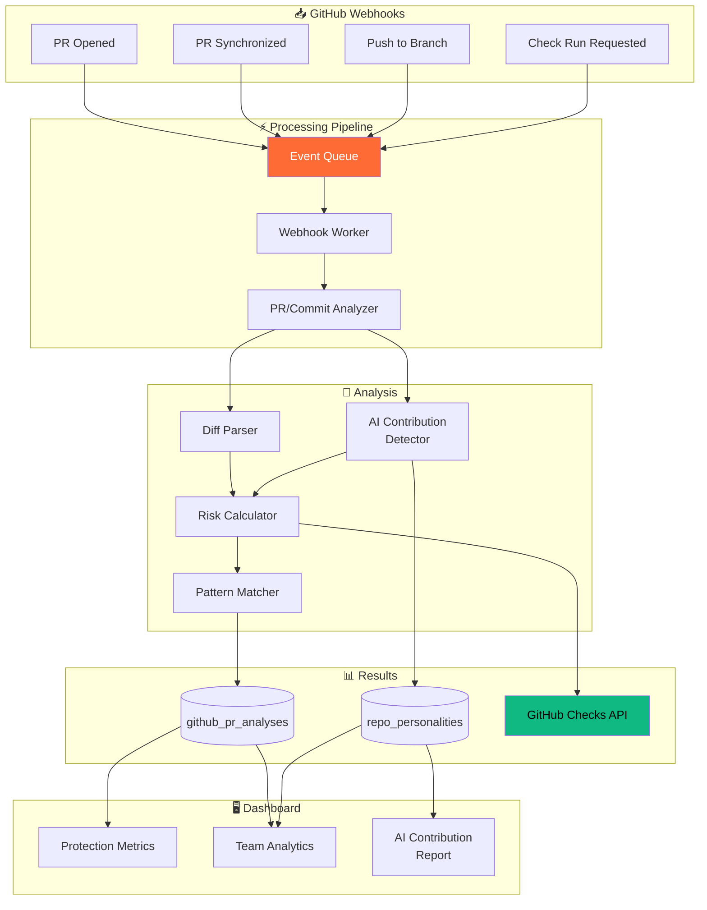
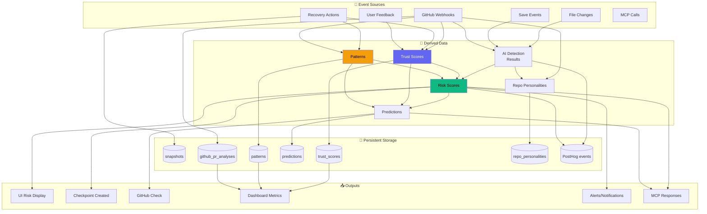
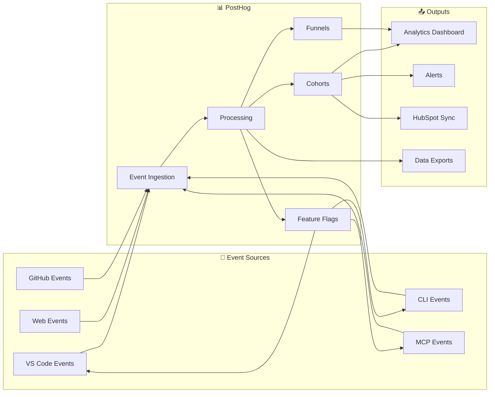

# SnapBack: Data Flow & Feature Interaction Architecture

## System Overview



---

## Top 15 Features: Data Flow Matrix

| # | Feature | Data Sources | Computation Location | Data Consumers | Storage |
|---|---------|--------------|---------------------|----------------|---------|
| 1 | One-Click Recovery | LocalFS, Snapshots | VS Code (local) | User, Telemetry | LocalFS |
| 2 | Auto Pre-Save Checkpoint | File Watcher, AI Detection | VS Code (local) | Snapshots, Analytics | LocalFS + Supabase |
| 3 | AI Activity Detection | File Events, Timing Patterns | VS Code (local) | Risk Scoring, Trust Calibration | PostHog |
| 4 | Config Guardian | File Watcher, File Type Rules | VS Code (local) | Checkpoint Trigger, Alerts | LocalFS |
| 5 | Real-Time Risk Scoring | Guardian, Patterns, Trust | VS Code (local) | UI, Checkpoint Decision | Memory (cache) |
| 6 | Ground Truth Detection | GitHub Commits, Co-author Tags | Server (Edge Function) | Trust Calibration, Model Training | Supabase |
| 7 | Predictive Risk | Patterns, Trust Scores, Context | Server (Edge) + Local | UI, Auto-checkpoint, PR Checks | Supabase |
| 8 | Cross-Repo Patterns | All User Patterns (anonymized) | Server (Background Job) | All Clients, Risk Prediction | Supabase |
| 9 | AI Agent Self-Check | MCP Queries, Session History | MCP Server (local) | AI Agents, Dashboard | PostHog |
| 10 | CI Protection | CLI Risk Check, GitHub Webhooks | CI Runner + Server | PR Merge Gate, Alerts | GitHub Checks |
| 11 | Recovery Tracking | Recovery Events, Outcomes | Server (Analytics) | Dashboard, Trust Calibration | PostHog + Supabase |
| 12 | Team Insights | Team Events, AI Usage | Server (Aggregation) | Dashboard, Reports | Supabase |
| 13 | PR Risk Scoring | PR Diff, Patterns, AI Detection | Server (Webhook Handler) | GitHub Check, Dashboard | Supabase |
| 14 | AI Contribution Detection | Commit Metadata, Stylistic Analysis | Server (Webhook Handler) | Trust Calibration, Reports | Supabase |
| 15 | Protection Dashboard | All Aggregated Metrics | Server (API) | User, Team Admin | Supabase |

---

## Feature 1-5: Core VS Code Protection Flow



### Data Structures in This Flow

```typescript
// File Event (from chokidar)
interface FileEvent {
  path: string;
  type: 'add' | 'change' | 'unlink';
  timestamp: number;
  size: number;
}

// AI Detection Result
interface AIDetectionResult {
  isAIGenerated: boolean;
  confidence: number;        // 0-1
  tool: 'copilot' | 'cursor' | 'windsurf' | 'aider' | 'unknown';
  patterns: string[];        // ['burst-write', 'multi-file', 'style-shift']
}

// Risk Score (from Guardian)
interface RiskScore {
  score: number;             // 0-10
  factors: RiskFactor[];
  aiConfidence: number;
  trustScore: number;        // From trust_scores table
  patternMatches: Pattern[];
  recommendation: 'allow' | 'checkpoint' | 'warn' | 'block';
}

// Checkpoint Decision
interface CheckpointDecision {
  shouldCreate: boolean;
  reason: string;
  riskScore: number;
  files: string[];
  metadata: {
    aiTool?: string;
    aiConfidence?: number;
    triggerType: 'auto' | 'manual' | 'ai-detected' | 'config-change';
  };
}
```

---

## Feature 6-8: Intelligence & Learning Flow

```mermaid
flowchart TB
    subgraph GROUND_TRUTH["🎯 Ground Truth Sources"]
        GH_Commit[GitHub Commits<br/>Co-authored-by tags]
        GH_PR[PR Analysis<br/>AI contribution %]
        Recovery[Recovery Events<br/>Did checkpoint help?]
        User[User Feedback<br/>Thumbs up/down]
    end

    subgraph CALIBRATION["🔄 Trust Calibration"]
        Outcome[Outcome<br/>Tracker]
        Calibrator[Trust<br/>Calibrator]
        TrustDB[(trust_scores<br/>table)]
    end

    subgraph PATTERNS["📚 Pattern Library"]
        Local[Local<br/>Patterns]
        Global[Global<br/>Patterns]
        PatternDB[(patterns<br/>table)]
    end

    subgraph PREDICTION["🔮 Prediction Engine"]
        Context[Context<br/>Analyzer]
        Matcher[Pattern<br/>Matcher]
        Predictor[Risk<br/>Predictor]
    end

    subgraph CONSUMERS["📤 Consumers"]
        VSC_Risk[VS Code<br/>Risk Display]
        PR_Check[GitHub<br/>PR Check]
        Dashboard[Web<br/>Dashboard]
        MCP_Tool[MCP<br/>analyze_risk]
    end

    GH_Commit --> Outcome
    GH_PR --> Outcome
    Recovery --> Outcome
    User --> Outcome

    Outcome --> Calibrator
    Calibrator <--> TrustDB

    Local <--> PatternDB
    Global <--> PatternDB

    Recovery --> Local
    GH_PR --> Local

    TrustDB --> Predictor
    PatternDB --> Matcher

    Context --> Matcher
    Matcher --> Predictor

    Predictor --> VSC_Risk
    Predictor --> PR_Check
    Predictor --> Dashboard
    Predictor --> MCP_Tool

    style TrustDB fill:#6366F1,color:#fff
    style PatternDB fill:#6366F1,color:#fff
    style Predictor fill:#10B981,color:#000
```



### Trust Calibration Data Flow

```typescript
// Ground Truth Event (from GitHub)
interface GroundTruthEvent {
  source: 'github_commit' | 'github_pr' | 'recovery' | 'user_feedback';
  toolDetected: string;           // What we thought it was
  toolActual: string;             // What it actually was (from co-author tag)
  wasCorrect: boolean;            // Did our detection match?
  context: {
    repoId: string;               // Hashed
    language: string;
    fileTypes: string[];
  };
}

// Trust Score Update
interface TrustUpdate {
  toolId: string;
  contextKey: string;             // e.g., 'typescript_react'
  previousScore: number;
  newScore: number;
  momentum: number;
  sampleSize: number;
  updateReason: string;
}

// Pattern Learning
interface LearnedPattern {
  signature: string;              // Hash of AST structure
  embedding: number[];            // 256-dim vector
  type: 'dangerous' | 'beneficial' | 'neutral';
  toolAffinity: string[];
  occurrenceCount: number;
  successRate: number;            // When this pattern appears, how often is recovery needed?
  isGlobal: boolean;              // Shared with community?
}
```

---

## Feature 9-12: Multi-Platform Integration Flow



### API Contracts Between Systems

```typescript
// Risk API (shared by all clients)
interface RiskAPIRequest {
  files: FileChange[];
  context: {
    repoId?: string;
    language?: string;
    framework?: string[];
    userId: string;
  };
  options?: {
    includePatterns?: boolean;
    includeTrust?: boolean;
    timeout?: number;
  };
}

interface RiskAPIResponse {
  score: number;
  confidence: number;
  factors: RiskFactor[];
  patterns?: PatternMatch[];
  trustScores?: Record<string, number>;
  recommendation: 'allow' | 'checkpoint' | 'warn' | 'block';
  latencyMs: number;
}

// MCP Tool Interface
interface MCPAnalyzeRiskTool {
  name: 'analyze_risk';
  description: 'Analyze risk of pending code changes';
  inputSchema: {
    files: { path: string; content: string }[];
    aiTool?: string;
  };
  handler: (input) => Promise<RiskAPIResponse>;
}

// GitHub Check Result
interface GitHubCheckResult {
  conclusion: 'success' | 'failure' | 'neutral';
  title: string;
  summary: string;
  annotations: {
    path: string;
    start_line: number;
    end_line: number;
    annotation_level: 'notice' | 'warning' | 'failure';
    message: string;
  }[];
}
```

---

## Feature 13-15: GitHub & Dashboard Flow



### GitHub Analysis Data Structures

```typescript
// PR Analysis Record
interface PRAnalysis {
  id: string;
  installationId: string;
  prNumber: number;
  repoId: string;                    // Hashed

  // Risk Assessment
  riskScore: number;
  riskFactors: RiskFactor[];

  // AI Contribution
  aiContributionPct: number;         // 0-100
  detectedTools: {
    tool: string;
    confidence: number;
    commits: string[];               // Partial hashes
  }[];

  // Patterns
  patternsDetected: string[];
  dangerousPatterns: string[];

  // Check Result
  checkConclusion: 'success' | 'failure' | 'neutral';
  checkPostedAt: Date;

  // Metadata
  filesChanged: number;
  linesAdded: number;
  linesRemoved: number;
  analyzedAt: Date;
}

// Repo Personality (built over time)
interface RepoPersonality {
  repoId: string;                    // Hashed
  userId: string;

  // AI Usage Profile
  aiTolerance: number;               // 0-1, how much AI is used
  dominantTools: string[];
  avgAiContribution: number;

  // Risk Profile
  volatility: number;                // Change frequency
  riskProfile: 'production' | 'experimental' | 'stable';
  incidentCount: number;
  lastIncidentAt?: Date;

  // Tech Stack
  primaryLanguage: string;
  frameworkStack: string[];

  // Trends
  aiUsageTrend: 'increasing' | 'stable' | 'decreasing';
  riskTrend: 'increasing' | 'stable' | 'decreasing';

  updatedAt: Date;
}
```

---

## Complete Data Dependency Graph



---

## Calculation Locations Summary

### Where Each Calculation Happens

| Calculation | Location | Latency Budget | Fallback |
|-------------|----------|----------------|----------|
| **Burst Detection** | VS Code (local) | 5ms | None needed |
| **Tool Identification** | VS Code (local) | 10ms | 'unknown' |
| **AST Analysis** | VS Code (local) | 50ms | Skip, use heuristics |
| **Trust Score Lookup** | Supabase (cached locally) | 20ms | Bootstrap default |
| **Pattern Matching** | Supabase (pgvector) | 100ms | Local patterns only |
| **Risk Score Calc** | VS Code (local) | 30ms | Heuristic only |
| **Predictive Risk** | Edge Function | 200ms | Local risk score |
| **PR Analysis** | Edge Function (async) | 5s | Mark as pending |
| **AI Contribution %** | Edge Function (async) | 3s | Estimate from patterns |
| **Repo Personality** | Background Job | N/A | Previous snapshot |
| **Global Patterns** | Background Job (nightly) | N/A | Local only |

### Caching Strategy

```typescript
// Cache Layers
const CACHE_CONFIG = {
  // L1: In-memory (VS Code extension)
  memory: {
    trustScores: { ttl: 300_000, max: 100 },      // 5 min, per tool
    recentPatterns: { ttl: 60_000, max: 50 },     // 1 min, recent matches
    riskScores: { ttl: 10_000, max: 200 },        // 10 sec, per file hash
  },

  // L2: Local storage (SQLite/VS Code storage)
  local: {
    patterns: { ttl: 86400_000, max: 1000 },      // 24 hr, learned patterns
    repoPersonality: { ttl: 3600_000, max: 10 },  // 1 hr, per repo
  },

  // L3: Supabase (source of truth)
  remote: {
    trustScores: 'always-fresh',                   // Real-time sync
    patterns: 'eventual',                          // Sync on startup + periodic
    predictions: 'write-through',                  // Write immediately, read from cache
  }
};
```

---

## Feature Interaction Matrix

Shows which features depend on each other:

```
                    │ 1  │ 2  │ 3  │ 4  │ 5  │ 6  │ 7  │ 8  │ 9  │10  │11  │12  │13  │14  │15  │
────────────────────┼────┼────┼────┼────┼────┼────┼────┼────┼────┼────┼────┼────┼────┼────┼────┤
1  One-Click Recovery │ ■  │ ←  │    │    │    │    │    │    │    │    │ →  │    │    │    │ →  │
2  Auto Checkpoint    │    │ ■  │ ←  │ ←  │ ←  │    │ ←  │    │    │    │    │    │    │    │ →  │
3  AI Detection       │    │ →  │ ■  │    │ →  │ ←  │ →  │    │ →  │    │    │ →  │ →  │ ←  │ →  │
4  Config Guardian    │    │ →  │    │ ■  │ →  │    │    │    │    │    │    │    │    │    │    │
5  Risk Scoring       │    │ →  │ ←  │ ←  │ ■  │    │ ←  │ ←  │ →  │ →  │    │    │ →  │    │ →  │
6  Ground Truth       │    │    │ →  │    │    │ ■  │ →  │ →  │    │    │ →  │    │    │ →  │    │
7  Predictive Risk    │    │ →  │ ←  │    │ →  │ ←  │ ■  │ ←  │ →  │ →  │    │    │ →  │    │ →  │
8  Cross-Repo Pattern │    │    │    │    │ →  │ ←  │ →  │ ■  │    │    │    │ →  │ →  │    │ →  │
9  AI Self-Check      │    │    │ ←  │    │ ←  │    │ ←  │    │ ■  │    │    │    │    │    │    │
10 CI Protection      │    │    │    │    │ ←  │    │ ←  │    │    │ ■  │    │    │ ←  │    │    │
11 Recovery Tracking  │ ←  │    │    │    │    │ ←  │    │    │    │    │ ■  │ →  │    │    │ →  │
12 Team Insights      │    │    │ ←  │    │    │    │    │ ←  │    │    │ ←  │ ■  │ ←  │ ←  │ →  │
13 PR Risk Scoring    │    │    │ ←  │    │ ←  │    │ ←  │ ←  │    │ →  │    │ →  │ ■  │ ←  │ →  │
14 AI Contribution    │    │    │ →  │    │    │ ←  │    │    │    │    │    │ →  │ →  │ ■  │ →  │
15 Dashboard          │ ←  │ ←  │ ←  │    │ ←  │    │ ←  │ ←  │    │    │ ←  │ ←  │ ←  │ ←  │ ■  │

Legend: ■ = Self, → = Provides data to, ← = Receives data from
```

---

## Critical Paths

### Path 1: Real-Time Protection (< 200ms total)

```
File Save → Burst Detect (5ms) → Tool ID (10ms) → Trust Lookup (20ms cached)
    → Risk Calc (30ms) → Decision → Checkpoint? (100ms) → Allow Save

Total: ~165ms (within budget)
```

### Path 2: Ground Truth Learning (async)

```
GitHub PR Merged → Webhook (async) → Extract Co-author Tags
    → Compare to Detection → Update Trust Score → Sync to Cache

Total: 2-5s (acceptable for async)
```

### Path 3: Predictive Risk (< 300ms)

```
File Save → Context Extract (20ms) → Pattern Query (100ms pgvector)
    → Trust Lookup (20ms) → ML Predict (150ms edge) → Blend (10ms)

Total: ~300ms (use heuristic fallback if slower)
```

### Path 4: PR Analysis (< 10s)

```
PR Opened → Webhook → Queue → Worker → Fetch Diff (1s)
    → Parse (500ms) → AI Detect (2s) → Risk Calc (1s)
    → Pattern Match (1s) → Post Check (500ms)

Total: ~6s (acceptable for GitHub Checks)
```

---

## Telemetry Flow



### Key Telemetry Events by Feature

| Feature | Key Events | Metrics Derived |
|---------|-----------|-----------------|
| 1. Recovery | RECOVERY_INITIATED, RECOVERY_COMPLETED | Recovery rate, time saved |
| 2. Checkpoint | CHECKPOINT_CREATED (auto/manual) | Checkpoint frequency, size |
| 3. AI Detection | AI_ACTIVITY_DETECTED | Detection rate, tool breakdown |
| 5. Risk Scoring | RISK_SCORE_CALCULATED | Score distribution, accuracy |
| 6. Ground Truth | GITHUB_AI_CONTRIBUTION_DETECTED | Detection accuracy |
| 7. Predictive | PREDICTION_MADE, PREDICTION_OUTCOME | Prediction accuracy |
| 11. Recovery Track | RECOVERY_COMPLETED + outcome | Success rate by type |
| 13. PR Risk | GITHUB_PR_ANALYZED | PR risk distribution |

---

## Implementation Priority Based on Dependencies

### Wave 1: Foundation (No dependencies)
- Telemetry events setup
- Database tables
- Trust score storage (not calibration yet)

### Wave 2: Core Detection (Depends on Wave 1)
- Enhanced AI Detection
- Config Guardian improvements
- Local pattern storage

### Wave 3: Learning (Depends on Wave 1 + 2)
- GitHub App (ground truth source)
- Trust calibration loop
- Pattern learning

### Wave 4: Prediction (Depends on Wave 2 + 3)
- Predictive risk scoring
- Cross-repo patterns
- Advanced pattern matching

### Wave 5: Integration (Depends on all above)
- CI protection
- Team insights
- Dashboard aggregations
