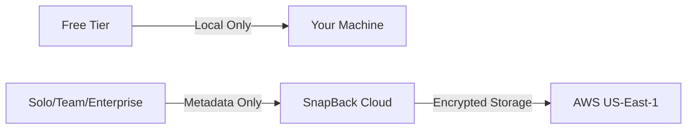

# Security & Privacy

Understand how SnapBack handles your data across all tiers with transparency and compliance.

## Data Flows by Tier

### Free Tier: Local Only

- **Storage**: All snapshots stored locally on your machine
- **Guardian**: Local MCP scan only (no cloud transmission)
- **Privacy**: Zero data sent to SnapBack servers
- **Control**: You manage retention via extension settings

### Solo/Team/Enterprise: Metadata Transmission

When MCP is enabled and cloud features are used:

- **Transmitted**: File paths (hashed), snapshot metadata, Guardian detection results (types only, not content)
- **Never Transmitted**: Actual code content, sensitive data values, personal information
- **Encryption**: All data encrypted in transit (TLS 1.3) and at rest (AES-256)

## Data Retention Policies

| Tier | Local Snapshots | Cloud Backup Retention |
|------|----------------|----------------------|
| Free | Unlimited (user controls pruning via settings) | N/A (no cloud backup) |
| Solo | Unlimited (user controlled) | 30 days |
| Team | Unlimited (user controlled) | 90 days |
| Enterprise | Unlimited (user controlled) | Custom (365+ days configurable) |

### Retention Details

- **Local snapshots**: Always under your control; never automatically deleted
- **Cloud backups**: Automatically pruned after retention period expires
- **Deleted data**: Permanently removed within 30 days of deletion request
- **Export**: Download all your data anytime via dashboard

## Export and Deletion (GDPR Compliance)

### Data Portability

You can export all your data at any time:

1. **Dashboard Export**: Download snapshots, metadata, and settings as JSON/ZIP
2. **API Access**: Programmatic export via REST API (Solo+ tiers)
3. **Format**: Industry-standard formats for portability

### Right to Deletion

Request deletion of your data:

1. **Account Settings**: Self-service deletion in dashboard
2. **Email Request**: Contact privacy@snapback.dev
3. **Timeline**: Data permanently deleted within 30 days
4. **Confirmation**: Email confirmation when deletion is complete

## Data Processing Agreement (DPA)

**Availability**: Enterprise customers only

Contact sales@snapback.dev to request a DPA. The DPA covers:

- Data processing terms and responsibilities
- Security measures and incident response
- Sub-processor disclosure and approval
- Data transfer mechanisms (Standard Contractual Clauses)
- Audit rights and compliance verification

## Subprocessors

SnapBack uses the following sub-processors to deliver our service:

[View complete subprocessors list →](/subprocessors)

## Compliance & Certifications

### Current Compliance

- ✅ **GDPR**: Compliant data handling practices implemented
- ✅ **Data Encryption**: TLS 1.3 in transit, AES-256 at rest
- ✅ **Access Controls**: Role-based access control (RBAC)
- ✅ **Audit Logging**: Immutable audit trails (Enterprise tier)

### Roadmap

- 🚧 **SOC 2 Type II**: Certification in progress (roadmap item)
- 🚧 **ISO 27001**: Planned for 2025
- 🚧 **HIPAA**: Under evaluation for healthcare customers

## Security Measures

### Infrastructure Security

- **Cloud Provider**: AWS (US-East-1 region)
- **Network**: VPC isolation, private subnets
- **DDoS Protection**: CloudFlare enterprise protection
- **Monitoring**: 24/7 security monitoring and alerting

### Application Security

- **Authentication**: Multi-factor authentication (MFA) supported
- **Authorization**: Role-based access control (RBAC)
- **Session Management**: Secure session tokens with expiration
- **Input Validation**: All inputs sanitized and validated

### Data Security

- **Encryption at Rest**: AES-256 for all stored data
- **Encryption in Transit**: TLS 1.3 with perfect forward secrecy
- **Key Management**: AWS KMS for encryption key management
- **Backup Encryption**: All backups encrypted with separate keys

## Incident Response

### Security Incidents

In the event of a security incident:

1. **Detection**: Automated monitoring detects anomalies
2. **Notification**: Affected customers notified within 72 hours
3. **Investigation**: Root cause analysis and remediation
4. **Disclosure**: Public disclosure if required by law or impact

### Data Breach Protocol

- **Containment**: Immediate isolation of affected systems
- **Assessment**: Scope and impact evaluation
- **Notification**: Customer notification within regulatory timeframes
- **Remediation**: Security improvements to prevent recurrence

## Privacy by Design

### Principles

- **Data Minimization**: Collect only what's necessary
- **Purpose Limitation**: Use data only for stated purposes
- **Transparency**: Clear communication about data handling
- **User Control**: You control your data and privacy settings

### MCP Optional Design

SnapBack works fully without MCP:

- **Core functionality**: Local snapshots, protection levels, session time-travel work offline
- **Optional cloud**: Guardian cloud detection and backup are opt-in features
- **Clear consent**: Explicit user consent before transmitting data
- **Granular control**: Enable/disable cloud features per-file or project

## Frequently Asked Questions

### Is my code ever sent to SnapBack servers?

No. Only metadata (file paths as hashes, snapshot timestamps, Guardian detection types) is transmitted when using cloud features. Your actual code never leaves your machine.

### Can SnapBack employees see my code?

No. SnapBack employees never have access to your code content. Even cloud metadata is hashed and encrypted.

### How do I disable all cloud features?

In VS Code settings, disable "MCP Integration". This ensures 100% local-only operation with zero data transmission.

### Where is my data stored geographically?

Cloud data is stored in AWS US-East-1 region. Enterprise customers can request custom data residency.

### How long do you retain my data after account deletion?

Cloud data is permanently deleted within 30 days of account deletion. Local snapshots remain on your machine under your control.

### Do you sell user data?

Never. We do not sell, rent, or share user data with third parties for marketing purposes.

## Contact

For security inquiries or to report a vulnerability:

- **Email**: security@snapback.dev
- **Privacy**: privacy@snapback.dev
- **DPA Requests**: sales@snapback.dev (Enterprise only)
