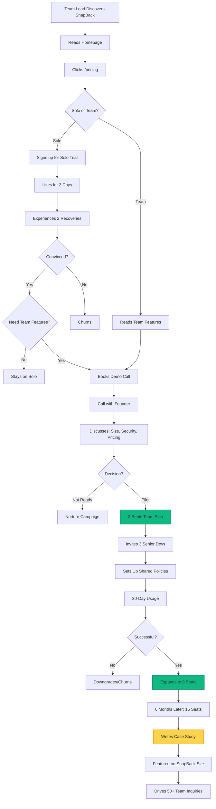
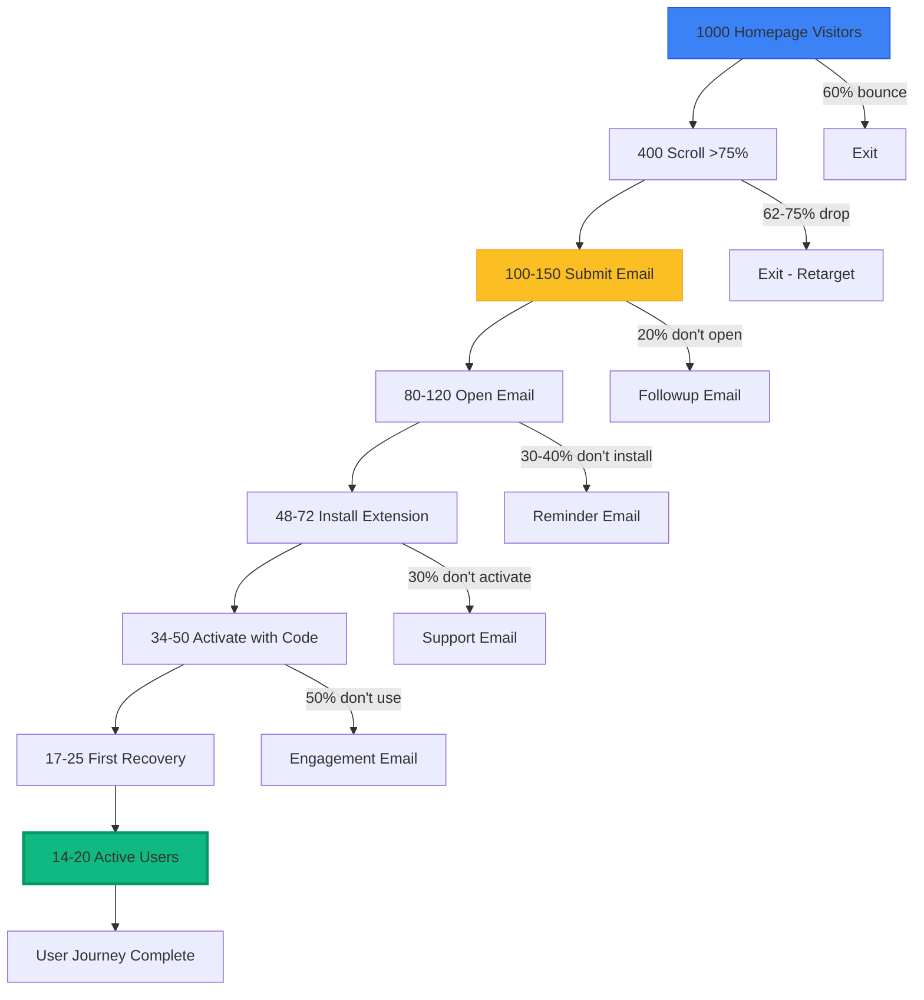
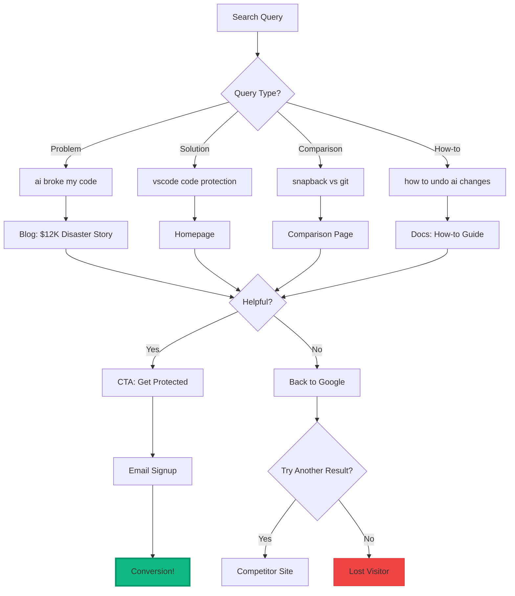
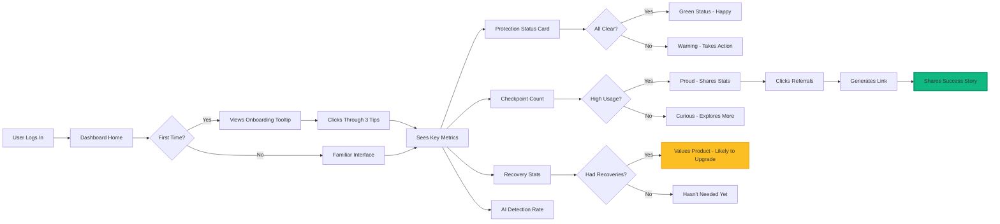

# SnapBack User Flow Diagrams (Mermaid)
## Paste these into Mermaid Live Editor (mermaid.live) to visualize

---

## 🎯 MAIN USER FLOW (Discovery → Active User)

```mermaid
graph TD
    A[Google Search: ai broke my code] --> B[Blog Post: $12K Disaster Story]
    B --> C{Resonates with pain?}
    C -->|Yes| D[Clicks CTA: Get Protected]
    C -->|No| Z1[Exits]
    
    D --> E[Homepage Hero]
    E --> F[Scrolls to How It Works]
    F --> G[Reads Git vs SnapBack Comparison]
    G --> H[Reviews FAQ]
    
    H --> I{Convinced?}
    I -->|No| Z2[Exits - Retarget]
    I -->|Yes| J[Submits Email]
    
    J --> K[Receives Email with Invite Code]
    K --> L{Opens Email?}
    L -->|No 20%| Z3[Abandoned - Followup Email]
    L -->|Yes 80%| M[Clicks Install Extension]
    
    M --> N[VS Code Marketplace]
    N --> O[Installs SnapBack]
    O --> P[Opens VS Code]
    P --> Q[SnapBack Prompts: Enter Invite Code]
    
    Q --> R[Enters Code - Account Linked]
    R --> S[First Checkpoint Created Automatically]
    S --> T[Status Bar Shows: Protection Active ✓]
    
    T --> U[Codes for 7 Days]
    U --> V{AI Disaster Happens?}
    V -->|No| U
    V -->|Yes| W[Opens SnapBack Explorer]
    
    W --> X[Previews Restore]
    X --> Y[Clicks Restore]
    Y --> AA[Code Restored in 200ms]
    
    AA --> AB[💡 AHA MOMENT]
    AB --> AC[Becomes Active User]
    AC --> AD[Logs into Dashboard]
    AD --> AE[Views Metrics]
    AE --> AF{Shares?}
    AF -->|Yes| AG[Visits Referrals Page]
    AF -->|No| AH[Silent User]
    
    AG --> AI[Generates Referral Link]
    AI --> AJ[Shares on Twitter/LinkedIn]
    AJ --> AK[Becomes Advocate]
    
    style AB fill:#10B981,stroke:#059669,stroke-width:4px,color:#000
    style AC fill:#10B981,stroke:#059669,stroke-width:2px
    style AK fill:#FCD34D,stroke:#F59E0B,stroke-width:2px
```



---

## 🚀 REFERRAL FLOW (User → Advocate)

```mermaid
graph LR
    A[Active User] --> B[Successful Recovery]
    B --> C{Impressed?}
    C -->|Yes| D[Logs into Dashboard]
    C -->|No| Z1[Churns]
    
    D --> E[Sees Referral Nav Item]
    E --> F[Clicks Referrals]
    F --> G[Sees Rewards: 3 refs = 3mo free]
    
    G --> H{Motivated?}
    H -->|Yes| I[Generates Link]
    H -->|No| Z2[Passive User]
    
    I --> J[Copies snapback.dev/r/username]
    J --> K[Shares on Social]
    K --> L[5 Friends Click Link]
    
    L --> M{Friend Signs Up?}
    M -->|Yes 40%| N[2 Signups]
    M -->|No 60%| O[3 Bounces]
    
    N --> P[Dashboard Updates: 2 Signups!]
    P --> Q[Progress Bar: 2/3 refs for reward]
    Q --> R{Shares More?}
    R -->|Yes| S[Reaches 3 Referrals]
    R -->|No| T[Waits for Organic]
    
    S --> U[🎉 Reward Unlocked: 3mo Pro Free]
    U --> V[Email: Congratulations!]
    V --> W[Continues Sharing - Next Goal: 10 refs]
    
    style U fill:#10B981,stroke:#059669,stroke-width:4px,color:#000
```



---

## 🎛️ DASHBOARD NAVIGATION FLOW

```mermaid
graph TD
    A[User Logs In] --> B[/app/dashboard]
    B --> C{What do they want?}
    
    C -->|Check stats| D[Views Metrics Cards]
    C -->|Deep dive| E[/app/metrics]
    C -->|Share SnapBack| F[/app/referrals]
    C -->|Configure| G[/app/settings]
    C -->|Get help| H[/app/support]
    
    D --> I[Sees: 247 checkpoints, 12 recoveries]
    D --> J[Views AI Activity Breakdown]
    D --> K[Scrolls Recent Activity Feed]
    
    E --> L[Charts: Checkpoints Over Time]
    E --> M[AI Tool Breakdown: Copilot/Cursor/Claude]
    E --> N[Guardian Alerts: Secrets/Mocks detected]
    E --> O[Export Data: CSV/JSON]
    
    F --> P[Referral Stats Dashboard]
    F --> Q[Generate/Copy Link]
    F --> R[Share Buttons: Twitter/LinkedIn]
    F --> S[View Leaderboard]
    
    G --> T[Account Settings]
    G --> U[API Keys Management]
    G --> V[Subscription/Billing]
    G --> W[Notification Preferences]
    
    H --> X[Search Help Center]
    H --> Y[Join Discord]
    H --> Z[Submit Ticket]
    
    style B fill:#3B82F6,stroke:#1D4ED8,stroke-width:2px
    style F fill:#10B981,stroke:#059669,stroke-width:2px
```

---

## 🏢 TEAM PURCHASE FLOW



---

## 🔄 CONVERSION FUNNEL (WITH DROP-OFF RATES)



---

## 📱 MOBILE VS DESKTOP USER PATHS

```mermaid
graph LR
    A[User Device] --> B{Mobile or Desktop?}
    
    B -->|Mobile 60%| C[Search: ai broke my code]
    B -->|Desktop 40%| D[Direct: snapback.dev]
    
    C --> E[Blog Post Optimized Mobile]
    E --> F[Reads 2 min - Scrolls]
    F --> G[Taps CTA Button]
    G --> H[Mobile Email Form]
    H --> I[Submits on Mobile]
    
    D --> J[Homepage Desktop View]
    J --> K[Scrolls - Views Comparison Table]
    K --> L[Opens Multiple Tabs]
    L --> M[Reads Docs in New Tab]
    M --> N[Returns to Pricing]
    N --> O[Desktop Email Form]
    O --> P[Submits on Desktop]
    
    I --> Q[Email on Phone]
    Q --> R[Opens Email on Phone]
    R --> S{Switch to Desktop?}
    S -->|Yes 70%| T[Installs on Desktop]
    S -->|No 30%| U[Mobile Web CTA]
    
    P --> V[Email on Desktop]
    V --> W[Opens Email on Desktop]
    W --> T
    
    T --> X[VS Code Installation]
    X --> Y[Desktop Usage Only]
    
    style I fill:#10B981,stroke:#059669
    style P fill:#10B981,stroke:#059669
    style Y fill:#FCD34D,stroke:#F59E0B,stroke-width:2px
```



---

## 🎯 SEO TRAFFIC FLOW



---

## 📊 DASHBOARD FEATURE ADOPTION



---

## USAGE INSTRUCTIONS

**To visualize these diagrams:**

1. Go to https://mermaid.live
2. Copy any diagram above
3. Paste into editor
4. Diagram renders automatically
5. Export as PNG/SVG

**Or use in documentation:**

```markdown
<!-- In your Nextra docs or README -->
```mermaid
[paste diagram here]
```
<!-- Renders automatically in GitHub, GitLab, Nextra -->
```

**Color Legend:**
- 🔵 Blue = Entry Points
- 🟢 Green = Success/Conversion
- 🟡 Yellow = Advocacy/Referral
- 🔴 Red = Drop-off/Churn

---

These diagrams show:
- Main user journey (discovery → active user)
- Referral/advocacy loop
- Dashboard navigation
- Team purchase flow
- Conversion funnel with drop-offs
- Mobile vs desktop behavior
- SEO traffic paths
- Dashboard feature adoption

Use these to:
- Identify bottlenecks
- Prioritize features
- Optimize conversion points
- Plan retention campaigns
