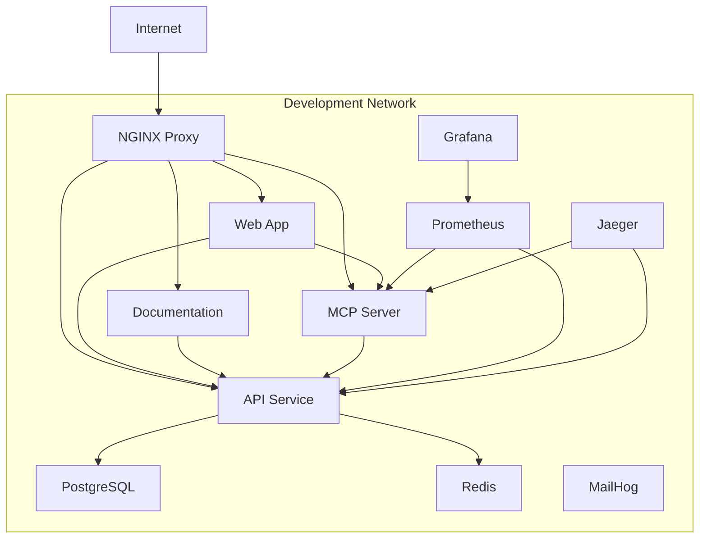

# Docker Architecture

This document describes the Docker architecture for the SnapBack development environment.

## Overview

The SnapBack development environment uses Docker Compose to orchestrate multiple services that work together to provide a complete local development experience. All services are connected through a shared Docker network and can communicate with each other using service names as hostnames.

## Service Architecture

## Services

### NGINX Proxy
- **Image**: nginx:alpine
- **Ports**: 80:80
- **Purpose**: Routes requests to appropriate services based on subdomain
- **Configuration**: `ops/nginx/nginx.conf`

### Web Application
- **Service Name**: web
- **Build**: apps/web/Dockerfile.dev
- **Ports**: 3000:3000, 9229:9229 (debugger)
- **Purpose**: Next.js marketing site and console application
- **Volumes**: Hot-reload for development

### Documentation
- **Service Name**: docs
- **Build**: apps/docs/Dockerfile.dev
- **Ports**: 3001:3000, 9232:9229 (debugger)
- **Purpose**: Next.js documentation site
- **Volumes**: Hot-reload for development

### API Service
- **Service Name**: api
- **Build**: apps/api/Dockerfile.dev
- **Ports**: 8080:8080, 9230:9230 (debugger)
- **Purpose**: Hono.js API service
- **Dependencies**: postgres, redis
- **Volumes**: Hot-reload for development

### MCP Server
- **Service Name**: mcp
- **Build**: apps/mcp-server/Dockerfile.dev
- **Ports**: 8081:8081, 9231:9231 (debugger)
- **Purpose**: Model Context Protocol server
- **Dependencies**: api
- **Volumes**: Hot-reload for development

### PostgreSQL
- **Service Name**: postgres
- **Image**: postgres:16-alpine
- **Ports**: 5432:5432
- **Purpose**: Primary database
- **Volumes**: postgres-data (persistent)

### Redis
- **Service Name**: redis
- **Image**: redis:7-alpine
- **Ports**: 6379:6379
- **Purpose**: Caching and session storage

### MailHog
- **Service Name**: mailhog
- **Image**: mailhog/mailhog:latest
- **Ports**: 8025:8025 (UI), 1025:1025 (SMTP)
- **Purpose**: Email testing

### Prometheus
- **Service Name**: prometheus
- **Image**: prom/prometheus:latest
- **Ports**: 9090:9090
- **Purpose**: Metrics collection
- **Configuration**: ops/prometheus/prometheus.yml
- **Volumes**: prometheus-data (persistent)

### Grafana
- **Service Name**: grafana
- **Image**: grafana/grafana-enterprise
- **Ports**: 3002:3000
- **Purpose**: Metrics visualization
- **Configuration**: ops/grafana/
- **Volumes**: grafana-data (persistent)

### Jaeger
- **Service Name**: jaeger
- **Image**: jaegertracing/all-in-one:latest
- **Ports**: 16686:16686 (UI), 14268:14268, 6831:6831/udp
- **Purpose**: Distributed tracing

## Service Dependencies

```mermaid
graph TD
    migrations[migrations] --> postgres
    api --> postgres
    api --> redis
    api --> migrations
    mcp --> api
    web --> api
    web --> mcp
    docs --> api
    grafana --> prometheus
    prometheus --> api
    prometheus --> mcp
    jaeger --> api
    jaeger --> mcp
```

## Port Mapping Reference

| Service | Internal Port | External Port | URL |
|---------|---------------|---------------|-----|
| NGINX | 80 | 80 | http://snapback.dev |
| Web | 3000 | 3000 | http://snapback.dev, http://console.snapback.dev |
| Docs | 3000 | 3001 | http://docs.snapback.dev |
| API | 8080 | 8080 | http://api.snapback.dev |
| MCP | 8081 | 8081 | http://mcp.snapback.dev |
| PostgreSQL | 5432 | 5432 | Direct connection |
| Redis | 6379 | 6379 | Direct connection |
| MailHog UI | 8025 | 8025 | http://localhost:8025 |
| MailHog SMTP | 1025 | 1025 | SMTP server |
| Prometheus | 9090 | 9090 | http://localhost:9090 |
| Grafana | 3000 | 3002 | http://localhost:3002 |
| Jaeger | 16686 | 16686 | http://localhost:16686 |

## Volume Mounts

### Development Volumes
- `./apps/*/src:/app/apps/*/src` - Source code hot-reload
- `./packages:/app/packages` - Shared packages
- `/app/*/node_modules` - Container node_modules (not synced)

### Data Volumes
- `postgres-data` - PostgreSQL persistent data
- `prometheus-data` - Prometheus metrics data
- `grafana-data` - Grafana dashboards and settings

### Configuration Volumes
- `./ops/nginx/nginx.conf:/etc/nginx/nginx.conf` - NGINX configuration
- `./ops/prometheus/prometheus.yml:/etc/prometheus/prometheus.yml` - Prometheus configuration
- `./ops/grafana/datasources:/etc/grafana/provisioning/datasources` - Grafana datasources
- `./ops/grafana/dashboards:/etc/grafana/provisioning/dashboards` - Grafana dashboards

## Network Configuration

All services are connected through the `snapback` bridge network, which allows:
- Service-to-service communication using service names
- Isolation from host network
- Consistent DNS resolution

## Environment Variables

Environment variables are loaded from `.env.docker` and passed to services:
- Database credentials
- API keys
- Service URLs
- Authentication secrets

## Development Workflow

### Hot Reload
- Source code changes are immediately reflected in running containers
- No need to rebuild containers for code changes
- Configuration changes require container restart

### Debugging
- Each service exposes a debug port
- Attach Node.js debugger to any service
- VS Code launch configurations provided

### Scaling
- Services can be scaled using `docker-compose up --scale`
- Note that some services (PostgreSQL, Redis) should not be scaled

## Makefile Commands

The Makefile provides convenient commands for common operations:

- `make dev` - Start all services
- `make down` - Stop all services
- `make logs` - View all logs
- `make rebuild` - Rebuild all services
- `make clean` - Remove all containers and volumes

## Troubleshooting

### Common Issues

1. **Port conflicts**: Stop other services using the same ports
2. **Volume permissions**: Ensure Docker has access to project directory
3. **Network issues**: Restart Docker daemon if services can't communicate
4. **Memory issues**: Increase Docker memory allocation in Docker Desktop

### Debugging Services

1. Access container shell: `make shell-<service>`
2. View logs: `make logs-<service>`
3. Restart service: `docker-compose restart <service>`

## Production vs Development

This architecture is designed for development. Production deployments use different configurations:

- Different Dockerfiles (optimized for size and security)
- Environment-specific configurations
- Different networking (no NGINX proxy in some setups)
- Monitoring and logging integrations
