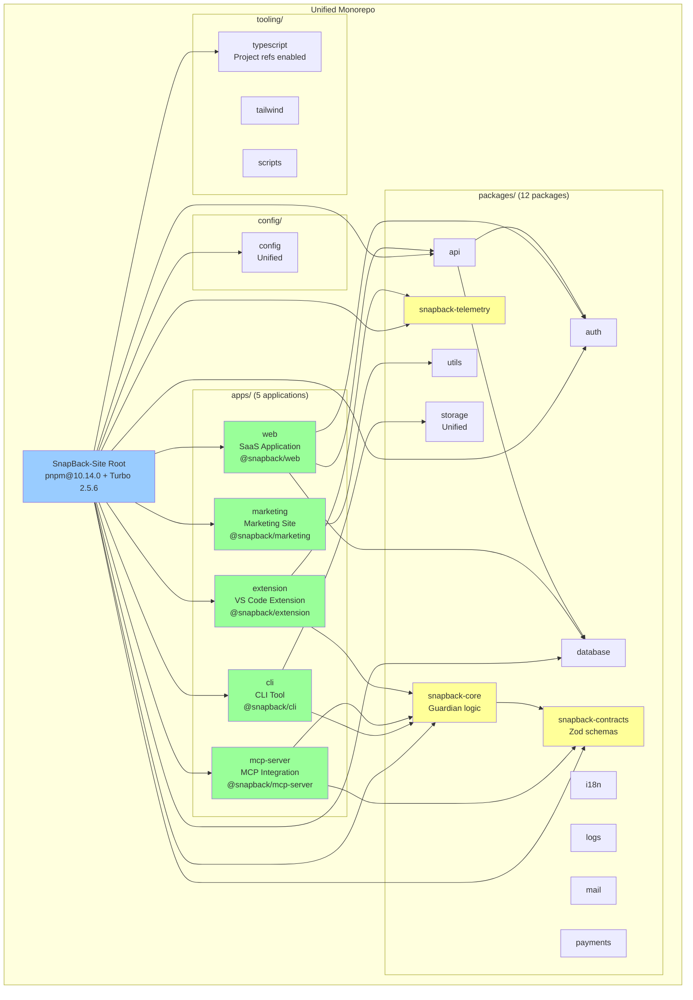
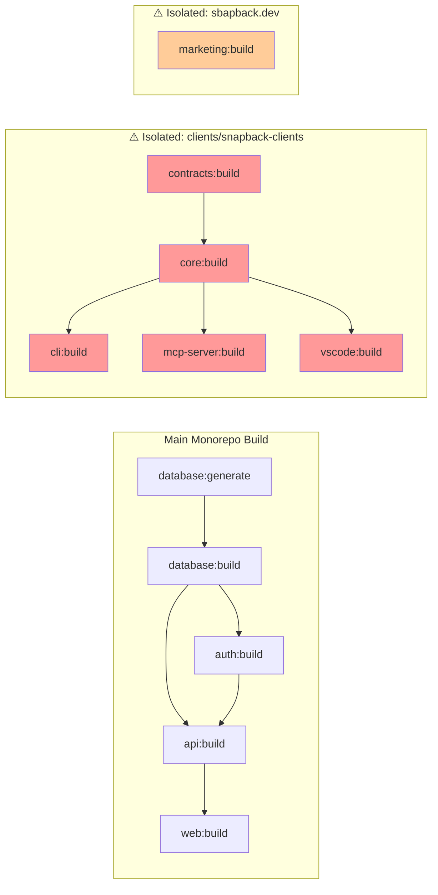
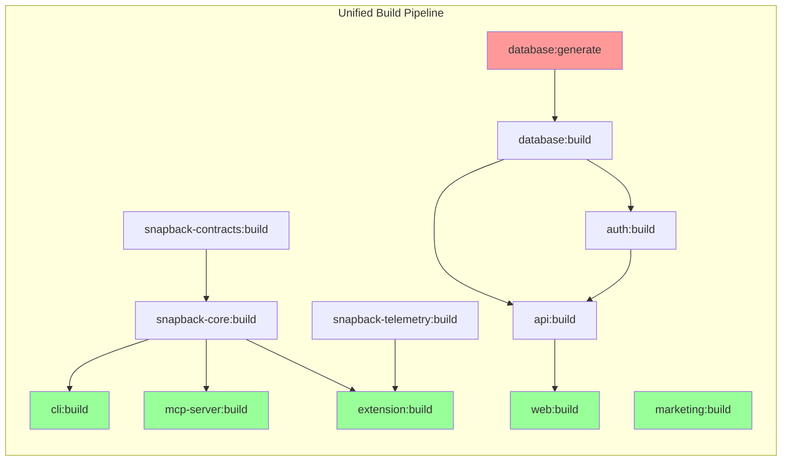
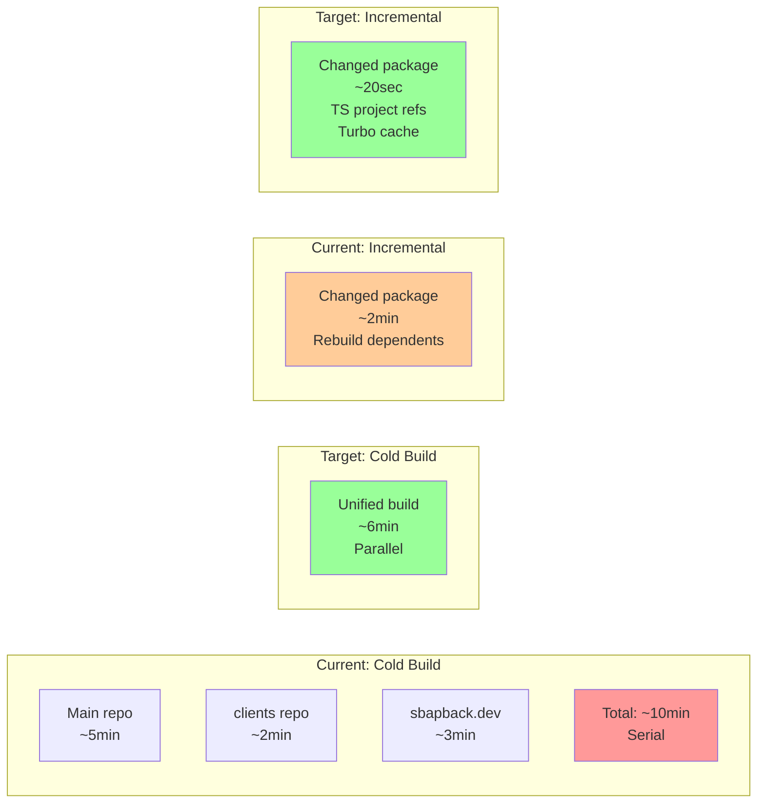
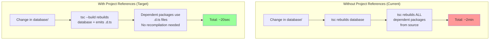

# SnapBack-Site Architecture Visualization

## Current State Diagram

```mermaid
graph TD
    subgraph "Main Repository (Git Repo 1)"
        ROOT[SnapBack-Site Root<br/>pnpm@10.14.0 + Turbo 2.5.6]

        subgraph "apps/"
            WEB[apps/web<br/>Next.js 15 SaaS<br/>@repo/web]
        end

        subgraph "packages/ (9 packages)"
            API[api<br/>HONO + oRPC]
            AUTH[auth<br/>Better Auth]
            DB[database<br/>Drizzle]
            I18N[i18n]
            LOGS[logs]
            MAIL[mail]
            PAY[payments]
            STOR1[storage]
            UTIL[utils]
        end

        subgraph "config/"
            CONF[config<br/>Feature flags]
        end

        subgraph "tooling/"
            TS[typescript configs]
            TW[tailwind config]
            SCR[scripts]
        end

        ROOT --> WEB
        ROOT --> API
        ROOT --> AUTH
        ROOT --> DB
        ROOT --> CONF
        ROOT --> TS
    end

    subgraph "⚠️ Nested Repository (Git Repo 2)"
        CLIENTS[clients/snapback-clients<br/>pnpm@9.12.0 + Turbo]

        subgraph "clients/apps/"
            CLI[cli<br/>@snapback/cli]
            MCP[mcp-server<br/>@snapback/mcp]
            VSC1[vscode<br/>v0.1.0 Full]
        end

        subgraph "clients/packages/"
            CORE[core<br/>Guardian logic]
            CONT[contracts<br/>Zod schemas]
            STOR2[storage<br/>DUPLICATE]
            TELE[telemetry]
            CONF2[config<br/>DUPLICATE]
        end

        CLIENTS --> CLI
        CLIENTS --> MCP
        CLIENTS --> VSC1
        CLIENTS --> CORE
    end

    subgraph "⚠️ Standalone Applications"
        SBDEV[sbapback.dev<br/>Next.js Marketing<br/>npm - no lockfile]
        EXT[extensions/vscode<br/>v0.0.1 Skeleton<br/>DUPLICATE]
    end

    ROOT -.->|nested| CLIENTS
    ROOT -.->|isolated| SBDEV
    ROOT -.->|isolated| EXT

    style CLIENTS fill:#ff9999
    style SBDEV fill:#ffcc99
    style EXT fill:#ffcc99
    style STOR2 fill:#ff6666
    style CONF2 fill:#ff6666
    style VSC1 fill:#99ff99
```

## Recommended Target State



## Migration Flow

```mermaid
flowchart LR
    subgraph "Phase 1: Consolidation"
        P1A[Move sbapback.dev<br/>→ apps/marketing]
        P1B[Consolidate VS Code<br/>Delete extensions/vscode<br/>Keep clients version]
        P1C[Update workspace config]

        P1A --> P1B --> P1C
    end

    subgraph "Phase 2: Flatten Clients"
        P2A[Move apps/<br/>cli, mcp-server, vscode<br/>→ apps/]
        P2B[Move packages/<br/>core, contracts, telemetry<br/>→ packages/]
        P2C[Merge duplicates<br/>storage, config]
        P2D[Update imports]

        P2A --> P2B --> P2C --> P2D
    end

    subgraph "Phase 3: Build Optimization"
        P3A[Enable TS<br/>project references]
        P3B[Optimize<br/>turbo.json]
        P3C[Configure<br/>vitest workspace]

        P3A --> P3B --> P3C
    end

    subgraph "Phase 4: Polish"
        P4A[Unify namespace<br/>→ @snapback/*]
        P4B[Update docs]
        P4C[CI/CD optimization]

        P4A --> P4B --> P4C
    end

    P1C --> P2A
    P2D --> P3A
    P3C --> P4A

    style P1A fill:#ffcc99
    style P1B fill:#ffcc99
    style P2A fill:#99ccff
    style P2B fill:#99ccff
    style P3A fill:#99ff99
    style P3B fill:#99ff99
    style P4A fill:#ffff99
```



## Build Dependency Graph (Current)



## Build Dependency Graph (Target)



## Package Dependency Matrix

### Current State

| Package                  | Depends On                | Used By                          |
| ------------------------ | ------------------------- | -------------------------------- |
| **database**             | -                         | auth, api, web                   |
| **auth**                 | database                  | api, web                         |
| **api**                  | database, auth            | web                              |
| **web**                  | api, auth, database       | -                                |
| **⚠️ clients/core**      | contracts (separate repo) | cli, mcp, vscode (separate repo) |
| **⚠️ clients/contracts** | -                         | core (separate repo)             |

### Target State

| Package                | Depends On                        | Used By                    |
| ---------------------- | --------------------------------- | -------------------------- |
| **database**           | -                                 | auth, api, web             |
| **snapback-contracts** | -                                 | snapback-core              |
| **snapback-core**      | snapback-contracts                | cli, mcp-server, extension |
| **auth**               | database                          | api, web                   |
| **api**                | database, auth                    | web                        |
| **web**                | api, auth, database               | -                          |
| **marketing**          | utils, ui                         | -                          |
| **cli**                | snapback-core, storage            | -                          |
| **mcp-server**         | snapback-core, snapback-contracts | -                          |
| **extension**          | snapback-core, snapback-telemetry | -                          |

## Performance Comparison



## TypeScript Project References Flow



## Workspace Configuration Evolution

### Current: Split Workspaces

```yaml
# Main: pnpm-workspace.yaml
packages:
  - config
  - apps/*          # Only web
  - packages/*      # 9 packages
  - tooling/*

# Clients: pnpm-workspace.yaml (separate)
packages:
  - apps/*          # cli, mcp-server, vscode
  - packages/*      # core, contracts, storage, telemetry, config
```

### Target: Unified Workspace

```yaml
# pnpm-workspace.yaml
packages:
    - config
    - apps/* # web, marketing, cli, mcp-server, extension
    - packages/* # All 12 packages unified
    - tooling/*

catalogs:
    default:
        react: 19.1.1
        typescript: 5.9.2
        vitest: 3.2.4
        # Centralized version management
```

## Summary Statistics

### Current State

-   **Git Repositories**: 3 (main + nested clients + potential submodules)
-   **Package Managers**: 2 (pnpm in main + clients, npm in sbapback.dev)
-   **Total Apps**: 5 (web, sbapback.dev, cli, mcp-server, 2x vscode)
-   **Total Packages**: 14 (9 main + 5 clients, with duplicates)
-   **Duplicate Applications**: 1 (VS Code extension)
-   **Duplicate Packages**: 2 (storage, config)
-   **Build Tools**: 2 Turbo configs (main + clients)

### Target State

-   **Git Repositories**: 1 (unified)
-   **Package Managers**: 1 (pnpm)
-   **Total Apps**: 5 (web, marketing, cli, mcp-server, extension)
-   **Total Packages**: 12 (unified, no duplicates)
-   **Duplicate Applications**: 0
-   **Duplicate Packages**: 0
-   **Build Tools**: 1 unified Turbo config

### Expected Improvements

-   **Setup Time**: 50% reduction (single repo clone + install)
-   **Build Time (Cold)**: 40% reduction (parallel builds, unified cache)
-   **Build Time (Incremental)**: 6x improvement (20sec vs 2min)
-   **CI/CD Duration**: 50% reduction (unified pipeline)
-   **Maintenance Overhead**: 70% reduction (single source of truth)
