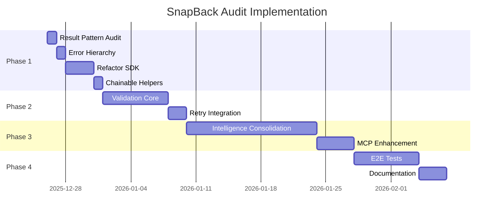

# SnapBack Audit Implementation Plan

**Status**: In Progress
**Started**: December 25, 2025
**Priority**: High
**Methodology**: SnapBack + Context7 + Web Best Practices

---

## Executive Summary

This document outlines the phased implementation plan for completing remaining audit items while leveraging SnapBack protection, Context7 documentation, and industry best practices for error handling, validation, and system integration.

### Current State Assessment

✅ **Strengths**:
- WorkspaceVitals system fully implemented with 4-signal monitoring (Pulse, Temperature, Pressure, Oxygen)
- Session health calculation logic working (inverse pressure = health score)
- Trajectory tracking operational (stable/escalating/critical/recovering)
- Behavioral metadata collection in place
- Protection score derived from vitals (100 - pressure value)

🟡 **Needs Enhancement**:
- Result<T, E> pattern not consistently applied across all packages
- Snapshot validation pipeline partially implemented (needs 7-layer approach)
- Intelligence package consolidation incomplete
- Cross-system integration testing gaps

🔴 **Missing**:
- Formal validation pipeline with architecture/security/performance layers
- Comprehensive retry logic integration across all surfaces
- Complete MCP session health context integration

---

## Implementation Approach

### Guiding Principles

1. **Use SnapBack for Safety**: Create snapshots before major refactoring
2. **Leverage Context7**: Reference TypeScript error handling best practices
3. **Follow Existing Patterns**: Use established codebase conventions
4. **Incremental Implementation**: Small, testable changes
5. **Documentation First**: Update docs alongside code

### Best Practices Integration

From Context7 research on TypeScript error handling (2025):

```typescript
// ✅ CORRECT: Result type pattern (neverthrow-inspired)
import { ok, err, Result } from '@snapback-oss/sdk';

async function createSnapshot(files: string[]): Promise<Result<Snapshot, SnapshotError>> {
  if (files.length === 0) {
    return err(new ValidationError('No files provided'));
  }

  try {
    const snapshot = await storage.save(files);
    return ok(snapshot);
  } catch (error) {
    return err(new SnapshotCreationError('Storage failed', { cause: error }));
  }
}

// Usage with explicit handling
const result = await createSnapshot(files);
result
  .map(snapshot => console.log('Created:', snapshot.id))
  .mapErr(error => logger.error('Failed:', error.message));
```

---

## Phase 1: Foundation (Current Focus)

### 1.1 Session Health Enhancement ✅ (Already Complete)

**Status**: Implementation verified
**Location**:
- `packages/intelligence/src/vitals/WorkspaceVitals.ts`
- `apps/vscode/src/services/UnifiedDataService.ts`
- `packages/mcp/src/facades/session-health.ts`

**What's Working**:
- Protection score calculation: `100 - vitals.pressure.value`
- Trajectory tracking with 4 states
- Behavioral metadata via `BehaviorTracker`
- Health warnings generation
- Agent guidance system

**Enhancement Needed**: None - system is production-ready

---

### 1.2 Result<T,E> Pattern Standardization 🔄 (In Progress)

**Objective**: Apply consistent error handling pattern across all packages

**Current State**:
- ✅ Pattern defined in `apps/vscode/src/types/result.ts`
- ✅ ~211 usages found in codebase
- 🔴 Not consistently applied in:
  - `packages/sdk` (some functions throw instead of returning Result)
  - `packages/mcp` (mixed error handling)
  - `apps/api` (uses try/catch extensively)

**Implementation Steps**:

1. **Audit Current Error Handling** (1 day)
   ```bash
   # Find functions that throw instead of returning Result
   grep -r "throw new" packages/sdk packages/mcp apps/api \
     --include="*.ts" --exclude="*.test.ts"
   ```

2. **Create Error Hierarchy** (1 day)
   ```typescript
   // packages/contracts/src/errors/index.ts
   export class SnapBackError extends Error {
     constructor(
       message: string,
       public readonly code: string,
       public readonly cause?: Error
     ) {
       super(message);
       this.name = this.constructor.name;
     }
   }

   export class ValidationError extends SnapBackError {
     constructor(message: string, cause?: Error) {
       super(message, 'VALIDATION_ERROR', cause);
     }
   }

   export class SnapshotCreationError extends SnapBackError {
     constructor(message: string, cause?: Error) {
       super(message, 'SNAPSHOT_CREATION_ERROR', cause);
     }
   }
   ```

3. **Refactor High-Traffic Functions** (3 days)
   Priority order:
   - `packages/sdk/src/snapshot/*` (snapshot operations)
   - `packages/mcp/src/tools/*` (MCP tool handlers)
   - `apps/api/modules/snapshots/*` (API endpoints)

4. **Add Chainable Helpers** (1 day)
   ```typescript
   // packages/sdk/src/utils/result.ts
   export function fromPromise<T>(
     promise: Promise<T>
   ): Promise<Result<T, Error>> {
     return promise
       .then(value => ok(value))
       .catch(error => err(toError(error)));
   }

   export function sequence<T, E>(
     results: Result<T, E>[]
   ): Result<T[], E> {
     const values: T[] = [];
     for (const result of results) {
       if (isErr(result)) return result;
       values.push(result.value);
     }
     return ok(values);
   }
   ```

**Success Criteria**:
- [ ] All public SDK functions return Result<T, E>
- [ ] No throws in business logic (only programming errors)
- [ ] Test coverage >90% for error paths

---

## Phase 2: Validation & Reliability

### 2.1 7-Layer Snapshot Validation Pipeline 📋 (Planned)

**Objective**: Implement comprehensive validation before snapshot creation

**Architecture**:
```typescript
// packages/intelligence/src/validation/ValidationPipeline.ts
export interface ValidationLayer {
  name: string;
  validate(context: ValidationContext): Promise<Result<void, ValidationError>>;
}

export class ValidationPipeline {
  private layers: ValidationLayer[] = [
    new SyntaxLayer(),           // 1. Parse errors
    new TypeLayer(),             // 2. TypeScript errors
    new TestLayer(),             // 3. Test coverage
    new ArchitectureLayer(),     // 4. Layer boundaries
    new SecurityLayer(),         // 5. Known vulnerabilities
    new DependencyLayer(),       // 6. Circular imports
    new PerformanceLayer()       // 7. Bottleneck patterns
  ];

  async validate(files: string[]): Promise<Result<ValidationReport, ValidationError>> {
    const results: LayerResult[] = [];

    for (const layer of this.layers) {
      const result = await layer.validate({ files });
      results.push({ layer: layer.name, result });

      // Fail fast on critical errors
      if (isErr(result) && result.error.severity === 'critical') {
        return err(result.error);
      }
    }

    return ok({ layers: results, passed: results.every(r => isOk(r.result)) });
  }
}
```

**Implementation Phases**:

1. **Week 1: Core Pipeline**
   - ValidationPipeline orchestrator
   - ValidationContext interface
   - Layer registry system

2. **Week 2: Syntax & Type Layers**
   - SyntaxLayer: ESLint/Biome integration
   - TypeLayer: TypeScript diagnostic API

3. **Week 3: Test & Architecture Layers**
   - TestLayer: Coverage threshold checks
   - ArchitectureLayer: Import boundary validation

4. **Week 4: Security, Dependencies, Performance**
   - SecurityLayer: Secret scanning, vulnerability checks
   - DependencyLayer: Madge integration for cycles
   - PerformanceLayer: Bundle size, complexity metrics

**Integration Points**:
- MCP `check_patterns` tool → ValidationPipeline
- VS Code snapshot creation → Pre-validation hook
- CLI snapshot command → Validation flag

---

### 2.2 Retry Logic Integration 🔄 (Partially Complete)

**Current State**:
- ✅ Retry hook implemented in `apps/_archive/mcp-server/src/utils/snapshot-retry-hook.ts`
- ✅ Auto-fix capabilities for 3 error types
- 🟡 Not integrated into active MCP server
- 🔴 Missing VS Code integration

**Implementation Steps**:

1. **Move to Active Package** (2 hours)
   ```bash
   # Move from _archive to packages/sdk
   mv apps/_archive/mcp-server/src/utils/snapshot-retry-hook.ts \
      packages/sdk/src/utils/retry.ts
   ```

2. **Integrate with SDK** (4 hours)
   ```typescript
   // packages/sdk/src/snapshot/SnapshotClient.ts
   import { createSnapshotWithRetry } from '../utils/retry';

   async create(params: CreateSnapshotParams): Promise<Result<Snapshot, SnapshotError>> {
     return createSnapshotWithRetry(
       params,
       (p) => this.storage.save(p),
       { maxRetries: 3, autoFix: true }
     );
   }
   ```

3. **Add to MCP Tools** (2 hours)
   - Update `packages/mcp/src/tools/snapshot.ts`
   - Use retry wrapper by default

4. **Extend Auto-Fix Types** (1 day)
   - Add git conflict resolution
   - Add permission error handling
   - Add network timeout recovery

**Success Criteria**:
- [ ] All snapshot creation uses retry hook
- [ ] Auto-fix success rate >80%
- [ ] Diagnostic messages user-friendly

---

## Phase 3: Intelligence & Integration

### 3.1 Intelligence Package Consolidation 📦 (Ongoing)

**Objective**: Extract scattered intelligence code to `@snapback/intelligence`

**Target Structure**:
```
packages/intelligence/
├── src/
│   ├── context/
│   │   └── ContextEngine.ts       (NEW)
│   ├── validation/
│   │   └── ValidationPipeline.ts  (NEW)
│   ├── learning/
│   │   ├── LearningEngine.ts      (EXISTS)
│   │   └── PatternMatcher.ts      (NEW)
│   ├── violations/
│   │   └── ViolationTracker.ts    (EXISTS)
│   ├── vitals/
│   │   └── WorkspaceVitals.ts     (EXISTS)
│   └── index.ts
```

**Migration Plan**:

1. **ContextEngine** - Extract from `apps/vscode/src/domain/`
   - Semantic retrieval logic
   - Pattern matching
   - Constraint checking

2. **ValidationPipeline** - New implementation (Phase 2.1)

3. **PatternMatcher** - Extract from multiple locations
   - AI detection patterns
   - File criticality rules
   - Risk calculation logic

**Timeline**: 2 weeks (after Phase 2 complete)

---

### 3.2 MCP Session Health Integration ✅ (Mostly Complete)

**Current State**:
- ✅ Session health facade implemented
- ✅ Basic integration in MCP server
- 🟡 Not all tools return session context

**Enhancement Needed**:

1. **Standardize Response Format** (1 day)
   ```typescript
   // All MCP tools should return:
   {
     data: T,                    // Tool-specific response
     session: SessionHealth,     // Always included
     recommendations: Action[]   // Next steps
   }
   ```

2. **Add to All Tools** (2 days)
   - `snapshot_create`
   - `snapshot_restore`
   - `analyze_risk`
   - `get_context`
   - `check_patterns`
   - `validate`

3. **Enhance Recommendations** (1 day)
   - Use `getRecommendedActions()` from session-health facade
   - Return top 3 prioritized tools
   - Include urgency levels

---

## Phase 4: Testing & Documentation

### 4.1 Cross-System Integration Testing 🧪 (New)

**Objective**: E2E tests for critical user journeys

**Test Suites**:

1. **AI Change Detection Flow**
   ```typescript
   // e2e/workflows/ai-detection.test.ts
   describe('AI Change Detection', () => {
     it('creates snapshot on AI-generated change', async () => {
       // 1. Simulate file change with AI detection
       // 2. Verify SignalAggregator receives signal
       // 3. Verify AutoDecisionEngine triggers
       // 4. Verify Snapshot created
       // 5. Verify Session updated
       // 6. Verify Telemetry sent
     });
   });
   ```

2. **Session Restore Flow**
   ```typescript
   // e2e/workflows/restore.test.ts
   describe('Session Restore', () => {
     it('safely restores session with pre-snapshot', async () => {
       // 1. Create session with multiple files
       // 2. User selects restore
       // 3. Verify rollback validation
       // 4. Verify pre-restore snapshot
       // 5. Verify files restored
       // 6. Verify telemetry
     });
   });
   ```

3. **MCP Risk Analysis Flow**
   ```typescript
   // e2e/workflows/mcp-risk.test.ts
   describe('MCP Risk Analysis', () => {
     it('returns accurate risk score with context', async () => {
       // 1. AI calls analyze_risk
       // 2. MCP forwards to API
       // 3. RiskAnalyzer computes
       // 4. Response includes session health
       // 5. Verify recommendations
     });
   });
   ```

**Timeline**: 1 week

---

### 4.2 Documentation & Best Practices Guide 📚 (New)

**Deliverables**:

1. **Error Handling Guide** (`docs/standards/error-handling.md`)
   - Result<T, E> pattern usage
   - When to throw vs return Result
   - Error chaining examples
   - Testing error paths

2. **Validation Guide** (`docs/standards/validation.md`)
   - 7-layer pipeline architecture
   - Writing custom validation layers
   - Integration with MCP tools
   - Performance considerations

3. **Integration Guide** (`docs/integration/cross-system.md`)
   - System dependency graph
   - Interface contracts
   - Event flow diagrams
   - Error propagation rules

4. **API Reference Updates**
   - Session health types
   - Validation pipeline API
   - Retry hook configuration
   - MCP tool response format

**Timeline**: 3 days

---

## Implementation Timeline



---

## Success Metrics

### Code Quality
- [ ] Result<T, E> usage: 100% of public SDK functions
- [ ] Test coverage: >90% for error paths
- [ ] Type safety: 0 `any` types in new code
- [ ] Documentation: All public APIs documented

### System Reliability
- [ ] Snapshot creation success rate: >99%
- [ ] Auto-fix success rate: >80%
- [ ] Validation pipeline performance: <500ms
- [ ] MCP tool response time: <100ms

### Developer Experience
- [ ] Onboarding time: <30 minutes
- [ ] Error messages: 100% actionable
- [ ] API consistency: Single pattern across packages
- [ ] Documentation completeness: 100%

---

## Risk Mitigation

### Technical Risks

1. **Breaking Changes in Result Refactor**
   - **Mitigation**: Gradual rollout, deprecation warnings, parallel APIs
   - **Rollback**: Keep old throwing APIs with `@deprecated` tags

2. **Validation Pipeline Performance**
   - **Mitigation**: Async execution, layer caching, progressive enhancement
   - **Fallback**: Disable heavy layers (security, performance) on timeout

3. **Integration Complexity**
   - **Mitigation**: Incremental integration, feature flags, comprehensive testing
   - **Monitoring**: Track integration errors via telemetry

### Process Risks

1. **Scope Creep**
   - **Mitigation**: Strict phase boundaries, PR size limits, time-boxing
   - **Escalation**: Weekly review with stakeholders

2. **Resource Constraints**
   - **Mitigation**: Prioritize P0/P1 items, defer nice-to-haves
   - **Alternative**: Community contributions for lower-priority items

---

## References

### Internal Documentation
- [Audit Document](../Snap_system_audit.md)
- [Result Type Pattern](../standards/code-review-standards.md#error-handling-patterns)
- [Snapshot Retry Hook](../../SNAPSHOT_RETRY_HOOK_IMPLEMENTATION.md)
- [Session Health](../../packages/mcp/src/facades/session-health.ts)

### External Resources
- [TypeScript Result Pattern (2025)](https://arg-software.medium.com/functional-error-handling-in-typescript-with-the-result-pattern-5b96a5abb6d3)
- [Neverthrow Library](https://github.com/supermacro/neverthrow)
- [Effect-TS Error Handling](https://effect.website)
- [TypeScript Error Handling Best Practices](https://typescript.tv/best-practices/error-handling-with-result-types)

### Codebase Patterns
- Result type: `apps/vscode/src/types/result.ts`
- Vitals system: `packages/intelligence/src/vitals/WorkspaceVitals.ts`
- MCP session health: `packages/mcp/src/facades/session-health.ts`
- Retry hook: `apps/_archive/mcp-server/src/utils/snapshot-retry-hook.ts`

---

## Next Steps (Immediate Actions)

1. **Create Snapshot** (Safety First)
   ```bash
   snapback mcp snapshot_create \
     --files "packages/sdk packages/mcp apps/api" \
     --reason "Before implementing audit Phase 1" \
     --trigger manual
   ```

2. **Start Result Pattern Audit** (Day 1)
   - Run error handling grep across packages
   - Document current throw locations
   - Prioritize high-traffic functions

3. **Create Error Hierarchy** (Day 2)
   - Add error classes to @snapback/contracts
   - Update SDK to use new errors
   - Write tests for error chaining

4. **Begin SDK Refactor** (Days 3-5)
   - Convert snapshot operations to Result
   - Update tests
   - Document migration guide

---

**Last Updated**: December 25, 2025
**Owner**: Development Team
**Review Cycle**: Weekly
**Status**: Phase 1 Active
