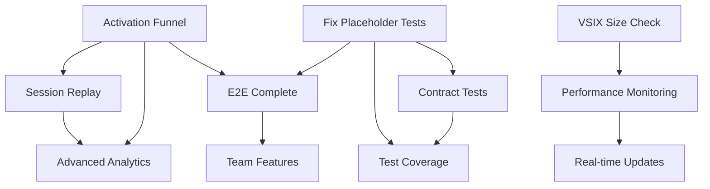

# SNAPBACK 8-WEEK ROADMAP
*Start Date: 2025-11-11 | End Date: 2026-01-03*

## Week 1 (Nov 11-15) - Foundation Sprint
**Focus:** Measurement & Quick Wins | **Capacity:** 35h | **Allocated:** 20h

### Monday-Tuesday
- [ ] **Activation Funnel Completion** (6h)
  - Owner: Analytics Team
  - Add missing funnel events
  - Deploy tracking to production
  - Verify data flow to PostHog

### Wednesday-Thursday  
- [ ] **FAQ Implementation** (4h)
  - Owner: Frontend Team
  - Create FAQ component
  - Add to footer layout
  - Deploy to production

### Friday
- [ ] **VSIX Size Check** (2h)
  - Owner: DevOps Team
  - Add bundle size check to CI
  - Set 2MB threshold
  - Test with current build

## Week 2 (Nov 18-22) - Testing & Optimization
**Focus:** Quality & Performance | **Capacity:** 35h | **Allocated:** 16h

### Monday-Tuesday
- [ ] **Fix Placeholder Tests** (8h)
  - Owner: QA Team
  - Replace placeholder implementations
  - Add assertions and validations
  - Run full test suite

### Wednesday-Thursday
- [ ] **Session Replay Optimization** (4h)
  - Owner: Analytics Team
  - Depends on: Activation Funnel
  - Adjust sampling rates
  - Configure budget alerts
  - Test replay functionality

### Friday
- [ ] **Weekly Review #1** (4h)
  - Review activation funnel metrics
  - Watch 10 session replays
  - Adjust priorities if needed

## Week 3 (Nov 25-29) - Contract & Performance
**Focus:** API Contracts & Monitoring | **Capacity:** 35h | **Allocated:** 22h

### Monday-Tuesday
- [ ] **Contract Tests Extension↔MCP** (8h)
  - Owner: Backend Team
  - Depends on: Fix Placeholder Tests
  - Create contract test suite
  - Cover all API endpoints
  - Add to CI pipeline

### Wednesday
- [ ] **Performance Monitoring** (6h)
  - Owner: DevOps Team
  - Depends on: VSIX Size Check
  - Setup performance dashboards
  - Add cold_start_ms tracking
  - Configure alerts

### Thursday-Friday
- [ ] **Documentation Start** (4h)
  - Owner: Docs Team
  - Audit current docs
  - Create consolidation plan
  - Start web app documentation

## Week 4 (Dec 2-6) - Documentation & Testing
**Focus:** Documentation & E2E Testing | **Capacity:** 35h | **Allocated:** 22h

### Monday-Tuesday
- [ ] **Documentation Consolidation** (8h)
  - Owner: Docs Team
  - Continue from Week 3
  - Centralize all docs
  - Add API documentation
  - Create single source of truth

### Wednesday-Thursday
- [ ] **Complete E2E Test Flow** (10h)
  - Owner: QA Team
  - Depends on: Fix Placeholder Tests, Activation Funnel
  - Implement full user journey
  - Test install→auth→key→success
  - Add to CI pipeline

### Friday
- [ ] **Weekly Review #2** (4h)
  - Review test coverage metrics
  - Evaluate documentation progress
  - Plan for next horizon

## Week 5 (Dec 9-13) - Coverage & Planning
**Focus:** Test Coverage & Feature Planning | **Capacity:** 35h | **Allocated:** 24h

### Monday-Wednesday
- [ ] **Test Coverage Improvement** (12h)
  - Owner: Engineering Team
  - Depends on: Fix Placeholder Tests, Contract Tests
  - Focus on MCP (currently ~40%)
  - Target 80% coverage
  - Add coverage reports to CI

### Thursday-Friday
- [ ] **Real-time Updates Design** (8h)
  - Owner: Frontend Team
  - Depends on: Performance Monitoring
  - Design WebSocket architecture
  - Plan implementation phases
  - Create technical spec

## Week 6 (Dec 16-20) - Real-time Features
**Focus:** WebSocket Implementation | **Capacity:** 35h | **Allocated:** 20h

### Monday-Wednesday
- [ ] **Real-time Updates Implementation** (16h)
  - Owner: Frontend Team
  - Continue from Week 5 design
  - Implement WebSocket server
  - Add to activity feed
  - Test with multiple clients

### Thursday-Friday
- [ ] **Advanced Analytics Planning** (4h)
  - Owner: Analytics Team
  - Design cohort analysis
  - Plan retention features
  - Create implementation spec

## Week 7 (Dec 23-27) - Holiday Week (Reduced Capacity)
**Focus:** Analytics & Monitoring | **Capacity:** 20h | **Allocated:** 12h

### Monday-Tuesday
- [ ] **Advanced Analytics Phase 1** (8h)
  - Owner: Analytics Team
  - Depends on: Activation Funnel, Replay Optimization
  - Implement cohort analysis
  - Add retention correlation
  - Deploy to staging

### Friday
- [ ] **System Health Check** (4h)
  - Review all metrics
  - Check performance budgets
  - Plan final week

## Week 8 (Dec 30-Jan 3) - Team Features & Wrap-up
**Focus:** Team Features & Final Polish | **Capacity:** 35h | **Allocated:** 24h

### Monday-Wednesday
- [ ] **Team Features Implementation** (20h)
  - Owner: Backend Team
  - Depends on: E2E Complete
  - Add granular permissions
  - Improve org management
  - Test with multiple teams

### Thursday-Friday
- [ ] **Final Review & Planning** (4h)
  - Complete retrospective
  - Document lessons learned
  - Plan next 8 weeks

## Dependencies Visualization

## Critical Path
1. **Activation Funnel** → **Session Replay** → **Advanced Analytics**
2. **Fix Placeholder Tests** → **Contract Tests** → **Test Coverage**
3. **VSIX Size Check** → **Performance Monitoring** → **Real-time Updates**

## Risk Buffer Application
- Week 1-2: 20% buffer (28h planned of 35h capacity)
- Week 3-4: 20% buffer (44h planned of 70h capacity)  
- Week 5-8: 25% buffer (100h planned of 140h capacity)

## Success Criteria
- [ ] TTFV p75 ≤ 5 minutes measured and improving
- [ ] Onboarding completion ≥ 70%
- [ ] Test coverage ≥ 80% across all packages
- [ ] Zero P0 bugs in production
- [ ] All documentation consolidated
- [ ] Performance budgets enforced in CI